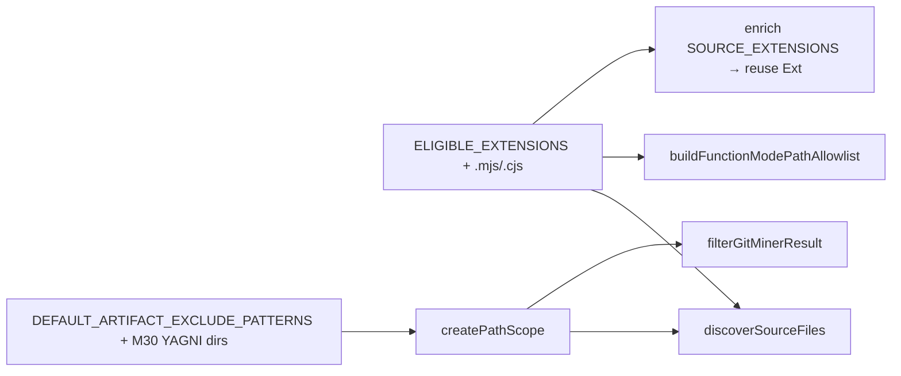

# Milestone 48 — Scope Extensions & Artifact Excludes Design

**Spec**: [`.specs/features/scope-extensions-excludes/spec.md`](./spec.md)  
**Context**: [`.specs/features/scope-extensions-excludes/context.md`](./context.md)  
**Status**: Done  
**Depth**: Small (thin)

---

## Architecture Overview

Two additive constant updates; no new modules, flags, or pipeline stages.

Consumers inherit automatically once constants change — same pattern as M7/M30.

---

## Code Reuse Analysis

| Component                        | Location                                | How to use                                                                                       |
| -------------------------------- | --------------------------------------- | ------------------------------------------------------------------------------------------------ |
| `ELIGIBLE_EXTENSIONS`            | `src/complexity/discover.ts`            | Append `.mjs`, `.cjs`; keep export                                                               |
| `buildFunctionModePathAllowlist` | `src/scan.ts`                           | Already takes `ELIGIBLE_EXTENSIONS` — no logic change if constant updates                        |
| `DEFAULT_*_EXCLUDE_PATTERNS`     | `src/paths/scope.ts`                    | Append to **artifact** list only (post-M46 name); leave test list alone                          |
| `createPathScope` / prune        | `src/paths/scope.ts`                    | Unchanged merge semantics                                                                        |
| Enrich peer extensions           | `src/scoring/enrich-coupling-static.ts` | Replace local `SOURCE_EXTENSIONS` with import of `ELIGIBLE_EXTENSIONS` (or keep alias re-export) |

### Integration points

| System                                | Method                                                             |
| ------------------------------------- | ------------------------------------------------------------------ |
| Complexity discover (ls-files + walk) | `hasEligibleExtension` via constant                                |
| Function-mode AST / patch             | Allowlist ∩ updated extensions                                     |
| PathScope defaults                    | Artifact append; M46 `includeTests` still lifts only test patterns |
| Docs                                  | ARCHITECTURE § Path scoping; README path-scoping bullet            |

---

## Components

### Eligible extensions constant

- **Purpose**: Single SoT for “is this a scannable TS/JS source file?”
- **Location**: `src/complexity/discover.ts` (export unchanged)
- **Change**: `[".ts", ".tsx", ".js", ".jsx", ".mjs", ".cjs"]`
- **Reuses**: Existing `hasEligibleExtension` / filter pipeline
- **Follow-on**: Enrich imports this constant so `.mjs`/`.cjs` resolve as peers (HOTSPOT-693)

### Artifact default excludes

- **Purpose**: Always-on directory excludes for toolchain artifacts
- **Location**: `src/paths/scope.ts`
- **Change**: Append locked seven patterns from [context.md](./context.md)
- **Reuses**: `createPathScope` merge + `shouldPruneDirectory`
- **Constraint**: Do **not** edit `DEFAULT_TEST_EXCLUDE_PATTERNS` (M46)

---

## Data Models

None. No type or JSON schema changes.

---

## Error Handling Strategy

| Scenario                            | Handling                   | User impact                                                      |
| ----------------------------------- | -------------------------- | ---------------------------------------------------------------- |
| Over-exclude of source under `tmp/` | Accepted (M30 `out` class) | User renames folder or narrows with include (exclude still wins) |
| `*.test.mjs` enters rankings        | Documented residual        | User `--exclude` or future test-glob follow-up                   |

---

## Tech Decisions

| Decision          | Choice                      | Rationale                                             |
| ----------------- | --------------------------- | ----------------------------------------------------- |
| Extension set     | `.mjs` + `.cjs` only        | ROADMAP; no `.mts`/`.cts`                             |
| Artifact set      | Full M30 YAGNI-cut list     | “Related” = all seven named in path-config-dx context |
| Enrich extensions | Reuse `ELIGIBLE_EXTENSIONS` | Prevent dual-list drift                               |
| Test globs        | Untouched                   | M46 ownership                                         |
| Fixtures          | No new repo                 | Unit coverage enough for Small                        |
| Soft dep          | Prefer post-M46 Execute     | Artifact constant ownership clarity                   |

---

## Risks / CONCERNS

| Risk                                                    | Mitigation                                                 |
| ------------------------------------------------------- | ---------------------------------------------------------- |
| Dual `SOURCE_EXTENSIONS` vs `ELIGIBLE_EXTENSIONS` drift | Import shared constant in enrich                           |
| `**/tmp/**` false positives                             | Document accepted over-exclude; same as `out`              |
| Residual `*.test.mjs` noise                             | Docs note; do not reopen M46 in this milestone             |
| Path conflict with M46 tasks                            | M48 owns artifact append only; Execute after M46 preferred |

---

## YAGNI

- No `--no-default-excludes`, no config for extension lists, no doctor changes (M52), no `.mts`/`.cts`, no new fixture repos.
