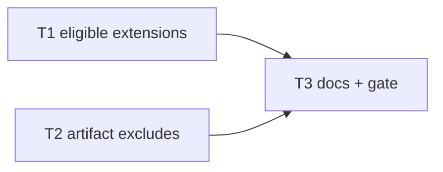

# Milestone 48 — Scope Extensions & Artifact Excludes Tasks

**Design**: [`.specs/features/scope-extensions-excludes/design.md`](./design.md)  
**Spec**: [`.specs/features/scope-extensions-excludes/spec.md`](./spec.md)  
**Context**: [`.specs/features/scope-extensions-excludes/context.md`](./context.md)  
**Status**: Done

**Soft dependency:** Prefer **M46** `exclude-tests-by-default` Complete before Execute so artifact vs test constants are split. Do **not** edit `DEFAULT_TEST_EXCLUDE_PATTERNS` in any task.

---

## Execution Plan

### Phase 1: Constants (Parallel OK)

```
T1 eligible extensions [P] ──┐
                             ├──→ Phase 2
T2 artifact excludes [P] ────┘
```

### Phase 2: Docs + gate

```
T1 + T2 → T3 docs + full gate
```



### Diagram-Definition Cross-Check

| Task | Depends on (body) | Diagram shows | Status |
| ---- | ----------------- | ------------- | ------ |
| T1 | None | Root | ✅ Match |
| T2 | None | Root | ✅ Match |
| T3 | T1, T2 | T1→T3, T2→T3 | ✅ Match |

### Path Conflict Check

| Task | Module owner | Paths | Conflict |
| ---- | ------------ | ----- | -------- |
| T1 | `src/complexity/` (+ enrich SoT) | `discover.ts`, `discover`/`index` tests; `enrich-coupling-static.ts` (+ test); optional `scan.test.ts` allowlist fixture strings | Disjoint from T2 `src/paths/` |
| T2 | `src/paths/` | `scope.ts`, `scope.test.ts` (± `paths/index.ts` re-exports if needed) | Do **not** edit test-exclude constants; disjoint from T1 |
| T3 | docs | ARCHITECTURE, README, CONCERNS (residual note), ROADMAP/STATE on Done | After T1+T2 |

### Test Co-location Validation

| Task | Code layer | Matrix / TESTING.md | Task Tests | Status |
| ---- | ---------- | ------------------- | ---------- | ------ |
| T1 | complexity discover + scoring enrich | unit | unit | ✅ OK |
| T2 | paths scope | unit | unit | ✅ OK |
| T3 | docs only | none | none | ✅ OK |

### Granularity Check

| Task | Scope | Status |
| ---- | ----- | ------ |
| T1 | One constant + consumers that must stay in sync | ✅ Cohesive |
| T2 | One artifact exclude append + unit tests | ✅ Granular |
| T3 | Docs + full gate | ✅ Granular |

---

## Task Breakdown

### T1: Add `.mjs` / `.cjs` to eligible extensions [P]

**What**: Extend `ELIGIBLE_EXTENSIONS` to include `.mjs` and `.cjs`; point enrich peer-extension list at the same SoT; update unit tests (discover filter, allowlist intersection, enrich extensions).  
**Where**: `src/complexity/discover.ts`, `src/complexity/discover.test.ts` (and/or `index.test.ts` as existing), `src/scoring/enrich-coupling-static.ts`, `src/scoring/enrich-coupling-static.test.ts`; touch `src/scan.test.ts` only if hardcoded extension arrays assert the old four-set.  
**Depends on**: None  
**Reuses**: `hasEligibleExtension`, `buildFunctionModePathAllowlist`, existing discover / enrich tests  
**Requirement**: HOTSPOT-690, HOTSPOT-691, HOTSPOT-692, HOTSPOT-693, HOTSPOT-694  
**Module owner**: `src/complexity/` (enrich follow-on for SoT)

**Tools**:

- MCP: NONE
- Skill: `coding-guidelines`, `vitals-pipeline-domain`

**Done when**:

- [x] `ELIGIBLE_EXTENSIONS` === `[".ts", ".tsx", ".js", ".jsx", ".mjs", ".cjs"]`
- [x] Discover includes in-scope `.mjs`/`.cjs`; excludes `.mts`/`.cts`
- [x] Enrich no longer maintains a divergent four-extension-only list (imports or equals `ELIGIBLE_EXTENSIONS`)
- [x] Function-mode allowlist tests cover a `.mjs` (or `.cjs`) key when present
- [x] Gate check passes: `pnpm exec vitest run src/complexity/discover.test.ts src/complexity/index.test.ts src/scoring/enrich-coupling-static.test.ts src/scan.test.ts` (adjust to files actually touched)
- [x] Test count: no silent deletions

**Tests**: unit  
**Gate**: `pnpm exec vitest run src/complexity/ src/scoring/enrich-coupling-static.test.ts src/scan.test.ts`

**Verify**:

```bash
pnpm exec vitest run src/complexity/discover.test.ts src/scoring/enrich-coupling-static.test.ts
```

Expect: `.mjs`/`.cjs` eligible; `.mts` not.

**Commit**: `feat(complexity): treat .mjs and .cjs as eligible sources`

---

### T2: Expand default artifact excludes [P]

**What**: Append locked M30 YAGNI-cut patterns to the **artifact** default exclude list; extend `scope.test.ts` for nested paths and prune; assert test-exclude constants (if present) unchanged.  
**Where**: `src/paths/scope.ts`, `src/paths/scope.test.ts`  
**Depends on**: None  
**Reuses**: `createPathScope`, `isPathInScope`, `shouldPruneDirectory`, M30 nested `**/…/**` convention  
**Requirement**: HOTSPOT-695, HOTSPOT-696, HOTSPOT-697, HOTSPOT-698  
**Module owner**: `src/paths/`

**Tools**:

- MCP: NONE
- Skill: `coding-guidelines`, `vitals-pipeline-domain`

**Done when**:

- [x] Artifact defaults include `**/.turbo/**`, `**/.vercel/**`, `**/.cache/**`, `**/.nuxt/**`, `**/.output/**`, `**/.parcel-cache/**`, `**/tmp/**`
- [x] M7/M30 prior artifact patterns preserved
- [x] `DEFAULT_TEST_EXCLUDE_PATTERNS` (post-M46) **not** modified
- [x] `isPathInScope` / `shouldPruneDirectory` unit cases for nested `.turbo` / `.cache` / `tmp` paths
- [x] Gate check passes: `pnpm exec vitest run src/paths/`
- [x] Test count: no silent deletions

**Tests**: unit  
**Gate**: `pnpm exec vitest run src/paths/`

**Verify**:

```bash
pnpm exec vitest run src/paths/scope.test.ts
```

Expect: locked paths out of scope; test-pattern snapshot/equality unchanged if exported.

**Commit**: `feat(paths): exclude turbo/cache and related artifact dirs by default`

---

### T3: Docs + full quality gate

**What**: Sync living docs for eligible extensions + artifact excludes; note residual `*.test.mjs` / `*.spec.cjs` (M46 globs not extended); mark ROADMAP M48 Done items only when Execute finishes (this planning session leaves Status Planned).  
**Where**: `.specs/codebase/ARCHITECTURE.md`, `README.md`, `.specs/codebase/CONCERNS.md` (short residual note); on Execute Done also ROADMAP/STATE  
**Depends on**: T1, T2  
**Reuses**: Existing path-scoping / eligibility prose sections  
**Requirement**: HOTSPOT-699, HOTSPOT-700  
**Module owner**: docs

**Tools**:

- MCP: NONE
- Skill: `vitals-spec-driven` (roadmap-sync on Done)

**Done when**:

- [x] ARCHITECTURE lists `.mjs`/`.cjs` and new artifact dirs/patterns
- [x] README path-scoping summary updated
- [x] Residual test-extension note documented (ARCHITECTURE or CONCERNS)
- [x] Full gate passes: `pnpm build && pnpm test`
- [x] Test count: no silent deletions vs pre-feature baseline

**Tests**: none  
**Gate**: `pnpm build && pnpm test`

**Verify**:

```bash
pnpm build && pnpm test
```

**Commit**: `docs: sync M48 eligible extensions and artifact excludes`

---

## Parallel Execution Map

```
Phase 1 (Parallel):
  ├── T1 [P]  complexity + enrich extensions
  └── T2 [P]  paths artifact excludes

Phase 2 (Sequential):
  T1 + T2 complete → T3 docs + full gate
```

**Parallelism constraint:** T1 and T2 touch disjoint path prefixes (`src/complexity/`+enrich vs `src/paths/`); unit tests are parallel-safe.

---

## Handoff

Status **Planned**. Promote to Approved / Ready for Execute in a **new** session, then invoke `orchestrator-implementer`. Prefer after M46 Complete. Gate final: `pnpm build && pnpm test`.
