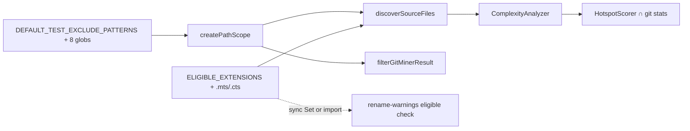

# Milestone 67 — Scope Extensions Plus Design

**Spec**: [`.specs/features/scope-extensions-plus/spec.md`](./spec.md)  
**Context**: [`.specs/features/scope-extensions-plus/context.md`](./context.md)  
**Status**: Planned  
**Depth**: Medium (thin — constant + docs; same shape as M48)

---

## Architecture Overview

Two additive constant updates; no new modules, flags, or pipeline stages. Consumers inherit via existing PathScope + discovery wiring (M7/M46/M48 pattern).

---

## Code Reuse Analysis

| Component | Location | How to use |
| --------- | -------- | ---------- |
| `DEFAULT_TEST_EXCLUDE_PATTERNS` | `src/paths/scope.ts` | Append locked eight patterns; leave artifact list alone |
| `createPathScope` / `includeTests` | `src/paths/scope.ts` | Unchanged merge semantics — new test entries auto-lift with `--include-tests` |
| `ELIGIBLE_EXTENSIONS` | `src/complexity/discover.ts` | Append `.mts`, `.cts`; keep export |
| `hasEligibleExtension` / discover filters | `src/complexity/discover.ts` | Inherit via constant |
| Complexity analyze | `src/complexity/` | No extension fork — analyzes discovered paths |
| HotspotScorer | `src/scoring/hotspot-scorer.ts` | Already joins complexity rows ∩ `fileStats` |
| Rename eligible Set | `src/git/rename-warnings.ts` | Sync with SoT (prefer `ELIGIBLE_EXTENSIONS` import over duplicate Set) |

### Integration points

| System | Method |
| ------ | ------ |
| PathScope defaults | Test-pattern append only |
| Discovery (ls-files + walk) | `hasEligibleExtension` via constant |
| Dry-run / doctor eligible count | Inherit via `discoverSourceFiles` + shared PathScope |
| Docs | ARCHITECTURE § Path scoping; README Limitations; CONCERNS residual clear |

---

## Components

### Test exclude constant expansion

- **Purpose**: Always-on built-in test globs for all eligible source extensions
- **Location**: `src/paths/scope.ts`
- **Change**: Append locked eight patterns from [context.md](./context.md) after `**/__tests__/**`
- **Reuses**: `createPathScope`, `isPathInScope`, existing `scope.test.ts` equality + path cases
- **Constraint**: Do **not** edit `DEFAULT_ARTIFACT_EXCLUDE_PATTERNS`

### Eligible extensions constant

- **Purpose**: Single SoT for scannable TS/JS (+ module variants) sources
- **Location**: `src/complexity/discover.ts` (export unchanged)
- **Change**: `[".ts", ".tsx", ".js", ".jsx", ".mjs", ".cjs", ".mts", ".cts"]`
- **Follow-on**: Update `src/git/rename-warnings.ts` eligible Set (or replace with import) in the same implementation task to avoid dual-list drift (CONCERNS / M48 lesson)

---

## Data Models

None. No type or JSON schema changes.

---

## Error Handling Strategy

| Scenario | Handling | User impact |
| -------- | -------- | ----------- |
| Legitimate source named like a test glob | Same as M46 — excluded by default; use `--include-tests` or rename | Opt-in to audit tests |
| Over-exclude under artifact dirs | Unchanged | N/A this milestone |

---

## Tech Decisions

| Decision | Choice | Rationale |
| -------- | ------ | --------- |
| Test glob set | ESM/CJS + mts/cts quartets | Mission floor + prevent new residual |
| Extension set | `.mts` + `.cts` only | Sister of M48; no `.d.ts` |
| Rename Set | Sync in same task as constant | Dual-list drift risk (M48 enrich lesson) |
| Fixtures | No new repo | Unit coverage enough |
| ROADMAP/STATE | Execute Done only | Planning mission: do not edit |

---

## Risks / CONCERNS

| Risk | Mitigation |
| ---- | ---------- |
| Dual `ELIGIBLE_EXTENSIONS` in discover vs rename-warnings | Same task updates both; prefer shared import |
| Path conflict paths vs complexity | Parallel tasks with disjoint owners (`src/paths/` vs `src/complexity/` + `src/git/rename-warnings.ts`) |
| Docs leave residual language | T3 checklist explicitly clears README Limitations + CONCERNS row |
| `endsWith` false positives | Existing matcher is suffix-based; `.mts` does not match `.ts` via `endsWith(".ts")` — covered by discover tests |

---

## YAGNI

- No `.hotspotignore`, no workspace parsers, no artifact-dir expansion, no new CLI/config, no schema bump, no new fixture repos.
