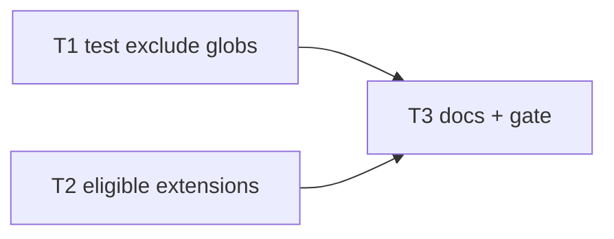

# Milestone 67 — Scope Extensions Plus Tasks

**Design**: [`.specs/features/scope-extensions-plus/design.md`](./design.md)  
**Spec**: [`.specs/features/scope-extensions-plus/spec.md`](./spec.md)  
**Context**: [`.specs/features/scope-extensions-plus/context.md`](./context.md)  
**Status**: Done  
**Note**: Medium feature — constant updates + docs. STOP at Planned; Execute in a separate session via `orchestrator-implementer` after Status promotion. Do **not** edit ROADMAP.md / STATE.md in planning; Execute Done owns those syncs.

---

## Execution Plan

### Phase 1: Constants (Parallel OK)

```
T1 residual test globs [P] ──┐
                             ├──→ Phase 2
T2 eligible .mts/.cts [P] ───┘
```

### Phase 2: Docs + gate

```
T1 + T2 → T3 docs + full gate
```



### Diagram-Definition Cross-Check

| Task | Depends on (body) | Diagram shows | Status |
| ---- | ----------------- | ------------- | ------ |
| T1 | None | Root | ✅ Match |
| T2 | None | Root | ✅ Match |
| T3 | T1, T2 | T1→T3, T2→T3 | ✅ Match |

### Path Conflict Check (Check 5)

| Task | Module owner | Paths | Conflict |
| ---- | ------------ | ----- | -------- |
| T1 | `src/paths/` | `scope.ts`, `scope.test.ts`; `paths/index.ts` only if re-exports need touch | Sole PathScope owner; **do not** edit `ELIGIBLE_EXTENSIONS` |
| T2 | `src/complexity/` (+ rename sync) | `discover.ts`, `discover.test.ts`; `src/git/rename-warnings.ts`, `rename-warnings.test.ts`; touch other complexity tests only if they hard-code the six-extension list | Disjoint from T1 `src/paths/` |
| T3 | docs | ARCHITECTURE, README, CONCERNS; ROADMAP/STATE only on Execute Done (not this planning session) | After T1+T2 |

T1 `[P]` with T2 — disjoint path prefixes. No other `[P]`.

### Test Co-location Validation

| Task | Code layer | TESTING.md expectation | Task Tests | Status |
| ---- | ---------- | ---------------------- | ---------- | ------ |
| T1 | `src/paths/` | unit | unit | ✅ OK |
| T2 | `src/complexity/` + `src/git/` | unit | unit | ✅ OK |
| T3 | docs + project gate | none / full gate | none + `pnpm build && pnpm test` | ✅ OK |

### Granularity Check

| Task | Scope | Status |
| ---- | ----- | ------ |
| T1 | One constant append + unit tests | ✅ Granular |
| T2 | One constant + rename sync + unit tests | ✅ Cohesive SoT sync |
| T3 | Docs + full gate | ✅ Granular |

---

## Task Breakdown

### T1: Expand default test exclude globs [P]

**What**: Append the locked eight residual/parity test patterns to `DEFAULT_TEST_EXCLUDE_PATTERNS`; update unit equality and `isPathInScope` / `includeTests` cases; leave artifact defaults unchanged.  
**Where**: `src/paths/scope.ts`, `src/paths/scope.test.ts`  
**Depends on**: None  
**Reuses**: `createPathScope`, `isPathInScope`, M46 `includeTests` lift semantics  
**Requirement**: HOTSPOT-1200, HOTSPOT-1201, HOTSPOT-1202, HOTSPOT-1203, HOTSPOT-1204  
**Module owner**: `src/paths/`

**Tools**:

- MCP: NONE
- Skill: `coding-guidelines`, `vitals-pipeline-domain`

**Done when**:

- [x] `DEFAULT_TEST_EXCLUDE_PATTERNS` equals locked array from context (17 entries: 8 legacy file globs + `__tests__` + 8 new)
- [x] `DEFAULT_ARTIFACT_EXCLUDE_PATTERNS` equality assertion still matches pre-M67 set (unchanged)
- [x] Default scope excludes representative paths: `src/foo.test.mjs`, `pkg/bar.spec.cjs`, `src/a.test.mts`, `src/b.spec.cts`
- [x] `createPathScope({ includeTests: true })` includes those paths (absent user exclude)
- [x] Gate check passes: `pnpm exec vitest run src/paths/`
- [x] Test count: no silent deletions

**Tests**: unit  
**Gate**: `pnpm exec vitest run src/paths/`

**Verify**:

```bash
pnpm exec vitest run src/paths/scope.test.ts
```

Expect: new globs present; artifact list untouched; includeTests lifts new patterns.

**Commit**: `feat(paths): exclude mjs/cjs/mts/cts test and spec globs by default`

---

### T2: Add `.mts` / `.cts` to eligible extensions [P]

**What**: Extend `ELIGIBLE_EXTENSIONS` with `.mts` and `.cts`; update discover unit expectations; sync rename-warnings eligible extension Set (prefer import of shared constant); cover rename heuristic for `.mts` if tests assert the Set.  
**Where**: `src/complexity/discover.ts`, `src/complexity/discover.test.ts`, `src/git/rename-warnings.ts`, `src/git/rename-warnings.test.ts`; other files only if they hard-code the prior six-extension list  
**Depends on**: None  
**Reuses**: `hasEligibleExtension`, discover ls-files/walk filters, HotspotScorer join semantics (no scorer change expected)  
**Requirement**: HOTSPOT-1205, HOTSPOT-1206, HOTSPOT-1207, HOTSPOT-1208, HOTSPOT-1209  
**Module owner**: `src/complexity/` (rename-warnings follow-on for SoT)

**Tools**:

- MCP: NONE
- Skill: `coding-guidelines`, `vitals-pipeline-domain`

**Done when**:

- [x] `ELIGIBLE_EXTENSIONS` === `[".ts", ".tsx", ".js", ".jsx", ".mjs", ".cjs", ".mts", ".cts"]`
- [x] Discover includes in-scope `.mts`/`.cts` (update existing test that currently expects them omitted)
- [x] Rename-warnings eligible check treats `.mts`/`.cts` as eligible (shared import or updated Set — no divergent stale list)
- [x] No divergent hard-coded six-extension assertions left in touched tests
- [x] Gate check passes: `pnpm exec vitest run src/complexity/discover.test.ts src/git/rename-warnings.test.ts` (add other touched test files if needed)
- [x] Test count: no silent deletions

**Tests**: unit  
**Gate**: `pnpm exec vitest run src/complexity/discover.test.ts src/git/rename-warnings.test.ts`

**Verify**:

```bash
pnpm exec vitest run src/complexity/discover.test.ts src/git/rename-warnings.test.ts
```

Expect: `.mts`/`.cts` eligible in discovery; rename heuristic accepts eligible module extensions.

**Commit**: `feat(complexity): treat .mts and .cts as eligible sources`

---

### T3: Docs + full quality gate

**What**: Sync living docs for expanded test globs and `.mts`/`.cts` eligibility; clear CONCERNS residual row for `*.test.mjs` / `*.spec.cjs`; run full project gate. On Execute Done only (not planning), check ROADMAP M67 / STATE — **do not edit ROADMAP/STATE while Status is Planned**.  
**Where**: `.specs/codebase/ARCHITECTURE.md`, `README.md`, `.specs/codebase/CONCERNS.md`  
**Depends on**: T1, T2  
**Reuses**: M48 docs update pattern  
**Requirement**: HOTSPOT-1210, HOTSPOT-1211, HOTSPOT-1212  
**Module owner**: docs

**Tools**:

- MCP: NONE
- Skill: `coding-guidelines`

**Done when**:

- [x] ARCHITECTURE eligible extensions list includes `.mts`/`.cts`; path-scoping notes expanded test globs (or points to constant)
- [x] README Limitations / path-scoping no longer warn that default test excludes miss `*.test.mjs` / `*.spec.cjs`; eligible list includes `.mts`/`.cts`
- [x] CONCERNS § Path scoping residual row removed or rewritten as mitigated (M67)
- [x] Gate check passes: `pnpm build && pnpm test`
- [x] Test count: no silent deletions

**Tests**: none  
**Gate**: `pnpm build && pnpm test`

**Verify**:

```bash
pnpm build && pnpm test
```

Expect: full gate green; docs match constants.

**Commit**: `docs: document mts/cts eligibility and expanded test excludes`

---

## Parallel Execution Map

```
Phase 1 (Parallel):
  ├── T1 [P]  src/paths/
  └── T2 [P]  src/complexity/ + src/git/rename-warnings.ts

Phase 2 (Sequential):
  T1 + T2 complete → T3 docs + full gate
```

**Parallelism constraint:** T1 and T2 have no shared mutable paths; unit tests are parallel-safe per TESTING.md.

---

## Requirement → Task Mapping

| Requirement IDs | Task |
| --------------- | ---- |
| HOTSPOT-1200, HOTSPOT-1201, HOTSPOT-1202, HOTSPOT-1203, HOTSPOT-1204 | T1 |
| HOTSPOT-1205, HOTSPOT-1206, HOTSPOT-1207, HOTSPOT-1208, HOTSPOT-1209 | T2 |
| HOTSPOT-1210, HOTSPOT-1211, HOTSPOT-1212 | T3 |
| HOTSPOT-1213–1229 | Reserved — unused |

---

## Handoff

Planning complete. Promote `Status` to `Approved` or `Ready for Execute`, then open a **new** development session and invoke `orchestrator-implementer`.

Expected final gate: `pnpm build && pnpm test`
