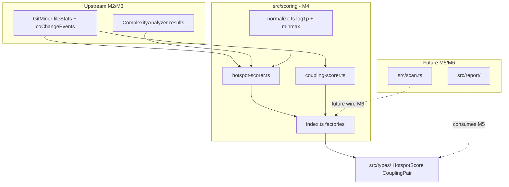

# Milestone 4 — Scoring Design

**Spec**: [`.specs/features/scoring/spec.md`](./spec.md)  
**Context**: [`.specs/features/scoring/context.md`](./context.md)  
**Status**: Done

---

## Architecture Overview

M4 implements the Scoring module as pure functions inside `src/scoring/`: log-scale normalization, hotspot score computation from complexity + churn, and temporal coupling from co-change events. No changes to `src/scan.ts` — scorers are independently testable.



**IMPL reference:** §4.3 Hotspot Scorer + Temporal Coupling Scorer, §5.1 `HOTSPOT_SCORE` + `CO_CHANGE_EVENT`, §7.1 data flow, §9 scoring unit tests.

---

## Code Reuse Analysis

### Existing Components to Leverage

| Component | Location | How to Use |
| --------- | -------- | ---------- |
| Domain types | `src/types/domain.ts` | `HotspotScore`, `CouplingPair`, `FileChangeStats`, `ComplexityResult`, `CoChangeEvent` — no changes expected |
| Scorer contracts | `src/scoring/index.ts` | Keep `HotspotScorer` and `TemporalCouplingScorer` interfaces; replace throwing factories |
| Stub test pattern | `src/scoring/index.test.ts` | Replace "throws not implemented" with factory integration tests |
| GitMiner deps pattern | `src/git/index.ts` | Mirror `ScoringDependencies` injection at factory boundary |
| ComplexityAnalyzer deps pattern | `src/complexity/index.ts` | Same injection pattern for testability |

### Integration Points

| System | M4 behavior | Future milestone |
| ------ | ----------- | ---------------- |
| `src/git/` | Consumes `FileChangeStats` map + `CoChangeEvent[]` | — |
| `src/complexity/` | Consumes `ComplexityResult[]` | — |
| `src/scan.ts` | Not wired | M6 Integration |
| `bin/hotspot-scanner.ts` | No flags added | M5 Reporter + CLI |
| `src/report/` | Consumes types only | M5 |

---

## Design Decisions

| # | Decision | Rationale |
| - | -------- | --------- |
| D1 | Log1p + min-max normalization | User decision in [context.md](./context.md); dampens heavy-tailed distributions |
| D2 | `DEFAULT_MIN_COCHANGE = 3` | User decision in [context.md](./context.md); filters noise pairs |
| D3 | Score all `ComplexityResult` files; churn defaults to 0 | Working-tree complexity is authoritative; git may not touch all files |
| D4 | Degenerate min-max → all normalized values 0 | CONCERNS: single-file / all-equal edge case |
| D5 | `ScoringDependencies` injection pattern | Mirrors M2/M3; mock at factory boundary in tests |
| D6 | No `src/scan.ts` changes | M3 precedent — scorer testable in isolation |
| D7 | Tie-break by `filePath` / `fileA` asc | Deterministic test assertions |

---

## Formulas

### Normalization (`normalize.ts`)

Per metric, per scan across the scored file set:

```
transformed[i] = log1p(raw[i])
normalized[i] = (transformed[i] - min) / (max - min)   // when max > min
normalized[i] = 0                                       // when max === min (degenerate)
```

- Applied independently to complexity values and churn values before hotspot multiplication
- Empty input array → empty output array

### Hotspot score (`hotspot-scorer.ts`)

```
hotspotScore = complexityNormalized × churnNormalized
```

- Churn = `fileStats.get(filePath)?.commitCount ?? 0`
- Scored set = all entries in `ComplexityResult[]`
- Sort: `hotspotScore` desc, then `filePath` asc

### Temporal coupling (`coupling-scorer.ts`)

```
couplingStrength = coChangeCount / min(commitsA, commitsB)
```

- Pair counting: for each `CoChangeEvent`, dedupe `filesChanged`, then increment C(N, 2) unordered pairs
- Canonical pair order: `fileA < fileB` lexicographically
- Include pair only when `coChangeCount >= minCochange` AND `min(commitsA, commitsB) > 0`
- Sort: `couplingStrength` desc, then `fileA` asc

---

## Components

### Normalization (`src/scoring/normalize.ts`)

- **Purpose**: Pure log1p + min-max normalization for scoring metrics.
- **Location**: `src/scoring/normalize.ts`
- **Interfaces**:

```typescript
/** Apply log1p then min-max to [0, 1]. Degenerate (all equal) → all 0. */
export function normalizeLogMinMax(values: number[]): number[];
```

- **Algorithm**:
  1. If `values.length === 0`, return `[]`
  2. `transformed = values.map(v => Math.log1p(v))`
  3. `min = Math.min(...transformed)`, `max = Math.max(...transformed)`
  4. If `max === min`, return `values.map(() => 0)`
  5. Return `transformed.map(t => (t - min) / (max - min))`
- **Dependencies**: None (pure math)
- **Reuses**: None

---

### Hotspot scorer (`src/scoring/hotspot-scorer.ts`)

- **Purpose**: Join complexity + churn, normalize, compute scores, sort.
- **Location**: `src/scoring/hotspot-scorer.ts`
- **Interfaces**:

```typescript
import type {
  ComplexityResult,
  FileChangeStats,
  HotspotScore,
} from "../types/index.js";

export function scoreHotspots(
  fileStats: Map<string, FileChangeStats>,
  complexity: ComplexityResult[],
): HotspotScore[];
```

- **Algorithm**:
  1. Extract `complexityValues` and `churnValues` arrays aligned with `complexity` order
  2. `complexityNorm = normalizeLogMinMax(complexityValues)`
  3. `churnNorm = normalizeLogMinMax(churnValues)`
  4. Map to `HotspotScore[]` with `hotspotScore = complexityNorm[i] × churnNorm[i]`
  5. Sort by `hotspotScore` desc, `filePath` asc
- **Dependencies**: `normalize.ts`, `src/types/`
- **Reuses**: `HotspotScore`, `ComplexityResult`, `FileChangeStats`

---

### Coupling scorer (`src/scoring/coupling-scorer.ts`)

- **Purpose**: Aggregate co-change pairs, apply threshold, compute strength, sort.
- **Location**: `src/scoring/coupling-scorer.ts`
- **Interfaces**:

```typescript
import type {
  CoChangeEvent,
  CouplingPair,
  FileChangeStats,
} from "../types/index.js";

export function scoreCoupling(
  coChangeEvents: CoChangeEvent[],
  fileStats: Map<string, FileChangeStats>,
  minCochange: number,
): CouplingPair[];
```

- **Algorithm**:
  1. Build `Map<string, number>` of pair key (`"fileA|fileB"` where `fileA < fileB`) → coChangeCount
  2. For each event: dedupe paths, generate all unordered pairs, increment counts
  3. For each pair with `count >= minCochange`:
     - `commitsA = fileStats.get(fileA)?.commitCount ?? 0`
     - `commitsB = fileStats.get(fileB)?.commitCount ?? 0`
     - Skip if `min(commitsA, commitsB) === 0`
     - Emit `{ fileA, fileB, coChangeCount: count, couplingStrength: count / min(commitsA, commitsB) }`
  4. Sort by `couplingStrength` desc, `fileA` asc
- **Dependencies**: `src/types/`
- **Reuses**: `CouplingPair`, `CoChangeEvent`, `FileChangeStats`

---

### Scoring factories (`src/scoring/index.ts`)

- **Purpose**: Public entry point — wire pure functions into interface contracts.
- **Location**: `src/scoring/index.ts`
- **Interfaces** (extended):

```typescript
export const DEFAULT_MIN_COCHANGE = 3;

export interface ScoringDependencies {
  scoreHotspots?: typeof scoreHotspots;
  scoreCoupling?: typeof scoreCoupling;
}

export function createHotspotScorer(deps?: ScoringDependencies): HotspotScorer;
export function createTemporalCouplingScorer(
  deps?: ScoringDependencies,
): TemporalCouplingScorer;
```

- **Factory behavior**:
  - `createHotspotScorer()` returns `{ score: deps?.scoreHotspots ?? scoreHotspots }`
  - `createTemporalCouplingScorer()` returns `{ score: (events, stats, min) => (deps?.scoreCoupling ?? scoreCoupling)(events, stats, min) }`
- **Dependencies**: `hotspot-scorer.ts`, `coupling-scorer.ts`, `src/types/`
- **Reuses**: Existing `HotspotScorer` and `TemporalCouplingScorer` interfaces

---

## Data Models

No new domain types in `src/types/`. Public additions in `src/scoring/index.ts`:

```typescript
export const DEFAULT_MIN_COCHANGE = 3;

export interface ScoringDependencies {
  scoreHotspots?: typeof scoreHotspots;
  scoreCoupling?: typeof scoreCoupling;
}
```

### HotspotScore (unchanged)

```typescript
export interface HotspotScore {
  filePath: string;
  complexityNormalized: number;
  churnNormalized: number;
  hotspotScore: number;
}
```

### CouplingPair (unchanged)

```typescript
export interface CouplingPair {
  fileA: string;
  fileB: string;
  coChangeCount: number;
  couplingStrength: number;
}
```

---

## Risks and Mitigations

| Risk | Source | Mitigation |
| ---- | ------ | ---------- |
| Normalization changes reorder rankings | CONCERNS.md | Lock log1p+minmax in design; fixture tests assert exact order |
| Zero-commit denominator in coupling | CONCERNS.md | Exclude pair; test explicitly |
| minCochange boundary off-by-one | CONCERNS.md | Tests at N-1, N, N+1 with DEFAULT=3 |
| Path mismatch git vs complexity | D3 join rule | Test missing churn → 0 |
| Floating-point tie instability | Determinism | Tie-break on string `filePath` / `fileA` |

---

## Test Strategy

| Layer | Location | Focus |
| ----- | -------- | ----- |
| Unit — normalize | `src/scoring/normalize.test.ts` | log1p, min-max, degenerate, empty, zeros |
| Unit — hotspot | `src/scoring/hotspot-scorer.test.ts` | join, formula, sort, missing churn |
| Unit — coupling | `src/scoring/coupling-scorer.test.ts` | pair count, dedupe, threshold, strength, zero denom |
| Integration | `src/scoring/index.test.ts` | Factory wiring, DEFAULT_MIN_COCHANGE export |
| Edge cases | T6, T7 task tests | Fixture-driven ranking order |
| Fixtures | `tests/fixtures/scoring/` | Documented expected orderings |

**Mock boundary:** Inject `scoreHotspots` / `scoreCoupling` via `ScoringDependencies` only in `index.test.ts` when needed. Pure function tests use direct imports with inline builders.

**Coverage target:** ≥80% lines on `src/scoring/**` per TESTING.md.

### Planned fixtures

| File | Scenario | Expected (documented in header) |
| ---- | -------- | ------------------------------- |
| `hotspot-ranking.json` | 4 files with varied complexity/churn | Ordered file paths by hotspotScore |
| `coupling-pairs.json` | Events + stats with threshold pairs | Ordered pairs by couplingStrength |

Fixture header comment format:

```
// Fixture: hotspot-ranking.json
// Provenance: hand-crafted
// Expected order: ["src/high.ts", "src/mid.ts", "src/low.ts", "src/zero-churn.ts"]
```

---

## File Layout (after M4)

```
src/scoring/
├── index.ts              # factories + DEFAULT_MIN_COCHANGE
├── normalize.ts          # log1p + min-max
├── hotspot-scorer.ts     # HotspotScorer impl
├── coupling-scorer.ts    # TemporalCouplingScorer impl
├── index.test.ts
├── normalize.test.ts
├── hotspot-scorer.test.ts
└── coupling-scorer.test.ts

tests/fixtures/scoring/
├── hotspot-ranking.json
└── coupling-pairs.json
```

---

## Out of Scope (design)

- `src/scan.ts` wiring — deferred to M6
- CLI `--min-cochange` flag — deferred to M5 (uses `DEFAULT_MIN_COCHANGE`)
- Reporter table/JSON — deferred to M5
- Intersection filter at orchestration — deferred to M6
- Raw complexity/churn in JSON output — M5 may expose; M4 outputs normalized + score only
