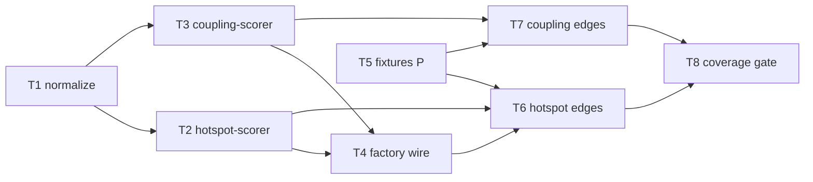

# Milestone 4 — Scoring Tasks

**Design**: [`.specs/features/scoring/design.md`](./design.md)  
**Spec**: [`.specs/features/scoring/spec.md`](./spec.md)  
**Context**: [`.specs/features/scoring/context.md`](./context.md)  
**Status**: Done

---

## Execution Plan

### Phase 1: Core modules (Sequential)

```
T1 → T2, T3 (parallel) → T4
```

### Phase 2: Fixtures (Parallel with Phase 1)

```
T5 [P]  (no code dependency on T1–T4)
```

### Phase 3: Integration and gate (Sequential)

```
T2, T3, T5 → T6 → T7 → T8
```



---

## Task Breakdown

### T1: Log-scale normalization module

**What**: Implement `normalizeLogMinMax(values: number[])` — apply `log1p` then min-max to [0, 1]. Handle empty array, single value, all-equal (degenerate → all 0), and zero inputs.

**Where**: `src/scoring/normalize.ts`, `src/scoring/normalize.test.ts`

**Depends on**: None

**Reuses**: None

**Requirement**: HOTSPOT-29

**Tools**:

- MCP: NONE
- Skill: NONE

**Done when**:

- [x] `normalizeLogMinMax([0, 1, 9])` returns documented expected values (log1p then min-max)
- [x] Single-element array returns `[0]` (degenerate)
- [x] All-equal array returns all zeros
- [x] Empty array returns `[]`
- [x] Zero inputs produce valid normalized output (not NaN)
- [x] Unit tests cover all edge cases above
- [x] Gate check passes: `pnpm build && pnpm test -- src/scoring/normalize.test.ts`

**Tests**: unit (`normalize.test.ts`)

**Gate**: build + test

---

### T2: Hotspot scorer implementation

**What**: Implement `scoreHotspots(fileStats, complexity)` — join by `filePath`, normalize complexity and churn independently via `normalizeLogMinMax`, compute `hotspotScore = complexityNormalized × churnNormalized`, sort desc by score with `filePath` tie-break.

**Where**: `src/scoring/hotspot-scorer.ts`, `src/scoring/hotspot-scorer.test.ts`

**Depends on**: T1

**Reuses**: `normalize.ts`, `HotspotScore`, `ComplexityResult`, `FileChangeStats` from `src/types/`

**Requirement**: HOTSPOT-30, HOTSPOT-31, HOTSPOT-32

**Tools**:

- MCP: NONE
- Skill: NONE

**Done when**:

- [x] One `HotspotScore` per `ComplexityResult` entry
- [x] Missing `fileStats` entry → churn treated as 0
- [x] `hotspotScore` equals product of normalized values
- [x] Results sorted by `hotspotScore` desc, `filePath` asc on tie
- [x] Empty `complexity` array returns `[]`
- [x] Unit tests with fixed inputs assert exact scores and order
- [x] Gate check passes: `pnpm build && pnpm test -- src/scoring/hotspot-scorer.test.ts`

**Tests**: unit (`hotspot-scorer.test.ts`)

**Gate**: build + test

---

### T3: Temporal coupling scorer implementation

**What**: Implement `scoreCoupling(coChangeEvents, fileStats, minCochange)` — aggregate unordered co-change pairs (dedupe within commit), apply `minCochange` threshold, compute `couplingStrength = coChangeCount / min(commitsA, commitsB)`, exclude zero-denominator pairs, sort desc by strength with `fileA` tie-break.

**Where**: `src/scoring/coupling-scorer.ts`, `src/scoring/coupling-scorer.test.ts`

**Depends on**: None (T1 optional — coupling does not use normalization)

**Reuses**: `CouplingPair`, `CoChangeEvent`, `FileChangeStats` from `src/types/`

**Requirement**: HOTSPOT-33, HOTSPOT-34, HOTSPOT-35, HOTSPOT-36

**Tools**:

- MCP: NONE
- Skill: NONE

**Done when**:

- [x] N files in one commit produce C(N, 2) pair increments
- [x] Duplicate paths within same commit deduplicated before pairing
- [x] Canonical pair order: `fileA < fileB` lexicographically
- [x] Pairs with `coChangeCount < minCochange` excluded
- [x] Pairs with `min(commitsA, commitsB) === 0` excluded (no NaN/Infinity)
- [x] Results sorted by `couplingStrength` desc, `fileA` asc on tie
- [x] Unit tests with fixed inputs assert exact strengths and order
- [x] Gate check passes: `pnpm build && pnpm test -- src/scoring/coupling-scorer.test.ts`

**Tests**: unit (`coupling-scorer.test.ts`)

**Gate**: build + test

---

### T4: Scoring factory wiring

**What**: Replace throwing stubs in `createHotspotScorer()` and `createTemporalCouplingScorer()`. Export `DEFAULT_MIN_COCHANGE = 3` and `ScoringDependencies` for test injection. Replace `index.test.ts` stub tests with factory integration tests.

**Where**: `src/scoring/index.ts`, `src/scoring/index.test.ts`

**Depends on**: T2, T3

**Reuses**: `hotspot-scorer.ts`, `coupling-scorer.ts`; existing `HotspotScorer` and `TemporalCouplingScorer` interfaces

**Requirement**: HOTSPOT-30, HOTSPOT-35

**Tools**:

- MCP: NONE
- Skill: NONE

**Done when**:

- [x] `createHotspotScorer().score()` returns scored hotspots without throwing
- [x] `createTemporalCouplingScorer().score()` returns coupling pairs without throwing
- [x] `DEFAULT_MIN_COCHANGE` exported and equals 3
- [x] `ScoringDependencies` allows injecting `scoreHotspots` and `scoreCoupling`
- [x] `index.test.ts` no longer expects "not implemented" / "Milestone 4" throw
- [x] Integration test calls both factories with minimal inline data
- [x] Gate check passes: `pnpm build && pnpm test -- src/scoring/index.test.ts`

**Tests**: integration (`index.test.ts`)

**Gate**: build + test

---

### T5: Scoring fixtures [P]

**What**: Create fixture files with documented expected ranking order: `hotspot-ranking.json` (fileStats + complexity inputs + expected hotspot order) and `coupling-pairs.json` (events + stats + minCochange + expected coupling order).

**Where**: `tests/fixtures/scoring/`

**Depends on**: None

**Reuses**: Existing `tests/fixtures/` directory structure

**Requirement**: HOTSPOT-37

**Tools**:

- MCP: NONE
- Skill: NONE

**Done when**:

- [x] `hotspot-ranking.json` exists with header comment documenting expected file order
- [x] `coupling-pairs.json` exists with header comment documenting expected pair order
- [x] Fixtures cover: varied complexity/churn, missing churn, minCochange boundary, zero-commit denominator, within-commit dedupe
- [x] Each fixture documents provenance and expected values in header or `_comment` field

**Tests**: none (fixture data only)

**Gate**: none

---

### T6: Hotspot edge-case tests

**What**: Add fixture-driven tests for hotspot scoring edge cases: missing churn (0), single file (degenerate normalization), equal scores (tie-break), and full ranking order from T5 fixture.

**Where**: `src/scoring/hotspot-scorer.test.ts` (supplement)

**Depends on**: T2, T5

**Reuses**: `tests/fixtures/scoring/hotspot-ranking.json`

**Requirement**: HOTSPOT-31, HOTSPOT-32, HOTSPOT-37

**Tools**:

- MCP: NONE
- Skill: NONE

**Done when**:

- [x] Fixture-driven test asserts exact hotspot ranking order
- [x] Single-file input → `hotspotScore` 0, normalized values 0
- [x] Missing churn file included with `churnNormalized` from log1p(0) in degenerate or mixed set
- [x] Equal `hotspotScore` tie-break by `filePath` asc verified
- [x] Gate check passes: `pnpm build && pnpm test -- src/scoring/hotspot-scorer.test.ts`

**Tests**: integration (fixture-driven)

**Gate**: build + test

---

### T7: Coupling edge-case tests

**What**: Add fixture-driven tests for coupling edge cases: minCochange boundary at 2/3/4, zero-commit denominator exclusion, within-commit path dedupe, and full ranking order from T5 fixture.

**Where**: `src/scoring/coupling-scorer.test.ts` (supplement)

**Depends on**: T3, T5

**Reuses**: `tests/fixtures/scoring/coupling-pairs.json`

**Requirement**: HOTSPOT-35, HOTSPOT-36, HOTSPOT-37

**Tools**:

- MCP: NONE
- Skill: NONE

**Done when**:

- [x] Fixture-driven test asserts exact coupling pair order with `DEFAULT_MIN_COCHANGE`
- [x] Boundary: count 2 excluded, count 3 included when `minCochange=3`
- [x] Zero-commit file pair excluded from output
- [x] Duplicate paths in one commit do not double-count pairs
- [x] Equal `couplingStrength` tie-break by `fileA` asc verified
- [x] Gate check passes: `pnpm build && pnpm test -- src/scoring/coupling-scorer.test.ts`

**Tests**: integration (fixture-driven)

**Gate**: build + test

---

### T8: Coverage gate and docs sync

**What**: Verify `src/scoring/**` ≥80% line coverage; run full project gate; update ROADMAP M4 checkboxes; update STRUCTURE.md module map for `src/scoring/` from `stub` to `implemented`.

**Where**: `vitest.config.ts` (if threshold config needed), `.specs/project/ROADMAP.md`, `.specs/codebase/STRUCTURE.md`

**Depends on**: T1–T7

**Reuses**: TESTING.md coverage rules

**Requirement**: HOTSPOT-38

**Tools**:

- MCP: NONE
- Skill: `verifier-quality-gates` (optional)

**Done when**:

- [x] `src/scoring/**` line coverage ≥80%
- [x] Gate check passes: `pnpm build && pnpm test`
- [x] ROADMAP M4 items checked or linked to completed spec
- [x] STRUCTURE.md reflects `src/scoring/` as implemented
- [x] No regressions in existing tests (`src/git/**`, `src/complexity/**`, `src/scan.test.ts`, etc.)

**Tests**: project gate + coverage report

**Gate**: full (`pnpm build && pnpm test`)

**Commit**: `feat(scoring): implement hotspot and coupling scorers (M4)`

---

## Parallel Execution Map

```
Phase 1 (Sequential):
  T1 ──→ T2 [P with T3 after T1]
  T1 ──→ T3

Phase 2 (Parallel — no code deps):
  T5 [P]  (can start immediately)

Phase 3 (Sequential):
  T2 + T5 ──→ T6
  T3 + T5 ──→ T7
  T4 ──→ T6 (factory available)
  T6 + T7 ──→ T8
```

**Note:** T5 can run in parallel with T1–T4. T6 needs T2 + T5. T7 needs T3 + T5. T4 can complete before T6/T7 but T6/T7 do not require T4.

---

## Task Granularity Check

| Task | Scope | Status |
| ---- | ----- | ------ |
| T1: normalize | 1 module (`normalize.ts`) | ✅ Granular |
| T2: hotspot-scorer | 1 module (`hotspot-scorer.ts`) | ✅ Granular |
| T3: coupling-scorer | 1 module (`coupling-scorer.ts`) | ✅ Granular |
| T4: factory wire | 1 file (`index.ts`) | ✅ Granular |
| T5: Fixtures | `tests/fixtures/scoring/` data files | ✅ Granular |
| T6: Hotspot edge tests | test supplement | ✅ Granular |
| T7: Coupling edge tests | test supplement | ✅ Granular |
| T8: Coverage + docs | verification + docs | ✅ Granular |

---

## Diagram-Definition Cross-Check

| Task | Depends On (task body) | Diagram Shows | Status |
| ---- | ---------------------- | ------------- | ------ |
| T1 | None | Entry node | ✅ Match |
| T2 | T1 | T1 → T2 | ✅ Match |
| T3 | None | T1 → T3 (optional) | ✅ Match |
| T4 | T2, T3 | T2+T3 → T4 | ✅ Match |
| T5 | None | Parallel node | ✅ Match |
| T6 | T2, T5 | T2+T5 → T6 | ✅ Match |
| T7 | T3, T5 | T3+T5 → T7 | ✅ Match |
| T8 | T1–T7 | T6+T7 → T8 | ✅ Match |

---

## Test Co-location Validation

| Task | Code Layer Created/Modified | Matrix Requires | Task Says | Status |
| ---- | --------------------------- | --------------- | --------- | ------ |
| T1: normalize | `src/scoring/normalize.ts` | unit ≥80% | unit (`normalize.test.ts`) | ✅ OK |
| T2: hotspot-scorer | `src/scoring/hotspot-scorer.ts` | unit ≥80% | unit (`hotspot-scorer.test.ts`) | ✅ OK |
| T3: coupling-scorer | `src/scoring/coupling-scorer.ts` | unit ≥80% | unit (`coupling-scorer.test.ts`) | ✅ OK |
| T4: factory wire | `src/scoring/index.ts` | unit ≥80% | integration (`index.test.ts`) | ✅ OK |
| T5: Fixtures | `tests/fixtures/scoring/` | none | none | ✅ OK |
| T6: Hotspot edges | `src/scoring/hotspot-scorer.test.ts` | unit ≥80% | integration | ✅ OK |
| T7: Coupling edges | `src/scoring/coupling-scorer.test.ts` | unit ≥80% | integration | ✅ OK |
| T8: Coverage gate | docs + config | project gate | full gate | ✅ OK |

---

## Requirement → Task Mapping

| Requirement | Task(s) |
| ----------- | ------- |
| HOTSPOT-29 | T1 |
| HOTSPOT-30 | T2, T4 |
| HOTSPOT-31 | T2, T6 |
| HOTSPOT-32 | T2, T6 |
| HOTSPOT-33 | T3, T7 |
| HOTSPOT-34 | T3, T7 |
| HOTSPOT-35 | T3, T4, T7 |
| HOTSPOT-36 | T3, T7 |
| HOTSPOT-37 | T5, T6, T7 |
| HOTSPOT-38 | T8 |

**Coverage:** 10 requirements, 10 mapped, 0 unmapped

---

## Module Owner Routing

| Task | Primary owner module |
| ---- | -------------------- |
| T1 | `src/scoring/normalize.ts` |
| T2 | `src/scoring/hotspot-scorer.ts` |
| T3 | `src/scoring/coupling-scorer.ts` |
| T4 | `src/scoring/index.ts` |
| T5 | `tests/fixtures/scoring/` |
| T6 | `src/scoring/hotspot-scorer.test.ts` |
| T7 | `src/scoring/coupling-scorer.test.ts` |
| T8 | project docs + vitest config |

**Path conflict check:** Each production file owned by exactly one task (T1–T4). ✅ No conflicts.

---

## Out of Scope Reminder

- Do **not** modify `src/scan.ts` in M4
- Do **not** add CLI flags in `bin/hotspot-scanner.ts` (M5)
- Do **not** implement Reporter output (M5)
- Do **not** import from `src/git/` or `src/complexity/` inside `src/scoring/` — scorers receive typed inputs only
