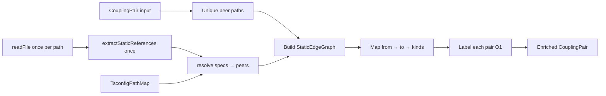

# Milestone 33 — Static Enrich Graph Cache Design

**Spec**: [`.specs/features/static-enrich-cache/spec.md`](./spec.md)  
**Status**: Done  
**Sister designs**: [enriched-coupling (M14)](../enriched-coupling/design.md), [coupling-enrichment (M27)](../coupling-enrichment/design.md)

---

## Architecture Overview

M33 is a **performance refactor** of the post-score static enricher. Public API, field semantics, resolution rules (relative + `TsconfigPathMap`), and ranking stay identical. The change replaces per-pair `read → extract → resolve-against-peer` with a single **peer-scoped directed edge graph** built once per `enrichCouplingStaticDeps` call, then O(1) labeling.



**Baseline code:** `src/scoring/enrich-coupling-static.ts`, `src/scoring/tsconfig-path-map.ts`  
**Hard boundaries:** no `package.json` exports; no ts-morph in scoring; no ranking formula edits; no schema/reporter changes.

---

## Code Reuse Analysis

### Existing Components to Leverage

| Component | Location | How to Use |
| --------- | -------- | ---------- |
| `enrichCouplingStaticDeps` | `src/scoring/enrich-coupling-static.ts` | Keep export signature; replace internal loop |
| `extractStaticReferences` | same file | Reuse as single parse step per file |
| `buildResolutionCandidates` / `resolutionBases` / `resolvesToPeer` | same file | Reuse resolution; lift into graph build |
| `aggregateEdgeKinds` / `computeDirection` | same file | Reuse for pair labeling from cached edges |
| `TsconfigPathMap` | `src/scoring/tsconfig-path-map.ts` | Unchanged; already caches configs per pass |
| Existing unit suite | `src/scoring/enrich-coupling-static.test.ts` | Keep as equivalence oracle; add read-once tests |
| `runScan` wiring | `src/scan.ts` | **No change** — already calls enricher |

### Integration Points

| Consumer | Impact |
| -------- | ------ |
| `src/scoring/enrich-coupling-static.ts` | Primary owner — graph build + label |
| Optional sibling `src/scoring/static-edge-graph.ts` | Only if file size warrants split; same module domain |
| `src/scoring/tsconfig-path-map.ts` | Untouched unless shared normalize helper export needed |
| Reporters / schemas / compare | None |
| ARCHITECTURE / CONCERNS | Document per-pass cache |

### Fragile areas (CONCERNS.md)

| Area | Mitigation |
| ---- | ---------- |
| Scoring formulas / ranking | Do not touch `coupling-scorer`; enrich metadata only |
| False negatives (paths / exports) | Do not “fix” resolution; same miss rules; exports stay deferred |
| Renamed-unlinked → false | Document only; no PathAliasMap in scoring |
| ts-morph boundary | Regex extract only |
| Perf RT-001 | This milestone — reduce redundant I/O/CPU in enrich |

---

## Components

### Peer set

- **Purpose**: Unique repo-relative paths appearing as `fileA` or `fileB` in the input pairs
- **Location**: Internal to enricher (or graph builder)
- **Interfaces**: `collectPeerPaths(pairs: CouplingPair[]): Set<string>` (illustrative)
- **Dependencies**: None
- **Reuses**: `normalizeRepoPath`

### StaticEdgeGraph (new internal)

- **Purpose**: Directed adjacency among peers with aggregated kind flags per edge
- **Location**: Prefer keep in `enrich-coupling-static.ts`; extract `src/scoring/static-edge-graph.ts` only if the file becomes hard to navigate
- **Interfaces** (illustrative):

```typescript
interface EdgeKinds {
  hasRuntimeStaticDependency: boolean;
  hasTypeOnlyStaticDependency: boolean;
  hasReExportStaticDependency: boolean;
}

/** fromRepoRelative → toRepoRelative → kinds (OR-aggregated if multiple specs) */
type StaticEdgeGraph = Map<string, Map<string, EdgeKinds>>;

function buildStaticEdgeGraph(
  peerPaths: ReadonlySet<string>,
  repoPath: string,
  pathMap: TsconfigPathMap,
): StaticEdgeGraph;

function getEdge(
  graph: StaticEdgeGraph,
  from: string,
  to: string,
): EdgeKinds | undefined;
```

- **Build algorithm**:
  1. For each `from` in `peerPaths` that is a supported source extension:
     - `readSourceSafe` once; if null, skip (no outbound edges)
     - `extractStaticReferences(source)` once
     - For each reference, resolve via existing relative / alias bases + `buildResolutionCandidates`
     - If a candidate equals some `to ∈ peerPaths` and `existsSync(repoPath/to)`, OR kind flags into `graph[from][to]`
  2. Do **not** index edges to paths outside the peer set (YAGNI for pair labeling)
- **Dependencies**: `TsconfigPathMap`, existing resolve helpers, `node:fs`
- **Reuses**: M27 resolution semantics exactly
- **Does not**: parse package exports; persist across scans; use ts-morph

### enrichCouplingStaticDeps (refactor)

- **Purpose**: Public enrich entry — build graph once, map pairs to labeled copies
- **Location**: `src/scoring/enrich-coupling-static.ts`
- **Interfaces**: Unchanged — `enrichCouplingStaticDeps(pairs, repoPath): CouplingPair[]`
- **Label algorithm** (per pair):
  - `aToB = getEdge(graph, fileA, fileB)`
  - `bToA = getEdge(graph, fileB, fileA)`
  - OR kinds across both directions for pair-level flags (same as concatenating edge lists today)
  - `hasStaticDependency` from runtime ∨ type-only
  - `staticDependencyDirection` from presence of aToB / bToA
  - Preserve `fileA`, `fileB`, `coChangeCount`, `couplingStrength`
- **Dependencies**: graph builder, `TsconfigPathMap`
- **Reuses**: `aggregateEdgeKinds` / `computeDirection` (adapt to EdgeKinds if needed)

### Tests

- **Location**: `src/scoring/enrich-coupling-static.test.ts` (+ optional `static-edge-graph.test.ts` if extracted)
- **Cases**:
  - Existing relative / alias / direction / kind cases (equivalence)
  - Empty pairs → `[]`
  - Hub + N leaves: assert `readFileSync` call count for hub === 1 (spy via `node:fs` mock or injectable reader — prefer minimal DI of `readSource` only if spy is brittle)
  - Mixed kinds still OR correctly when edges come from cache

---

## Data Models

### Cached edge kinds

Same boolean triad as today’s structured references, aggregated per directed peer edge:

| Flag | Meaning |
| ---- | ------- |
| `hasRuntimeStaticDependency` | Any non-type-only edge from→to |
| `hasTypeOnlyStaticDependency` | Any type-only edge from→to |
| `hasReExportStaticDependency` | Any re-export edge from→to |

Pair-level fields remain the five public static fields on `CouplingPair` (unchanged contract).

---

## Error Handling Strategy

| Error Scenario | Handling | User Impact |
| -------------- | -------- | ----------- |
| Missing / unreadable source | Skip outbound edges for that path | Same as M14/M27 — no edge from that side |
| Unresolved alias / bare package | No edge | Unchanged |
| `existsSync` false for candidates | No edge | Unchanged |
| Empty pairs | Return `[]` early | Unchanged |

No new warnings; optional `onWarning` not introduced here.

---

## Complexity / Complexity class

| Phase | Pre-M33 (typical) | Post-M33 |
| ----- | ----------------- | -------- |
| Reads | O(pairs) file opens (often 2× pairs) | O(unique peers) |
| Regex extract | O(pairs) | O(unique peers) |
| Resolve loops | O(pairs × refs) | O(peers × refs) with peer-set membership checks |
| Pair label | O(refs) per pair | O(1) map lookup per direction |

Worst case still O(peers × refs × candidates) for resolution — intentional; win is eliminating repeated work when files repeat across pairs.

---

## Tech Decisions

| Decision | Choice | Rationale |
| -------- | ------ | --------- |
| Cache scope | Peer set only (paths in input pairs) | Sufficient for labeling; avoids full-repo walk |
| Storage | In-memory `Map` per enrich call | No disk cache; scan-local |
| Module split | Prefer single file; optional sibling | YAGNI until file size hurts |
| Public API | Unchanged signature | No CLI/config surface |
| Equivalence proof | Keep existing tests + read-count test | Safer than rewriting oracles |
| package.json exports | Still deferred | Locked ROADMAP / CONCERNS |
| Injectable fs | Spy `fs.readFileSync` in tests first; DI only if needed | Minimal surface |

---

## Risks

| Risk | Mitigation |
| ---- | ---------- |
| Subtle kind/direction drift vs M27 | Do not change extract/resolve helpers’ semantics; reuse aggregation; keep suite green |
| Peer-set membership misses edge that old code found | Old code only matched the pair’s peer path — same constraint |
| `existsSync` still hot in resolve | Accept for M33; further candidate caching is out of scope unless trivial |
| Over-engineering graph module | Keep internal; no new exports from package public API |

---

## Testing Strategy

| Layer | What |
| ----- | ---- |
| Unit | Graph build + enrich labeling; read-once spy; existing enrich cases |
| Integration | Not required for API change (none); optional `small-ts` smoke only if desired in final gate |
| Contract / schema | None |
| Gate | Per-task targeted Vitest on scoring enrich tests; final `pnpm build && pnpm test` |
