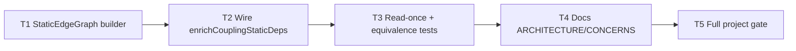

# Milestone 33 — Static Enrich Graph Cache Tasks

**Design**: [`.specs/features/static-enrich-cache/design.md`](./design.md)  
**Spec**: [`.specs/features/static-enrich-cache/spec.md`](./spec.md)  
**Status**: Done  
**Module owner**: `src/scoring/` (`enrich-coupling-static` + tests)

---

## Execution Plan

### Phase 1: Graph builder (Sequential)

```
T1 → T2
```

### Phase 2: Wire enrich + equivalence (Sequential)

```
T2 → T3
```

### Phase 3: Docs + full gate (Sequential)

```
T3 → T4 → T5
```



### Diagram-Definition Cross-Check

| Task | Depends on (declared) | Diagram shows | Match |
| ---- | --------------------- | ------------- | ----- |
| T1 | None | Root | ✅ |
| T2 | T1 | T1 → T2 | ✅ |
| T3 | T2 | T2 → T3 | ✅ |
| T4 | T3 | T3 → T4 | ✅ |
| T5 | T4 | T4 → T5 | ✅ |

### Test Co-location Validation

| Task | Code layer | TESTING.md expectation | Task Tests field | Match |
| ---- | ---------- | ---------------------- | ---------------- | ----- |
| T1 | `src/scoring/` enrich/graph | Unit | unit | ✅ |
| T2 | `src/scoring/enrich-coupling-static.ts` | Unit | unit | ✅ |
| T3 | `src/scoring/*.test.ts` | Unit | unit | ✅ |
| T4 | `.specs/codebase/` docs | none | none | ✅ |
| T5 | project gate | full gate | full (`pnpm build && pnpm test`) | ✅ |

### Path Conflict Check

| Task | Primary paths | Conflict with parallel peers | Notes |
| ---- | ------------- | ---------------------------- | ----- |
| T1 | `enrich-coupling-static.ts` (+ optional `static-edge-graph.ts`) | — | Sole Phase 1 owner |
| T2 | same scoring files | sequential after T1 | Same module — no `[P]` |
| T3 | `enrich-coupling-static.test.ts` | sequential after T2 | May extend T1/T2 tests |
| T4 | ARCHITECTURE.md, CONCERNS.md | after T3 | Docs only |
| T5 | — | after T4 | Gate only |

**Parallelism:** No `[P]` tasks — all touch the same scoring enrich module or depend on prior verification.

### Requirement → Task Mapping

| Requirement ID | Task(s) |
| -------------- | ------- |
| HOTSPOT-340 | T1, T3 |
| HOTSPOT-341 | T1, T2 |
| HOTSPOT-342 | T2 |
| HOTSPOT-343 | T2, T3 |
| HOTSPOT-344 | T2, T3 |
| HOTSPOT-345 | T2, T4 |
| HOTSPOT-346 | T2 |
| HOTSPOT-347 | T2, T3 |
| HOTSPOT-348 | T2, T3 |
| HOTSPOT-351 | T4 |

---

## Task Breakdown

### T1: Build peer-scoped StaticEdgeGraph

**What**: Introduce an internal graph builder that, given the unique peer paths from coupling pairs, reads each supported source at most once, extracts static references once, resolves relative/alias specs with existing helpers + `TsconfigPathMap`, and records directed edges only to other peers (OR-aggregating kind flags).

**Where**: `src/scoring/enrich-coupling-static.ts` (preferred) or new `src/scoring/static-edge-graph.ts` if split for clarity — **do not** change package public exports beyond existing enrich API.

**Depends on**: None

**Reuses**: `extractStaticReferences`, `resolutionBases`, `buildResolutionCandidates`, `TsconfigPathMap`, `normalizeRepoPath`, `readSourceSafe` / `isSourceFile`

**Requirement**: HOTSPOT-340, HOTSPOT-341

**Tools**:

- MCP: NONE
- Skill: `vitals-pipeline-domain`, `coding-guidelines`, `task-implementer`

**Done when**:

- [x] `buildStaticEdgeGraph(peerPaths, repoPath, pathMap)` (name flexible) exists and returns a directed adjacency structure with kind flags
- [x] Edges only target paths in the peer set that exist on disk under M27 resolution rules
- [x] Unit tests cover: one-way edge, both directions, type-only vs runtime vs re-export OR, missing file → no outbound edges, alias + relative hits
- [x] Gate check passes: `pnpm test -- src/scoring/enrich-coupling-static.test.ts` (and sibling test file if created)
- [x] Test count: no silent deletions of existing enrich cases

**Tests**: unit  
**Gate**: `pnpm test -- src/scoring/enrich-coupling-static.test.ts`

**Verify**:

```bash
pnpm test -- src/scoring/enrich-coupling-static.test.ts
```

---

### T2: Wire enrichCouplingStaticDeps to O(1) label from graph

**What**: Refactor `enrichCouplingStaticDeps` to collect the peer set, build the graph once, and label each pair via adjacency lookup (direction + aggregated kinds). Preserve input ranking fields and public field semantics. Remove per-pair `collectEdgesToPeer` re-read path (or leave unused helpers only if still needed by tests — prefer delete dead per-pair read path).

**Where**: `src/scoring/enrich-coupling-static.ts`

**Depends on**: T1

**Reuses**: `aggregateEdgeKinds` / `computeDirection` (adapt as needed), T1 graph, `TsconfigPathMap`

**Requirement**: HOTSPOT-341, HOTSPOT-342, HOTSPOT-343, HOTSPOT-344, HOTSPOT-345, HOTSPOT-346, HOTSPOT-347, HOTSPOT-348

**Tools**:

- MCP: NONE
- Skill: `vitals-pipeline-domain`, `coding-guidelines`, `task-implementer`

**Done when**:

- [x] `enrichCouplingStaticDeps(pairs, repoPath)` still exported with the same signature
- [x] Empty `pairs` → `[]` without building a graph / reading sources
- [x] Pair labeling uses graph lookup (no re-extract of peer source per pair)
- [x] Existing semantic tests remain green (relative, alias, direction, kinds, invariants)
- [x] No `ts-morph` import under `src/scoring/`
- [x] No `package.json` exports/imports resolution added
- [x] `couplingStrength` / `coChangeCount` / pair order preserved from input
- [x] Gate check passes: `pnpm test -- src/scoring/enrich-coupling-static.test.ts`

**Tests**: unit  
**Gate**: `pnpm test -- src/scoring/enrich-coupling-static.test.ts`

**Verify**:

```bash
pnpm test -- src/scoring/enrich-coupling-static.test.ts
# optional: rg "ts-morph" src/scoring || true  → no matches
```

**Commit** (propose only): `perf(scoring): cache static enrich edges per pass`

---

### T3: Read-once regression + equivalence hardening

**What**: Add explicit tests that a hub file appearing in many pairs is read at most once per enrich call, and strengthen equivalence coverage so M33 cannot regress M14/M27 labels.

**Where**: `src/scoring/enrich-coupling-static.test.ts` (and graph test file if present)

**Depends on**: T2

**Reuses**: Existing temp-repo helpers in the enrich test file; `vi.spyOn` on `node:fs` `readFileSync` or an injectable reader if introduced in T1/T2

**Requirement**: HOTSPOT-340, HOTSPOT-343, HOTSPOT-344, HOTSPOT-347, HOTSPOT-348

**Tools**:

- MCP: NONE
- Skill: `coding-guidelines`, `task-implementer`

**Done when**:

- [x] Test: hub + ≥5 leaf pairs → hub path `readFileSync` count === 1 (or equivalent injectable counter)
- [x] Test: empty pairs → no source reads
- [x] Existing direction/kind/alias cases still assert invariants via `assertCouplingInvariants` (or equivalent)
- [x] Gate check passes: `pnpm test -- src/scoring/enrich-coupling-static.test.ts`

**Tests**: unit  
**Gate**: `pnpm test -- src/scoring/enrich-coupling-static.test.ts`

**Verify**:

```bash
pnpm test -- src/scoring/enrich-coupling-static.test.ts
```

---

### T4: Document per-pass enrich cache in SoT docs

**What**: Update ARCHITECTURE § Enriched coupling and CONCERNS enriched-coupling / performance notes to describe the in-memory peer-scoped edge cache (one read/parse per file; O(1) pair lookup). Reaffirm `package.json` exports/imports remain deferred. Do **not** edit ROADMAP.md or STATE.md in Execute unless the user asks (planning deferred sync).

**Where**: `.specs/codebase/ARCHITECTURE.md`, `.specs/codebase/CONCERNS.md` (optional one-line STRUCTURE.md if module split added a new file)

**Depends on**: T3

**Reuses**: Existing enriched-coupling sections from M14/M27 wording

**Requirement**: HOTSPOT-345, HOTSPOT-351

**Tools**:

- MCP: NONE
- Skill: NONE

**Done when**:

- [x] ARCHITECTURE states enrich builds a per-call edge cache / one read-parse per peer file / O(1) labeling
- [x] CONCERNS notes M33 mitigation for repeated enrich I/O (or links to ARCHITECTURE)
- [x] Deferred exports/imports still called out as deferred
- [x] No application code changes in this task

**Tests**: none  
**Gate**: none (docs-only; verified in T5)

**Verify**: Manual doc review of the two SoT sections.

---

### T5: Full project quality gate

**What**: Run the mandatory project gate and confirm enrich + broader suite are green after M33.

**Where**: repo root (no code changes expected)

**Depends on**: T4

**Reuses**: [TESTING.md](../../codebase/TESTING.md) quality gate

**Requirement**: (feature Success Criteria — gate)

**Tools**:

- MCP: NONE
- Skill: `vitals-cli-validation` (optional smoke), agent `verifier-quality-gates`

**Done when**:

- [x] `pnpm build && pnpm test` exits 0
- [x] No coverage threshold regressions on `src/scoring/enrich-coupling-static.ts` (and sibling if any)
- [x] Optional smoke: `pnpm exec hotspot-scanner scan tests/fixtures/repos/small-ts --format json` exits 0

**Tests**: full suite  
**Gate**: `pnpm build && pnpm test`

**Verify**:

```bash
pnpm build && pnpm test
```

**Commit** (propose only, if docs+code not yet committed): follow Conventional Commit; do not commit unless user asks.

---

## Parallel Execution Map

```
Phase 1: T1
Phase 2: T2  (after T1)
Phase 3: T3  (after T2)
Phase 4: T4  (after T3)
Phase 5: T5  (after T4)
```

No parallel `[P]` tasks — single module owner (`src/scoring/` enrich path) to avoid path conflicts.

---

## Task Granularity Check

| Task | Scope | Status |
| ---- | ----- | ------ |
| T1 | Graph builder + unit tests | ✅ Granular |
| T2 | Wire public enrich API | ✅ Granular |
| T3 | Read-once / equivalence tests | ✅ Granular |
| T4 | Docs SoT sync | ✅ Granular |
| T5 | Full gate | ✅ Granular |

---

## Handoff

Execute complete (**Status: Done**).

- ROADMAP M33 marked Done; STATE.md updated
- Proposed commit: `perf(scoring): cache static enrich edges per pass`
