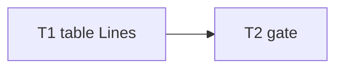

# Milestone 70 — Report Table Lines Parity Tasks

**Spec**: [`.specs/features/table-lines-parity/spec.md`](./spec.md)  
**Status**: Done  
**Note**: Medium-light feature — report table + glossary. STOP at Planned; Execute in a separate session via `orchestrator-implementer` after Status promotion. Prefer Execute after M68–M69. Do **not** implement M68/M69 here.

---

## Execution Plan

### Phase 1: Implementation

```
T1 Lines column + glossary + tests
```

### Phase 2: Gate

```
T1 → T2 project gate
```



### Diagram-Definition Cross-Check

| Task | Depends on (body) | Diagram shows | Status   |
| ---- | ----------------- | ------------- | -------- |
| T1   | None              | Root          | ✅ Match |
| T2   | T1                | T1→T2         | ✅ Match |

### Path Conflict Check (Check 5)

| Task | Module owner | Paths                                                                                                                                                                                                       | Conflict                         |
| ---- | ------------ | ----------------------------------------------------------------------------------------------------------------------------------------------------------------------------------------------------------- | -------------------------------- |
| T1   | report       | `src/report/table.ts`, `table.test.ts`, `glossary.ts`, `glossary.test.ts` (if copy changes); do **not** edit compare-table unless a shared header helper is strictly required (YAGNI — leave compare alone) | Sole report owner for scan table |
| T2   | gate         | none                                                                                                                                                                                                        | After T1                         |

No `[P]`.

### Test Co-location Validation

| Task | Code layer    | TESTING.md expectation | Task Tests                | Status |
| ---- | ------------- | ---------------------- | ------------------------- | ------ |
| T1   | `src/report/` | unit                   | unit                      | ✅ OK  |
| T2   | full project  | gate                   | `pnpm build && pnpm test` | ✅ OK  |

### Granularity Check

| Task | Scope                                   | Status             |
| ---- | --------------------------------------- | ------------------ |
| T1   | Table column + glossary wording + tests | ✅ Cohesive report |
| T2   | Project gate                            | ✅ Granular        |

---

## Task Breakdown

### T1: Add Lines column to scan table (+ glossary)

**What:** Extend `renderHotspotsSection` in `table.ts` with a `Lines` column bound to `linesChanged`, matching markdown column order; update glossary/how-to-read so Lines is not markdown-only; add/adjust unit tests.  
**Where:** `src/report/table.ts`, `src/report/table.test.ts`, `src/report/glossary.ts`, `src/report/glossary.test.ts`  
**Depends on:** None  
**Reuses:** `markdown.ts` header order; existing pad helpers; M60 File width helpers unchanged  
**Requirement:** HOTSPOT-1280, HOTSPOT-1281, HOTSPOT-1282, HOTSPOT-1283  
**Module owner:** `src/report/`

**Tools:**

- MCP: NONE
- Skill: `coding-guidelines`

**Done when:**

- [x] Table header includes `Lines` after `Authors`
- [x] Rows print `hotspot.linesChanged`
- [x] Glossary/how-to-read no longer claim markdown-only for Lines
- [x] Unit tests assert header + sample values
- [x] Gate check passes: `pnpm test -- src/report/table.test.ts src/report/glossary.test.ts`
- [x] Test count: no silent deletions

**Tests:** unit  
**Gate:** `pnpm test -- src/report/table.test.ts src/report/glossary.test.ts`

**Verify:** Render fixture scan table contains Lines column matching known `linesChanged`.

**Commit:** `feat(report): add Lines column to hotspot table`

---

### T2: Project quality gate

**What:** Run full project gate.  
**Where:** repo root  
**Depends on:** T1  
**Reuses:** N/A  
**Requirement:** Success criteria  
**Module owner:** gate

**Done when:**

- [x] `pnpm build && pnpm test` exits 0

**Tests:** full suite  
**Gate:** `pnpm build && pnpm test`

---

## Requirement → Task Mapping

| Requirement ID | Task |
| -------------- | ---- |
| HOTSPOT-1280   | T1   |
| HOTSPOT-1281   | T1   |
| HOTSPOT-1282   | T1   |
| HOTSPOT-1283   | T1   |
