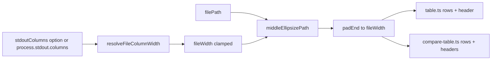

# Milestone 60 — Table Path Column UX Design

**Spec**: [`.specs/features/table-path-column-ux/spec.md`](./spec.md)  
**Context**: [`.specs/features/table-path-column-ux/context.md`](./context.md)  
**Status**: Done

---

## Architecture Overview

Presentation-only change inside `src/report/`. Introduce a small pure helper module used by both `renderTable` and `renderCompareTable`. No pipeline, CLI flag, config, or schema changes.



**Data flow (locked sketch):**

```
stdout.columns or fallback → File column width
filePath → middleEllipsize(path, width) → padEnd → table / compare-table row
```

---

## Code Reuse Analysis

| Component                  | Location                      | How to Use                                                                                                                                     |
| -------------------------- | ----------------------------- | ---------------------------------------------------------------------------------------------------------------------------------------------- |
| Scan table pad helpers     | `src/report/table.ts`         | Keep `padStart` / `padEnd` for numeric/score; **replace** `padEnd(filePath, 24)` with shared File cell helper; make File header dashes dynamic |
| Compare table pads         | `src/report/compare-table.ts` | Same File cell helper for New/Removed/Rank Changed                                                                                             |
| Injectable options pattern | M59 `stderrIsTTY`             | Mirror as `stdoutColumns?: number` on `RenderTableOptions` / `CompareRenderOptions`                                                            |
| `stripAnsi`                | `src/report/color.js`         | File column stays uncolored; no change required unless a future color wraps paths                                                              |

### Fragile / concerns

| Concern                              | Mitigation                                                                                                   |
| ------------------------------------ | ------------------------------------------------------------------------------------------------------------ |
| Wide Unicode / East Asian width      | Paths are repo-relative ASCII-heavy; treat `…` and BMP as width 1; YAGNI grapheme cluster library            |
| Compare rank-changed wider than 80   | Same File width as scan; document acceptance — do not shrink File below scan budget for compare-only columns |
| Existing test expects `slice(0, 24)` | Update `table.test.ts` “truncates long file paths…” to middle-ellipsis assertions                            |
| Header / separator misalignment      | Build File header label/dashes from resolved width in both renderers                                         |

---

## Components and Interfaces

### 1. Shared path column helper

**Location:** `src/report/path-column.ts` (filename Agent's Discretion; keep under `src/report/`)

**Exports (suggested):**

```ts
/** Unicode ellipsis U+2026 — locked. */
export const PATH_ELLIPSIS = "…";

/** Fallback when columns missing / invalid — locked (= today's hard-coded width). */
export const FALLBACK_FILE_COLUMN_WIDTH = 24;

/** Minimum File width after clamp. Recommended: 16. */
export const MIN_FILE_COLUMN_WIDTH = 16;

/** Maximum File width after clamp. Recommended: 64. */
export const MAX_FILE_COLUMN_WIDTH = 64;

/**
 * Fixed non-File budget for scan hotspot row:
 * Rank(4) + Score(8) + NLOC(4) + NLOCN(8) + Churn(5) + ChurnN(6) + Authors(7)
 * + 7 × two-space separators = 56.
 * At columns === 80 → fileWidth = 80 - 56 = 24.
 */
export const SCAN_TABLE_NON_FILE_WIDTH = 56;

export function resolveFileColumnWidth(stdoutColumns?: number): number;

/** Middle-ellipsis; result length === width (caller may pad if shorter paths — prefer exact width out). */
export function formatFileColumn(filePath: string, width: number): string;
```

`formatFileColumn` = `middleEllipsize` then `padEnd` to `width` (truncate never exceeds `width`).

Optional: export `middleEllipsizePath` for unit tests; or test only via `formatFileColumn`.

### 2. Width algorithm (LOCKED)

```ts
function resolveFileColumnWidth(stdoutColumns?: number): number {
  const cols =
    stdoutColumns !== undefined ? stdoutColumns : process.stdout.columns;

  if (cols === undefined || !Number.isFinite(cols) || cols <= 0) {
    return FALLBACK_FILE_COLUMN_WIDTH; // 24
  }

  const budgeted = Math.floor(cols) - SCAN_TABLE_NON_FILE_WIDTH;
  return clamp(budgeted, MIN_FILE_COLUMN_WIDTH, MAX_FILE_COLUMN_WIDTH);
}
```

| `cols`              | Expected `fileWidth`                                    |
| ------------------- | ------------------------------------------------------- |
| undefined / 0 / NaN | 24                                                      |
| 80                  | 24                                                      |
| 100                 | 44 (= 100 − 56)                                         |
| 200                 | 64 (hit max)                                            |
| 50                  | 16 (hit min; row may wrap on tiny terminals — accepted) |

**Compare:** call the same `resolveFileColumnWidth`; do **not** subtract Baseline/Current/Delta from the budget.

### 3. Middle-ellipsis algorithm (LOCKED)

Ellipsis character: **`…`** (`PATH_ELLIPSIS`), length **1**.

Let `width` be the File column width. If `filePath.length <= width`, return `filePath` (then pad).

Otherwise:

1. Let `base` = substring after last `/`, or the whole path if no `/`.
2. **Preferred form** when `1 + 1 + base.length < width` (room for at least one prefix char + `…` + `/` + basename):  
   `head + "…" + "/" + base` where `head.length = width - 2 - base.length` and `head = filePath.slice(0, head.length)`.  
   Example shape: `src/api/v1/…/schema.ts` (head may end mid-segment — OK; do not require segment-aligned trim for v1).
3. **Fallback** when basename is too long to keep a `/` + full basename after ellipsis:  
   emit `…` + tail of `filePath` with `tail.length = width - 1` (basename-biased end), still exact `width`. Never use left-only `slice(0, width)` as the long-path SoT.

**Not allowed:** end-ellipsis-only (`src/foo/ba…`) as the primary strategy; basename-only column.

### 4. Renderer options

```ts
// RenderTableOptions + CompareRenderOptions
stdoutColumns?: number; // injectable; omit → process.stdout.columns
```

Resolve width **once per render** (not per row). Pass `fileWidth` into row loops. Rebuild File header segment:

- Label: `"File"` padded/truncated to `fileWidth`
- Dashes: `"-"`.repeat(fileWidth)

Numeric column widths stay as today (4 / 8 / 4 / 8 / 5 / 6 / 7, etc.).

### 5. Docs

- **ARCHITECTURE.md** — brief note under Reporter / table output: File column uses middle-ellipsis; width from `stdout.columns` with fallback 24 and ~80-col cap.
- **README.md** — only if Output formats → Table claims fixed truncation; add one sentence. Do **not** refresh PNG unless samples show deep truncated paths (fixture paths are short).
- **STRUCTURE.md** — list new helper file if the report tree is enumerated.

---

## Decisions log (design)

| ID  | Decision                   | Rationale                                           |
| --- | -------------------------- | --------------------------------------------------- |
| D1  | Unicode `…`                | Locked; single-cell width; matches progress UX tone |
| D2  | Fallback File width 24     | Preserves today’s pipe/CI layout                    |
| D3  | Cap via `cols - 56`        | At 80 cols → 24; numeric columns remain visible     |
| D4  | Shared helper module       | Scan/compare parity; single SoT for tests           |
| D5  | Injectable `stdoutColumns` | Testability parity with M59 `stderrIsTTY`           |
| D6  | No flags / schema          | Presentation-only                                   |

---

## Risks

| Risk                                   | Likelihood | Impact | Mitigation                                |
| -------------------------------------- | ---------- | ------ | ----------------------------------------- |
| Tiny terminals (cols &lt; 56+min) wrap | Medium     | Low    | Min clamp 16; accepted wrap               |
| `head` mid-segment looks rough         | Low        | Low    | Document; segment-align is YAGNI          |
| Test flake from live `stdout.columns`  | Medium     | Medium | Always inject in unit tests               |
| README sample drift                    | Low        | Low    | Short fixture paths; no forced screenshot |

---

## Testing strategy

| Layer                        | What                                                                                              |
| ---------------------------- | ------------------------------------------------------------------------------------------------- |
| Unit `path-column.test.ts`   | Width table (undefined/80/100/200/50); middle-ellipsis examples; no-slash; basename-too-long; pad |
| Unit `table.test.ts`         | Replace left-truncation assertion; inject `stdoutColumns`; header dash length                     |
| Unit `compare-table.test.ts` | Long path + inject columns; parity with `formatFileColumn`                                        |
| Gate                         | `pnpm build && pnpm test`                                                                         |

No new fixture repo. No CLI flag tests.
