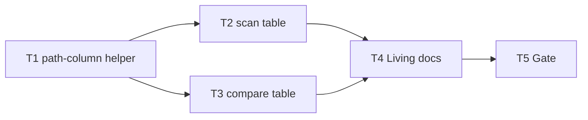

# Milestone 60 — Table Path Column UX Tasks

**Design**: [`.specs/features/table-path-column-ux/design.md`](./design.md)  
**Spec**: [`.specs/features/table-path-column-ux/spec.md`](./spec.md)  
**Context**: [`.specs/features/table-path-column-ux/context.md`](./context.md)  
**Status**: Done  
**Note**: Medium feature — shared helper + scan/compare wiring + docs. Planning session ends here; Execute in a separate session after Status → Approved / Ready for Execute.

---

## Execution Plan

### Phase 1: Shared helper (foundation)

```
T1 path-column helper + unit tests
```

### Phase 2: Wire renderers (parallel OK)

```
T1 → T2 scan table
T1 → T3 compare table
```

### Phase 3: Docs + gate

```
T2 + T3 → T4 living docs → T5 project gate
```



### Diagram-Definition Cross-Check

| Task | Depends on (declared) | Diagram shows | Match |
| ---- | --------------------- | ------------- | ----- |
| T1   | None                  | Root          | ✅    |
| T2   | T1                    | T1 → T2       | ✅    |
| T3   | T1                    | T1 → T3       | ✅    |
| T4   | T2, T3                | T2+T3 → T4    | ✅    |
| T5   | T4                    | T4 → T5       | ✅    |

### Path Conflict Check (Check 5)

| Task | Module owner           | Paths                                                                                                          | Conflict                                      |
| ---- | ---------------------- | -------------------------------------------------------------------------------------------------------------- | --------------------------------------------- |
| T1   | report (helper)        | `src/report/path-column.ts`, `src/report/path-column.test.ts`                                                  | Sole owner of new helper                      |
| T2   | report (scan table)    | `src/report/table.ts`, `src/report/table.test.ts`                                                              | Disjoint from T3 files; after T1              |
| T3   | report (compare table) | `src/report/compare-table.ts`, `src/report/compare-table.test.ts`                                              | Disjoint from T2; after T1 — `[P]` OK with T2 |
| T4   | docs                   | `README.md`, `.specs/codebase/ARCHITECTURE.md`, optionally `STRUCTURE.md`; Execute may tick ROADMAP/STATE Done | After T2+T3; no src overlap                   |
| T5   | gate                   | none (verify)                                                                                                  | After T4                                      |

T2 and T3 may run in parallel after T1 (`[P]` on T3).

### Test Co-location Validation

| Task | Code layer                    | TESTING.md expectation | Task says                 | Match |
| ---- | ----------------------------- | ---------------------- | ------------------------- | ----- |
| T1   | `src/report/` helper          | Unit                   | unit in same task         | ✅    |
| T2   | `src/report/table.ts`         | Unit                   | unit in same task         | ✅    |
| T3   | `src/report/compare-table.ts` | Unit                   | unit in same task         | ✅    |
| T4   | Docs                          | none                   | none                      | ✅    |
| T5   | Full project                  | Gate                   | `pnpm build && pnpm test` | ✅    |

### Granularity Check

| Task | Scope                                    | Status           |
| ---- | ---------------------------------------- | ---------------- |
| T1   | Width + middle-ellipsis helper + tests   | ✅ Atomic module |
| T2   | Wire scan table + update truncation test | ✅ One renderer  |
| T3   | Wire compare table + tests               | ✅ One renderer  |
| T4   | Living docs                              | ✅ Granular      |
| T5   | Project gate                             | ✅ Granular      |

### Requirement → Task Mapping

| Requirement ID                                                               | Task              |
| ---------------------------------------------------------------------------- | ----------------- |
| HOTSPOT-991, HOTSPOT-992, HOTSPOT-993, HOTSPOT-995, HOTSPOT-997, HOTSPOT-998 | T1                |
| HOTSPOT-990, HOTSPOT-996 (scan), HOTSPOT-999 (no surface — verify)           | T2                |
| HOTSPOT-994, HOTSPOT-996 (compare), HOTSPOT-999 (parity / no surface)        | T3                |
| HOTSPOT-1000                                                                 | T4                |
| (gate)                                                                       | T5                |
| HOTSPOT-1001–1009                                                            | Reserved — unused |

---

## Task Breakdown

### T1: Shared path-column helper

**What**: Add `src/report/path-column.ts` implementing `resolveFileColumnWidth` and `formatFileColumn` (middle-ellipsis with Unicode `…`, then padEnd to width) per [design.md](./design.md). Export constants (`FALLBACK_FILE_COLUMN_WIDTH = 24`, `SCAN_TABLE_NON_FILE_WIDTH = 56`, min/max, `PATH_ELLIPSIS`). Co-locate unit tests covering: missing/invalid columns → 24; `80` → 24; larger cols up to max; small cols → min; preferred `head…/basename` form; no-slash path; basename-too-long fallback; exact-width output.

**Where**: `src/report/path-column.ts`; `src/report/path-column.test.ts`

**Depends on**: None

**Reuses**: Design width/ellipsis algorithms; M59 injectable-options testing style (pure functions — no process mutation required if columns passed in)

**Done when**:

- [x] `resolveFileColumnWidth` matches design table (fallback 24, 80→24, clamp min/max)
- [x] `formatFileColumn` uses Unicode `…`; keeps prefix + basename when room; never exceeds width
- [x] Edge cases HOTSPOT-997 covered by unit tests
- [x] No CLI/config/schema edits

**Tests**: unit in `src/report/path-column.test.ts` (same task)

**Gate**: `pnpm exec vitest run src/report/path-column.test.ts` — PASS

**Requirements**: HOTSPOT-991, HOTSPOT-992, HOTSPOT-993, HOTSPOT-995, HOTSPOT-997, HOTSPOT-998

**Tools**:

- MCP: NONE
- Skill: `coding-guidelines`, `vitals-pipeline-domain` (report purity)

---

### T2: Wire scan table + update truncation tests

**What**: Add optional `stdoutColumns?: number` to `RenderTableOptions`. Resolve File width once per `renderTable`. Replace hard-coded `padEnd(hotspot.filePath, 24)` with `formatFileColumn`. Make File header label/dashes match resolved width. Update `table.test.ts` — replace left-`slice(0, 24)` assertion with middle-ellipsis expectations; inject `stdoutColumns` so tests do not depend on the live TTY. Do not change markdown/json/csv.

**Where**: `src/report/table.ts`; `src/report/table.test.ts`

**Depends on**: T1

**Reuses**: `formatFileColumn`, `resolveFileColumnWidth` from T1; existing `padStart` for numeric columns

**Done when**:

- [x] Long paths show `…` + basename within File width (not left truncation SoT)
- [x] Short paths unchanged (full path + pad)
- [x] Headers/dashes align to File width
- [x] Injectable `stdoutColumns` used in tests
- [x] No new flags

**Tests**: unit in `src/report/table.test.ts` (same task)

**Gate**: `pnpm exec vitest run src/report/table.test.ts` — PASS

**Requirements**: HOTSPOT-990, HOTSPOT-996, HOTSPOT-999

**Tools**:

- MCP: NONE
- Skill: `coding-guidelines`

---

### T3: Wire compare table + parity tests [P]

**What**: Add optional `stdoutColumns?: number` to `CompareRenderOptions`. Use the same helper for New / Removed / Rank Changed File cells and matching File header segments. Add/extend `compare-table.test.ts` for long-path middle-ellipsis with injected columns; assert same `formatFileColumn` result as scan would for the same path/width.

**Where**: `src/report/compare-table.ts`; `src/report/compare-table.test.ts`

**Depends on**: T1

**Reuses**: T1 helper; existing compare section structure

**Done when**:

- [x] All compare hotspot File cells use shared helper
- [x] Headers match File width
- [x] Unit coverage for long paths + injection
- [x] No schema/flag changes

**Tests**: unit in `src/report/compare-table.test.ts` (same task)

**Gate**: `pnpm exec vitest run src/report/compare-table.test.ts` — PASS

**Requirements**: HOTSPOT-994, HOTSPOT-996, HOTSPOT-999

**Tools**:

- MCP: NONE
- Skill: `coding-guidelines`

---

### T4: Living docs

**What**: Document that default table/compare-table File columns use **middle-ellipsis** and width derived from `process.stdout.columns` (fallback **24**, capped so ~80-col scan layout still fits numeric columns). Update ARCHITECTURE reporter/table notes; README only if it implies fixed left-truncation or fixed 24 forever. Touch STRUCTURE if report file list is enumerated. On Execute Done, tick ROADMAP M60 checkboxes and STATE Active/decision row (planner already added Planned milestone). Do **not** invent `--full-paths` or config keys.

**Where**: `.specs/codebase/ARCHITECTURE.md`, optionally `README.md`, optionally `.specs/codebase/STRUCTURE.md` (+ ROADMAP/STATE Done sync at Execute completion)

**Depends on**: T2, T3

**Reuses**: M59 docs tone for presentation-only UX

**Done when**:

- [x] ARCHITECTURE describes middle-ellipsis + columns/fallback accurately
- [x] README updated only if needed; no invented flags
- [x] STRUCTURE lists helper if applicable

**Tests**: none (docs)

**Gate**: none beyond review (full gate in T5)

**Requirements**: HOTSPOT-1000

**Tools**:

- MCP: NONE
- Skill: NONE

---

### T5: Project quality gate

**What**: Run the required project gate and confirm green. Do not mark feature Done until this passes.

**Where**: repo root (no source edits unless gate surfaces a fix owned by T1–T4 — then fix in the owning task and re-run)

**Depends on**: T4

**Reuses**: quality-gates rule / `verifier-quality-gates`

**Done when**:

- [x] `pnpm build && pnpm test` PASS
- [x] tasks.md Status → Done (Execute session); ROADMAP M60 marked Done

**Tests**: full suite via gate

**Gate**: `pnpm build && pnpm test` — PASS

**Requirements**: (verification only)

**Tools**:

- MCP: NONE
- Skill: NONE
- Agent (Execute session): `verifier-quality-gates`

---

## Parallelism notes

- T3 `[P]` with T2 after T1 (disjoint files under `src/report/`).
- T4 waits for both T2 and T3.
- No bin / scan.ts tasks.

---

## Handoff

Planning complete. Next: review artifacts, promote **Status** to `Approved` or `Ready for Execute`, open a **new** development session, invoke `orchestrator-implementer`. Expected final gate: `pnpm build && pnpm test`.
