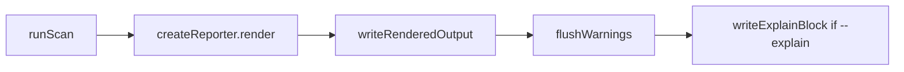

# Milestone 73 — Top-only Summary Rollups Design

**Spec**: [`.specs/features/top-only-rollups/spec.md`](./spec.md)  
**Context**: [`.specs/features/top-only-rollups/context.md`](./context.md)  
**Status**: Specs Planned

---

## Overview

Presentation-only change on the scan CLI lifecycle. Remove the M68 pre-write warning teaser and the M62 brief stderr timing echo. Executive summary and post-write `flushWarnings` stay. No pipeline, schema, or ranking changes.

---

## Components

| Component               | Path                                                                                | Change                                                                                                              |
| ----------------------- | ----------------------------------------------------------------------------------- | ------------------------------------------------------------------------------------------------------------------- |
| Scan CLI action         | `bin/hotspot-scanner.ts`                                                            | Remove `emitWarningTeaser()` before write; remove `emitBriefTimingStderr(...)` after flush                          |
| Scan actions            | `bin/scan-actions.ts`                                                               | Delete `emitBriefTimingStderr`; stop returning / wiring `emitWarningTeaser` from `executeScan` if unused            |
| CLI diagnostic handlers | `src/diagnostics/logger.ts`                                                         | Remove `emitWarningTeaser` from `createCliDiagnosticHandlers` return (and implementation) when no remaining callers |
| Diagnostics barrel      | `src/diagnostics/index.ts`                                                          | Drop exports if teaser symbols were public                                                                          |
| Report summary          | `src/report/summary.ts`                                                             | **Unchanged** — keep Warnings + Timing lines                                                                        |
| Docs                    | `docs/warning-codes.md`, `README.md`, `.specs/codebase/ARCHITECTURE.md`             | Document post-write-only summary flush; no teaser; no brief stderr timing                                           |
| Tests                   | `bin/hotspot-scanner.test.ts`, `src/diagnostics/logger.test.ts` (if teaser covered) | Update lifecycle order assertions                                                                                   |

---

## Data flow (stderr vs stdout)

| Channel                        | Content after M73                                                                                                          |
| ------------------------------ | -------------------------------------------------------------------------------------------------------------------------- |
| stdout / `--output` (table/md) | Exec summary includes `Warnings:` + `Timing:`; then tables                                                                 |
| stderr during scan             | Progress; `full` mode warning lines; no teaser                                                                             |
| stderr after write             | `flushWarnings` (summary aggregates / json document); optional M69 `Wrote …`; optional `--explain`; **no** `timing: total` |

---

## API / surface cleanup

**Prefer delete over no-op:**

1. `emitBriefTimingStderr` in `bin/scan-actions.ts` — delete function + imports/exports.
2. `emitWarningTeaser` on handler return and `executeScan` result — delete if nothing else calls it (scan-only after M71).
3. Keep `flushWarnings` / `onWarning` / `onProgress` unchanged.

---

## Test plan

| Area         | Assert                                                                                |
| ------------ | ------------------------------------------------------------------------------------- |
| Order        | write → flush → explain; **no** teaser before write; **no** timing stderr after flush |
| Summary mode | stderr after write still has aggregated `warning:` when buffer non-empty              |
| Exec summary | table/markdown still contain `Warnings:` and `Timing:` when timings present           |
| full / json  | no teaser; existing flush semantics                                                   |
| quiet        | still no brief timing (N/A after removal); warnings/errors still flush per M58        |

Gate: `pnpm build && pnpm test`

---

## Risks

| Risk                     | Mitigation                                                           |
| ------------------------ | -------------------------------------------------------------------- |
| Stale docs claim bookend | T4 docs sync + STATE supersession note                               |
| Orphan teaser API        | Delete in T1; grep for `emitWarningTeaser` / `emitBriefTimingStderr` |
| Over-removing flush      | Spec explicitly keeps post-write detail                              |

---

## Out of scope (design)

- Changing `buildScanExecutiveSummary` content
- Item C body warning lines
- Trend / doctor / init stderr
