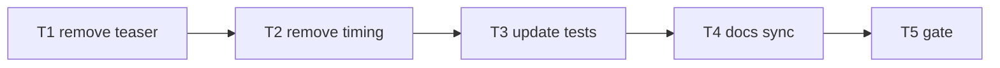

# Milestone 73 — Top-only Summary Rollups Tasks

**Spec**: [`.specs/features/top-only-rollups/spec.md`](./spec.md)  
**Design**: [`.specs/features/top-only-rollups/design.md`](./design.md)  
**Context**: [`.specs/features/top-only-rollups/context.md`](./context.md)  
**Status**: Done  
**Note**: Medium feature — bin lifecycle + diagnostics cleanup + docs. STOP at Planned; Execute in a separate session via `orchestrator-implementer` after Status promotion. Do **not** implement in the planning session.

---

## Execution Plan

### Phase 1: Implementation

```
T1 remove teaser → T2 remove brief timing → T3 tests → T4 docs
```

### Phase 2: Gate

```
T4 → T5 project gate
```



### Diagram-Definition Cross-Check

| Task | Depends on (body) | Diagram shows | Status |
| ---- | ----------------- | ------------- | ------ |
| T1   | None              | Root          | Match  |
| T2   | T1                | T1→T2         | Match  |
| T3   | T2                | T2→T3         | Match  |
| T4   | T3                | T3→T4         | Match  |
| T5   | T4                | T4→T5         | Match  |

### Path Conflict Check (Check 5)

| Task | Module owner      | Paths                                                                                                    | Conflict                               |
| ---- | ----------------- | -------------------------------------------------------------------------------------------------------- | -------------------------------------- |
| T1   | diagnostics + bin | `src/diagnostics/logger.ts`, `src/diagnostics/index.ts`, `bin/scan-actions.ts`, `bin/hotspot-scanner.ts` | Sole teaser removal owner              |
| T2   | bin               | `bin/scan-actions.ts`, `bin/hotspot-scanner.ts`                                                          | After T1; same bin files OK sequential |
| T3   | bin tests         | `bin/hotspot-scanner.test.ts`, `src/diagnostics/logger.test.ts` (if needed)                              | After API stable                       |
| T4   | docs              | `docs/warning-codes.md`, `README.md`, `.specs/codebase/ARCHITECTURE.md`                                  | Sole docs                              |
| T5   | gate              | none                                                                                                     | After T4                               |

No `[P]` — sequential owners.

### Test Co-location Validation

| Task | Code layer                  | TESTING.md expectation | Task Tests                | Status |
| ---- | --------------------------- | ---------------------- | ------------------------- | ------ |
| T1   | `src/diagnostics/` + `bin/` | unit                   | covered in T3             | OK     |
| T2   | `bin/`                      | unit                   | covered in T3             | OK     |
| T3   | `bin/` / diagnostics tests  | unit                   | unit                      | OK     |
| T4   | docs                        | n/a                    | review                    | OK     |
| T5   | full project                | gate                   | `pnpm build && pnpm test` | OK     |

### Granularity Check

| Task | Scope                          | Status   |
| ---- | ------------------------------ | -------- |
| T1   | Teaser API + call-site removal | Cohesive |
| T2   | Brief timing removal           | Cohesive |
| T3   | Lifecycle test updates         | Cohesive |
| T4   | Living docs                    | Cohesive |
| T5   | Project gate                   | Granular |

---

## Task Breakdown

### T1: Remove pre-write warning teaser

**What:** Stop emitting the M68 pre-write stderr teaser. Remove `emitWarningTeaser` from `createCliDiagnosticHandlers` return/implementation, from `executeScan` result, and from `bin/hotspot-scanner.ts` scan path. Keep `flushWarnings` after write.  
**Where:** `src/diagnostics/logger.ts`, `src/diagnostics/index.ts`, `bin/scan-actions.ts`, `bin/hotspot-scanner.ts`  
**Depends on:** None  
**Reuses:** Existing `flushWarnings` / clear-live teardown  
**Requirement:** HOTSPOT-1500, HOTSPOT-1502, HOTSPOT-1503, HOTSPOT-1504  
**Module owner:** `src/diagnostics/` + `bin/`

**Tools:**

- MCP: NONE
- Skill: `coding-guidelines`, `vitals-cli-validation`

**Done when:**

- [x] No `emitWarningTeaser` call before report write on scan path
- [x] Dead teaser API removed (not left as no-op) unless a documented internal need remains — prefer delete
- [x] `flushWarnings` still invoked after write
- [x] `--warnings=full` / `json` semantics otherwise unchanged
- [x] Gate check passes: `pnpm test -- bin/hotspot-scanner.test.ts src/diagnostics/` (may be red until T3 — then green)

**Tests:** unit (finalize in T3)  
**Gate:** deferred to T3 if tests still expect teaser; otherwise `pnpm test -- bin/hotspot-scanner.test.ts src/diagnostics/`

**Verify:** Grep repo for `emitWarningTeaser` — only historical specs/docs until T4.

**Commit:** `feat(diagnostics): drop pre-write warning teaser for top-only rollups`

---

### T2: Remove brief stderr timing

**What:** Delete `emitBriefTimingStderr` and all call sites so successful scans no longer write `timing: total Nms` on stderr. Keep `formatTimingSummaryLine` in executive summary.  
**Where:** `bin/scan-actions.ts`, `bin/hotspot-scanner.ts`  
**Depends on:** T1  
**Reuses:** `buildScanExecutiveSummary` / `formatTimingSummaryLine` unchanged  
**Requirement:** HOTSPOT-1505, HOTSPOT-1506, HOTSPOT-1507  
**Module owner:** `bin/`

**Tools:**

- MCP: NONE
- Skill: `coding-guidelines`, `vitals-cli-validation`

**Done when:**

- [x] `emitBriefTimingStderr` removed (function + imports)
- [x] Scan path does not write brief timing to stderr after flush
- [x] Table/markdown Timing summary line still produced by reporter (no code change expected in `summary.ts`)

**Tests:** unit (finalize in T3)  
**Gate:** deferred to T3

**Verify:** Grep for `timing: total` / `emitBriefTimingStderr` in `bin/` and `src/` — absent from runtime code.

**Commit:** `feat(cli): remove brief stderr timing echo`

---

### T3: Update lifecycle / unit tests

**What:** Rewrite bin (and diagnostics if needed) tests that asserted teaser→write→flush→timing. New order: write → flush → explain. Assert absence of teaser and brief timing; keep summary Warnings/Timing and post-write flush coverage.  
**Where:** `bin/hotspot-scanner.test.ts`, `src/diagnostics/logger.test.ts` (only if teaser unit tests exist)  
**Depends on:** T2  
**Reuses:** Existing deferred-flush / order test harnesses  
**Requirement:** HOTSPOT-1500–1507  
**Module owner:** `bin/` tests

**Tools:**

- MCP: NONE
- Skill: `coding-guidelines`, `vitals-cli-validation`

**Done when:**

- [x] No tests require `emitWarningTeaser` or `timing: total` stderr after successful scan
- [x] Order tests cover write → flush → explain
- [x] Summary-mode flush still asserted when warnings present
- [x] `pnpm test -- bin/hotspot-scanner.test.ts src/diagnostics/` exits 0
- [x] Test count: no silent deletions without replacement coverage

**Tests:** unit  
**Gate:** `pnpm test -- bin/hotspot-scanner.test.ts src/diagnostics/`

**Verify:** Read failing assertions first; invert expectations rather than deleting whole suites.

**Commit:** `test(cli): assert top-only rollups lifecycle`

---

### T4: Docs sync

**What:** Update living docs so they no longer describe the M68 bookend teaser or M62 brief stderr timing as current behavior. Point summary mode to: buffer → write → post-write flush.  
**Where:** `docs/warning-codes.md`, `README.md`, `.specs/codebase/ARCHITECTURE.md` (diagnostics / progress notes as needed)  
**Depends on:** T3  
**Reuses:** M73 context locks  
**Requirement:** HOTSPOT-1508, HOTSPOT-1509, HOTSPOT-1510  
**Module owner:** docs

**Tools:**

- MCP: NONE
- Skill: `vitals-spec-driven` (docs only)

**Done when:**

- [x] `docs/warning-codes.md` documents no pre-write teaser; summary/json post-write flush; full during scan
- [x] README does not claim brief stderr timing after successful scans
- [x] ARCHITECTURE diagnostics note matches M73 lifecycle
- [x] No new flags/schema claimed

**Tests:** docs review  
**Gate:** none beyond T5

**Verify:** Grep docs for “teaser”, “bookend”, `timing: total` presentation claims — align with M73.

**Commit:** `docs(warnings): align top-only rollups presentation`

---

### T5: Project quality gate

**What:** Run full project gate. Sync ROADMAP M73 → Done and STATE Active row in Execute (not in planning).  
**Where:** repo root  
**Depends on:** T4  
**Reuses:** N/A  
**Requirement:** Success criteria  
**Module owner:** gate

**Done when:**

- [x] `pnpm build && pnpm test` exits 0
- [x] ROADMAP/STATE Execute sync complete (Done)

**Tests:** full suite  
**Gate:** `pnpm build && pnpm test`

---

## Requirement → Task Mapping

| Requirement ID | Task                                                           |
| -------------- | -------------------------------------------------------------- |
| HOTSPOT-1500   | T1, T3                                                         |
| HOTSPOT-1501   | T3 (assert exec summary still present; no `summary.ts` change) |
| HOTSPOT-1502   | T1, T3                                                         |
| HOTSPOT-1503   | T1, T3                                                         |
| HOTSPOT-1504   | T1, T3                                                         |
| HOTSPOT-1505   | T2, T3                                                         |
| HOTSPOT-1506   | T2, T3                                                         |
| HOTSPOT-1507   | T2, T3                                                         |
| HOTSPOT-1508   | T4                                                             |
| HOTSPOT-1509   | T4                                                             |
| HOTSPOT-1510   | T4                                                             |
