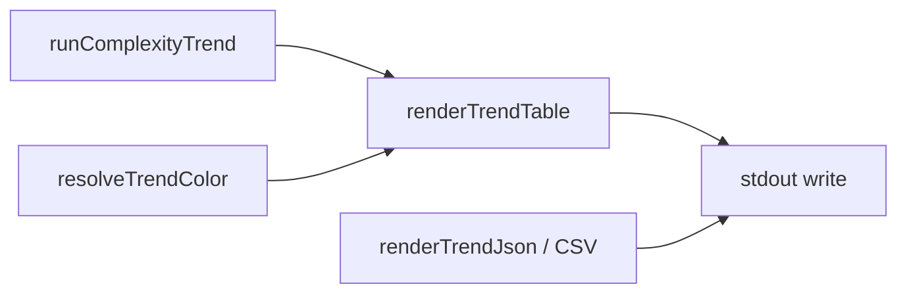

# Milestone 76 — Trend Color UX Design

**Spec**: [`.specs/features/trend-color-ux/spec.md`](./spec.md)  
**Context**: [`.specs/features/trend-color-ux/context.md`](./context.md)  
**Status**: Specs Done  

---

## Architecture Overview

Presentation-only change for trend **table** output. Domain result from `runComplexityTrend` (including `meta.growthPattern`) stays unchanged. Color paint lives with existing ANSI helpers; `renderTrendTable` accepts `color`; bin resolves enablement and passes it through `trend-actions`.



**Data flow:**

```
runComplexityTrend → ComplexityTrendResult
resolveTrendColor(format, outputPath, noColor, envNoColor, stdoutIsTTY) → color: boolean
renderTrendTable(result, { color }) → string → stdout | --output file
```

JSON/CSV paths unchanged: `renderTrendJson` / `renderTrendCsv` — never receive color.

---

## Code Reuse Analysis

| Component | Location | How to use |
| --------- | -------- | ---------- |
| ANSI + `stripAnsi` | `src/report/color.ts` | Add `paintGrowthPattern(kind, enabled)`; reuse `RESET` / red / yellow / green |
| Table color gate | `bin/hotspot-scanner.ts` `resolveTableColor` | Mirror as `resolveTrendColor` with `format === "table"` + `outputPath` gate (same as scan) |
| Trend table | `src/report/trend-table.ts` | Add optional `{ color?: boolean }`; wrap kind only |
| Trend actions | `bin/trend-actions.ts` | Accept `color` in `executeTrend` / `renderTrendOutput`; pass to table only |
| Trend CLI tests | `bin/hotspot-scanner.test.ts` | Extend trend cases; use `stripAnsi` where needed |

### Fragile / concerns

| Concern | Mitigation |
| ------- | ---------- |
| Existing Pattern-line assertions may break with ANSI | Prefer `stripAnsi(stdout)` then assert; update fixtures/tests accordingly |
| Padding / column layout | Kind is mid-line text, not a padded cell — ANSI wrap does not affect column widths |
| Scan `--no-color` vs doctor vs trend | Separate commander options on each command; document all three |
| Importing `GrowthPatternKind` into report | Prefer inline string union matching kinds to avoid cycles; type-only import OK if clean |

---

## Components and Interfaces

### 1. `paintGrowthPattern`

**Location:** `src/report/color.ts`

```ts
export function paintGrowthPattern(
  kind: "deteriorating" | "refactored" | "stable" | "inconclusive",
  enabled: boolean,
): string {
  if (!enabled) return kind;
  switch (kind) {
    case "deteriorating":
      return `${RED}${kind}${RESET}`;
    case "refactored":
      return `${GREEN}${kind}${RESET}`;
    case "inconclusive":
      return `${YELLOW}${kind}${RESET}`;
    case "stable":
      return kind; // plain by design
  }
}
```

### 2. `renderTrendTable` color option

**Location:** `src/report/trend-table.ts`

```ts
export function renderTrendTable(
  result: ComplexityTrendResult,
  options?: { color?: boolean },
): string {
  const color = options?.color === true;
  const { kind, summary } = result.meta.growthPattern;
  lines.push(`Pattern: ${paintGrowthPattern(kind, color)} — ${summary}`);
  // … rest unchanged
}
```

Default `color` false preserves today’s plain output for callers that omit the option.

### 3. `resolveTrendColor`

**Location:** `bin/hotspot-scanner.ts` (export for unit tests, like `resolveTableColor`)

```ts
export function resolveTrendColor(opts: {
  format: "table" | "json" | "csv";
  outputPath?: string;
  noColor: boolean;
  envNoColor: string | undefined;
  stdoutIsTTY: boolean | undefined;
}): boolean {
  if (opts.format !== "table") return false;
  if (opts.noColor) return false;
  if (opts.envNoColor !== undefined && opts.envNoColor.length > 0) return false;
  if (opts.outputPath !== undefined) return false;
  if (opts.stdoutIsTTY !== true) return false;
  return true;
}
```

### 4. Trend command + actions wiring

- `.option("--no-color", "Disable ANSI colors in trend table output")` on `trend`
- In trend action: resolve color; pass into `executeTrend({ …, color })`
- `renderTrendOutput(result, format, color?)` — only table path uses color

Commander maps `--no-color` to `options.color === false` — match scan/doctor wiring.

---

## Test Plan

| Layer | Coverage |
| ----- | -------- |
| Unit `src/report/color.test.ts` | `paintGrowthPattern` on/off for all four kinds; stable never ANSI |
| Unit `src/report/trend-format.test.ts` (or trend-table tests) | `renderTrendTable` color true/false; `stripAnsi` equality; Pattern line shape |
| Unit bin | `resolveTrendColor` matrix (table/json/csv, TTY, noColor, NO_COLOR, outputPath) |
| CLI `bin/hotspot-scanner.test.ts` | trend `--no-color`; json/csv no ANSI; help lists flag; TTY → ANSI when injectable |

Gate: `pnpm build && pnpm test`

---

## Hard Boundaries

- Do **not** change `classifyGrowthPattern` heuristics or summaries
- Do **not** bump complexity-trend JSON `version` or schema
- Do **not** add color deps to `package.json`
- Do **not** implement `FORCE_COLOR`
- Do **not** color scan/doctor in this milestone
- Do **not** color sparklines, headers, or revision rows
