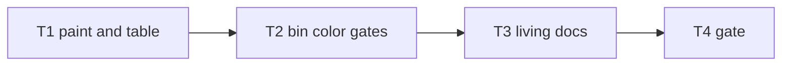

# Milestone 76 — Trend Color UX Tasks

**Design**: [`.specs/features/trend-color-ux/design.md`](./design.md)  
**Spec**: [`.specs/features/trend-color-ux/spec.md`](./spec.md)  
**Context**: [`.specs/features/trend-color-ux/context.md`](./context.md)  
**Status**: Done  
**Note**: Medium feature — color paint + trend table + bin gates + docs. STOP at Planned; Execute in a separate session via `orchestrator-implementer` after Status promotion. Do **not** change M75 classification heuristics or schema here.

---

## Execution Plan

### Phase 1: Paint + trend table

```
T1 paintGrowthPattern + renderTrendTable({ color }) + unit tests
```

### Phase 2: Bin wiring

```
T1 → T2 resolveTrendColor + trend --no-color + trend-actions + CLI tests
```

### Phase 3: Docs + gate

```
T2 → T3 README / ARCHITECTURE / CONVENTIONS
T3 → T4 project gate
```



### Diagram-Definition Cross-Check

| Task | Depends on (body) | Diagram shows | Status |
| ---- | ----------------- | ------------- | ------ |
| T1   | None              | Root          | Match  |
| T2   | T1                | T1→T2         | Match  |
| T3   | T2                | T2→T3         | Match  |
| T4   | T3                | T3→T4         | Match  |

### Path Conflict Check (Check 5)

| Task | Module owner | Paths                                                                                                                             | Conflict               |
| ---- | ------------ | --------------------------------------------------------------------------------------------------------------------------------- | ---------------------- |
| T1   | report       | `src/report/color.ts`, `src/report/color.test.ts`, `src/report/trend-table.ts`, `src/report/trend-format.test.ts` (or co-located) | Sole paint/table owner |
| T2   | bin          | `bin/hotspot-scanner.ts`, `bin/trend-actions.ts`, `bin/hotspot-scanner.test.ts`                                                   | Sole CLI owner         |
| T3   | docs         | `README.md`, `.specs/codebase/ARCHITECTURE.md`, `.specs/codebase/CONVENTIONS.md` (brief)                                          | After T2               |
| T4   | gate         | none                                                                                                                              | After T3               |

No `[P]` — sequential owners.

### Test Co-location Validation

| Task | Code layer    | TESTING.md expectation | Task Tests                | Status |
| ---- | ------------- | ---------------------- | ------------------------- | ------ |
| T1   | `src/report/` | unit                   | unit                      | OK     |
| T2   | `bin/`        | unit                   | unit                      | OK     |
| T3   | docs          | none                   | review checklist          | OK     |
| T4   | full project  | gate                   | `pnpm build && pnpm test` | OK     |

### Granularity Check

| Task | Scope                                              | Status   |
| ---- | -------------------------------------------------- | -------- |
| T1   | Paint + trend table + unit tests                   | Cohesive |
| T2   | Color resolve + `--no-color` + actions + CLI tests | Cohesive |
| T3   | Living docs only                                   | Cohesive |
| T4   | Project gate                                       | Granular |

---

## Task Breakdown

### T1: `paintGrowthPattern` + `renderTrendTable({ color })`

**What:** Add `paintGrowthPattern` in `src/report/color.ts` (deteriorating red, refactored green, inconclusive yellow, stable plain; no-op when disabled). Extend `renderTrendTable(result, { color })` to wrap only the Pattern kind token. Unit-test paint and table; assert `stripAnsi(colored) === plain`. Do not change JSON/CSV renderers.  
**Where:** `src/report/color.ts`, `src/report/color.test.ts`, `src/report/trend-table.ts`, `src/report/trend-format.test.ts` (extend or add)  
**Depends on:** None  
**Reuses:** Existing ANSI constants / `stripAnsi` in `color.ts`; `ComplexityTrendResult.meta.growthPattern`  
**Requirement:** HOTSPOT-1600, HOTSPOT-1601, HOTSPOT-1602  
**Module owner:** `src/report/`

**Tools:**

- MCP: NONE
- Skill: `coding-guidelines`, `vitals-pipeline-domain` (light — report/trend table only)

**Done when:**

- [x] `paintGrowthPattern` colors deteriorating/refactored/inconclusive when enabled; stable always plain; all plain when disabled
- [x] `renderTrendTable` wraps only the kind token on the `Pattern:` line
- [x] `stripAnsi(renderTrendTable(r, { color: true })) === renderTrendTable(r, { color: false })`
- [x] Default / omitted `color` remains plain (backward compatible)
- [x] Gate check passes: `pnpm test -- src/report/color.test.ts src/report/trend-format.test.ts`
- [x] Test count: no silent deletions

**Tests:** unit  
**Gate:** `pnpm test -- src/report/color.test.ts src/report/trend-format.test.ts`

**Verify:** Manual unit run; inspect one colored Pattern line contains `\x1b[` around kind and stripAnsi equals plain.

**Commit:** `feat(report): paint trend Pattern kind in table output`

---

### T2: `resolveTrendColor` + trend `--no-color` + CLI wiring

**What:** Export `resolveTrendColor` (table + TTY + `--no-color` + `NO_COLOR` + no `--output`). Add `--no-color` on the trend command. Wire trend action / `executeTrend` to pass resolved color into `renderTrendTable`. Unit-test resolver matrix; extend trend CLI tests (TTY on → ANSI when injectable; `--no-color` / `NO_COLOR` / `--output` / json / csv → plain; help lists flag). Prefer injecting stdout TTY the same way other bin tests inject env.  
**Where:** `bin/hotspot-scanner.ts`, `bin/trend-actions.ts`, `bin/hotspot-scanner.test.ts`  
**Depends on:** T1  
**Reuses:** `resolveTableColor` pattern; scan/doctor `--no-color` commander wiring  
**Requirement:** HOTSPOT-1603, HOTSPOT-1604, HOTSPOT-1605, HOTSPOT-1606, HOTSPOT-1607, HOTSPOT-1608, HOTSPOT-1609  
**Module owner:** `bin/`

**Tools:**

- MCP: NONE
- Skill: `coding-guidelines`, `vitals-cli-validation`

**Done when:**

- [x] `resolveTrendColor` matrix covered (table/json/csv, TTY, noColor, NO_COLOR empty vs set, outputPath)
- [x] Trend `--no-color` registered and disables color on TTY
- [x] JSON/CSV trend output has no ANSI
- [x] Existing trend table assertions updated with `stripAnsi` if needed
- [x] Gate check passes: `pnpm test -- bin/hotspot-scanner.test.ts`
- [x] Test count: no silent deletions

**Tests:** unit  
**Gate:** `pnpm test -- bin/hotspot-scanner.test.ts`

**Verify:** `pnpm exec hotspot-scanner trend --help` lists `--no-color`; CLI tests green.

**Commit:** `feat(cli): add trend --no-color and TTY Pattern colors`

---

### T3: Living docs (README + codebase)

**What:** Document trend TTY Pattern-kind colors and disable rules (`--no-color`, `NO_COLOR`, non-TTY, `--output`, json/csv plain) in README trend section; brief note in ARCHITECTURE § CLI ANSI colors (add trend row) and CONVENTIONS if they mention color. No pipeline/schema doc churn.  
**Where:** `README.md`, `.specs/codebase/ARCHITECTURE.md`, `.specs/codebase/CONVENTIONS.md`  
**Depends on:** T2  
**Reuses:** Existing README “Colors” / trend / doctor color wording  
**Requirement:** HOTSPOT-1610, HOTSPOT-1611  
**Module owner:** docs

**Tools:**

- MCP: NONE
- Skill: `coding-guidelines`

**Done when:**

- [x] README mentions trend table Pattern colors + disable gates
- [x] ARCHITECTURE (and CONVENTIONS if applicable) note trend color briefly
- [x] No contradictory “trend never colors” claims left (e.g. M74 out-of-scope wording may stay historical)
- [x] Gate check: docs-only review (no code gate required beyond T4)

**Tests:** none  
**Gate:** review checklist

**Verify:** Grep README for trend + color / `--no-color`.

**Commit:** `docs: document trend TTY Pattern colors`

---

### T4: Project quality gate

**What:** Run full project gate.  
**Where:** repo root  
**Depends on:** T3  
**Reuses:** AGENTS.md quality gate  
**Requirement:** (milestone success — all HOTSPOT-1600–1611)  
**Module owner:** gate

**Tools:**

- MCP: NONE
- Skill: none — invoke `verifier-quality-gates` or run gate inline

**Done when:**

- [x] `pnpm build && pnpm test` passes
- [x] Test count: no silent deletions vs pre-milestone baseline

**Tests:** full suite  
**Gate:** `pnpm build && pnpm test`

**Verify:** Gate output green.

**Commit:** (none — verification only; or chore if docs-only fixups needed)

---

## Parallelization Summary

| Flag | Tasks       | Reason                      |
| ---- | ----------- | --------------------------- |
| none | T1→T2→T3→T4 | Sequential module ownership |

**Max parallel workers:** 1

---

## Requirement Coverage

| ID           | Task |
| ------------ | ---- |
| HOTSPOT-1600 | T1   |
| HOTSPOT-1601 | T1   |
| HOTSPOT-1602 | T1   |
| HOTSPOT-1603 | T2   |
| HOTSPOT-1604 | T2   |
| HOTSPOT-1605 | T2   |
| HOTSPOT-1606 | T2   |
| HOTSPOT-1607 | T2   |
| HOTSPOT-1608 | T2   |
| HOTSPOT-1609 | T2   |
| HOTSPOT-1610 | T3   |
| HOTSPOT-1611 | T3   |

All mapped. Buffer/reserved IDs unassigned.
