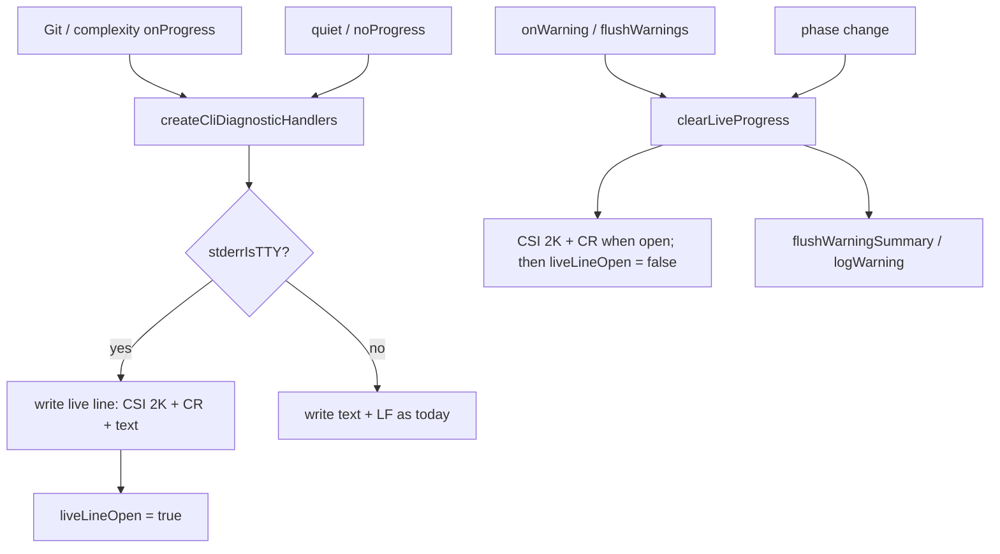

# Milestone 59 — Ephemeral TTY Scan Progress Design

**Spec**: [`.specs/features/tty-ephemeral-progress/spec.md`](./spec.md)  
**Context**: [`.specs/features/tty-ephemeral-progress/context.md`](./context.md)  
**Status**: Done

---

## Architecture Overview

Presentation-only change inside the CLI diagnostic sink. Pipeline emitters (`GitMiner`, complexity pool) keep calling `onProgress` unchanged. `createCliDiagnosticHandlers` owns **whether** and **how** progress is written to stderr: TTY live overwrite vs non-TTY newlines, plus **clear** before other stderr diagnostics and on teardown / phase switch.



**No** changes to `ScanProgress` types, throttle intervals, JSON contract, CLI flags, or config.

---

## Code Reuse Analysis

| Component               | Location                                     | How to Use                                                                                                                 |
| ----------------------- | -------------------------------------------- | -------------------------------------------------------------------------------------------------------------------------- |
| Progress format helpers | `src/diagnostics/logger.ts`                  | Keep `formatComplexityProgressLine` wording; split trailing `\n` from body so TTY/non-TTY share text                       |
| Throttle                | `maybeLogProgress`, intervals                | Unchanged                                                                                                                  |
| CLI handlers            | `createCliDiagnosticHandlers`                | Own live-line state; inject `stderrIsTTY`; clear on warning/flush/phase                                                    |
| M58 summary flush       | `flushWarningSummary` / `flushWarnings`      | Always `clearLiveProgress()` first                                                                                         |
| M58 full `logWarning`   | `logWarning`                                 | Call clear from handler wrappers before write (prefer not making bare `logWarning` globally TTY-aware for library callers) |
| Bin wiring              | `bin/scan-actions.ts`                        | Already calls `flushWarnings()` — sufficient teardown hook; no new flags                                                   |
| TTY mock pattern        | `bin/hotspot-scanner.test.ts` (stdout isTTY) | Mirror for stderr injection via options (prefer options over mutating `process.stderr.isTTY` when testing handlers)        |

### Fragile / concerns

| Concern                     | Mitigation                                                                                            |
| --------------------------- | ----------------------------------------------------------------------------------------------------- |
| ANSI / dumb terminals       | Use standard `\x1b[2K\r` clear-to-EOL; non-TTY path skips ANSI                                        |
| Narrow terminal width       | Prefer CSI `2K` over space-padding so leftover glyphs clear                                           |
| Interleaved `warnings=full` | Clear before every handler-driven `logWarning`                                                        |
| Dual emit / meta            | Progress remains presentation-only; no `meta` change                                                  |
| Module-global live state    | Keep `liveLineOpen` in **handler closure** so concurrent/library `logProgress` callers are unaffected |
| Verbose argv interleave     | Document risk; out of scope                                                                           |

---

## Components and Interfaces

### 1. Injectable TTY + live-line state

**Location:** `src/diagnostics/logger.ts`

```ts
export interface CliDiagnosticOptions {
  quiet?: boolean;
  noProgress?: boolean;
  warningsMode?: WarningsMode;
  /** Default: process.stderr.isTTY === true */
  stderrIsTTY?: boolean;
}

export function createCliDiagnosticHandlers(options?: CliDiagnosticOptions): {
  onProgress: (progress: ScanProgress) => void;
  onWarning: (warning: ScanWarning) => void;
  flushWarnings: () => void;
  /** Optional explicit teardown; flushWarnings already clears. */
  clearLiveProgress?: () => void;
};
```

**State (closure):**

| Field          | Role                                               |
| -------------- | -------------------------------------------------- |
| `liveLineOpen` | True after a TTY progress write until cleared      |
| `lastPhase`    | Previous `ScanProgress.phase` for switch detection |
| `stderrIsTTY`  | From options / default                             |

**`clearLiveProgress()`:** If `liveLineOpen`, write `\x1b[2K\r` (or equivalent) to stderr; set `liveLineOpen = false`. Else no-op.

Exporting `clearLiveProgress` on the return object is **Agent's Discretion** if tests can assert via `flushWarnings` alone; prefer exporting for unit clarity.

### 2. Progress write path

Refactor so format helpers return **body without `\n`**:

```ts
function formatComplexityProgressBody(progress: ScanProgress): string;
function formatGitProgressBody(progress: ScanProgress): string;
// e.g. "Processing git commit 5,000..."
```

| Mode    | Write                                                   |
| ------- | ------------------------------------------------------- |
| TTY     | `\x1b[2K\r` + body (no `\n`); set `liveLineOpen = true` |
| Non-TTY | `body + "\n"`; do not set live open                     |

**Phase switch:** If `liveLineOpen` and `progress.phase !== lastPhase`, call `clearLiveProgress()` (or rely on `\x1b[2K\r` before the new body — either is fine if tests assert no stale phase label). Update `lastPhase`.

**Standalone `logProgress` / `maybeLogProgress`:** Today used by handlers and unit tests. Options:

1. **Preferred:** Handlers call an internal `writeProgressLine(progress, ctx)` that knows TTY/live state; keep exported `logProgress` as **non-TTY `\n`** for backward-compatible direct/unit use **or** add optional second arg `{ tty?: boolean; onLive?: … }` — implementer picks smallest diff that keeps existing tests meaningful.
2. Avoid making process-global TTY mutation the only test seam — **must** support `stderrIsTTY` on handlers.

### 3. Clear compose with warnings

| Path                          | Behavior                                                            |
| ----------------------------- | ------------------------------------------------------------------- |
| `warnings=full` → `onWarning` | `clearLiveProgress()` then existing quiet-aware `logWarning`        |
| `warnings=summary` → buffer   | No stderr during scan for warnings → progress uninterrupted         |
| `flushWarnings()`             | **Always** `clearLiveProgress()` first; then summary flush or no-op |
| Info under full/non-quiet     | Same clear-before-write as warning/error                            |

Bin already calls `flushWarnings()` after scan/compare warning emission — that is the **scan complete** clear hook for both modes.

### 4. Docs

| File                              | Update                                                                                                     |
| --------------------------------- | ---------------------------------------------------------------------------------------------------------- |
| `README.md`                       | Advanced **Progress (stderr)** — TTY live overwrite + clear; non-TTY newlines; quiet/no-progress unchanged |
| `.specs/codebase/ARCHITECTURE.md` | Diagnostics progress subsection — ephemeral TTY line                                                       |
| `docs/recipes.md`                 | Only if a recipe mentions progress line permanence / CI capture                                            |

No completion / help flag changes (no new flags).

---

## Data Flow (ordering)

```
executeScan:
  handlers = createCliDiagnosticHandlers({ quiet, noProgress, warningsMode, stderrIsTTY? })
  result = await runScan({ onProgress, onWarning, … })
  // TTY: live line may still be open
  handlers.flushWarnings()   // clears live line, then summary flush if any
  return result → report on stdout
```

Under `warnings=full`, clears may already have happened per warning; final flush clear is still required if the last event was progress with no subsequent warning.

---

## Test Plan

| Layer                                 | Focus                                                                                                                                                                             |
| ------------------------------------- | --------------------------------------------------------------------------------------------------------------------------------------------------------------------------------- |
| Unit `src/diagnostics/logger.test.ts` | TTY overwrite (`\x1b[2K` / `\r`); non-TTY `\n` golden strings; clear before warning; clear on flush; phase switch; quiet/no-progress; summary vs full compose; double clear no-op |
| Unit `bin/` (optional)                | Only if CLI wiring changes; prefer handler injection over process.stderr.isTTY mutation                                                                                           |
| Integration                           | Not required for presentation-only (optional manual TTY smoke)                                                                                                                    |

**Gate:** per-task `vitest` on diagnostics; final `pnpm build && pnpm test`.

---

## Risks

| Risk                                                          | Mitigation                                                                     |
| ------------------------------------------------------------- | ------------------------------------------------------------------------------ |
| ANSI ignored / partial clear on exotic terminals              | CSI `2K` is widely supported; non-TTY path unchanged for CI                    |
| Progress string longer than previous leaves remnants          | Always clear-to-EOL before write                                               |
| `logWarning` used outside handlers still races with live line | Live state is handler-scoped; CLI path always uses handlers                    |
| Verbose argv overwrites live line                             | Document; out of scope                                                         |
| Existing `logProgress` tests expect `\n`                      | Keep non-TTY / direct API `\n` or update tests when TTY option used explicitly |
| Width / Unicode                                               | en-US locale counts already used; no new formatting                            |

---

## Implementation Notes (Execute)

- YAGNI: no flags, no config, no schema, no throttle changes, no spinners.
- Prefer small internal helpers in `logger.ts`; new file only if readability demands (unlikely).
- Export new symbols from `src/diagnostics/index.ts` only if tests/bin need them.
- Do not revive function-churn progress phase.
