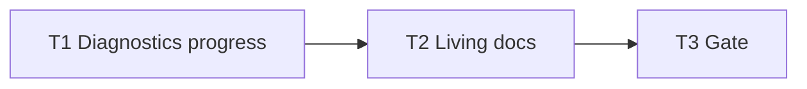

# Milestone 59 — Ephemeral TTY Scan Progress Tasks

**Design**: [`.specs/features/tty-ephemeral-progress/design.md`](./design.md)  
**Spec**: [`.specs/features/tty-ephemeral-progress/spec.md`](./spec.md)  
**Context**: [`.specs/features/tty-ephemeral-progress/context.md`](./context.md)  
**Status**: Done  
**Note**: Large feature — diagnostics progress sink + docs. Planning session ends here; Execute in a separate session after Status → Approved / Ready for Execute.

---

## Execution Plan

### Phase 1: Diagnostics sink (foundation)

```
T1 ephemeral TTY progress + clear + M58 compose + unit tests
```

### Phase 2: Docs + gate

```
T1 → T2 living docs → T3 project gate
```



### Diagram-Definition Cross-Check

| Task | Depends on (declared) | Diagram shows | Match |
| ---- | --------------------- | ------------- | ----- |
| T1 | None | Root | ✅ |
| T2 | T1 | T1 → T2 | ✅ |
| T3 | T2 | T2 → T3 | ✅ |

### Path Conflict Check (Check 5)

| Task | Module owner | Paths | Conflict |
| ---- | ------------ | ----- | -------- |
| T1 | diagnostics | `src/diagnostics/logger.ts`, `src/diagnostics/logger.test.ts`, optionally `src/diagnostics/index.ts` exports | Sole diagnostics owner |
| T2 | docs | `README.md`, `.specs/codebase/ARCHITECTURE.md`, optionally `docs/recipes.md`; Execute may tick ROADMAP/STATE Done | After T1; no src overlap |
| T3 | gate | none (verify) | After T2 |

No `[P]` — sequential docs after code. Bin wiring unchanged (existing `flushWarnings()` is teardown hook); optional bin test only if T1 discovers a required CLI seam — prefer staying in `logger.test.ts`.

### Test Co-location Validation

| Task | Code layer | TESTING.md expectation | Task says | Match |
| ---- | ---------- | ---------------------- | --------- | ----- |
| T1 | `src/diagnostics/` | Unit | unit in same task | ✅ |
| T2 | Docs | none | none | ✅ |
| T3 | Full project | Gate | `pnpm build && pnpm test` | ✅ |

### Granularity Check

| Task | Scope | Status |
| ---- | ----- | ------ |
| T1 | TTY/non-TTY write + clear + handlers compose + unit tests | ✅ Cohesive diagnostics module |
| T2 | Living docs | ✅ Granular |
| T3 | Project gate | ✅ Granular |

### Requirement → Task Mapping

| Requirement ID | Task |
| -------------- | ---- |
| HOTSPOT-970, HOTSPOT-971, HOTSPOT-972, HOTSPOT-973, HOTSPOT-974, HOTSPOT-975, HOTSPOT-976, HOTSPOT-977, HOTSPOT-978, HOTSPOT-979 | T1 |
| HOTSPOT-980 | T2 |
| (gate) | T3 |
| HOTSPOT-981–989 | Reserved — unused |

---

## Task Breakdown

### T1: Ephemeral TTY progress in diagnostics

**What**: Implement TTY live overwrite vs non-TTY `\n` progress for phases `git` and `complexity` inside `createCliDiagnosticHandlers` (and supporting helpers in `logger.ts`). Track `liveLineOpen` / last phase in the handler closure. Add injectable `stderrIsTTY?: boolean` (default `process.stderr.isTTY === true`). Clear live line: (1) always at start of `flushWarnings()`, (2) before handler-driven warning/error/info stderr writes (`warnings=full` and any immediate info path), (3) on phase switch when a live line is open. Keep message wording and throttle intervals unchanged. Honor `--quiet` / `--no-progress` (no progress writes). Do **not** change JSON/schema, CLI flags, config, bin scan-actions beyond what is already calling `flushWarnings()`, or revive function-churn progress. Export new symbols from `src/diagnostics/index.ts` only if needed.

**Where**: `src/diagnostics/logger.ts`; `src/diagnostics/logger.test.ts`; optionally `src/diagnostics/index.ts`

**Depends on**: None

**Reuses**: `formatComplexityProgressLine` / git progress text; `maybeLogProgress` throttles; M58 `warningsMode` + `flushWarnings`; quiet/noProgress suppression

**Done when**:

- [x] TTY progress writes use clear-to-EOL + CR overwrite (no permanent `\n` live spam); body text matches today’s wording
- [x] Non-TTY progress writes remain `\n`-terminated golden strings
- [x] `flushWarnings()` clears any open live line (summary and full)
- [x] Full mode clears before each `logWarning`; summary clears at flush
- [x] Phase switch does not leave a stale previous-phase live line
- [x] Quiet / no-progress still emit no progress
- [x] `stderrIsTTY` injectable; unit tests cover TTY vs non-TTY, clear triggers, M58 compose, double-clear no-op
- [x] No new flags / schema / throttle changes

**Tests**: Unit in `src/diagnostics/logger.test.ts` (same task); optionally extend `warning-summary.test.ts` only if handlers tests live there already for compose

**Gate**: `pnpm exec vitest run src/diagnostics/` — PASS

**Requirements**: HOTSPOT-970, HOTSPOT-971, HOTSPOT-972, HOTSPOT-973, HOTSPOT-974, HOTSPOT-975, HOTSPOT-976, HOTSPOT-977, HOTSPOT-978, HOTSPOT-979

---

### T2: Living docs

**What**: Document TTY live overwrite (one updating line, cleared when done / before diagnostics) vs non-TTY permanent newline logs. Note quiet/no-progress unchanged; no new flags. Update README Advanced **Progress (stderr)**; ARCHITECTURE diagnostics progress subsection. Touch `docs/recipes.md` only if a recipe implies permanent progress lines / CI capture. On Execute Done, tick ROADMAP M59 checkboxes and STATE Active/decision row (planner already added Planned milestone).

**Where**: `README.md`, `.specs/codebase/ARCHITECTURE.md`, optionally `docs/recipes.md` (+ ROADMAP/STATE Done sync at Execute completion)

**Depends on**: T1

**Reuses**: M58 docs tone for diagnostics presentation-only notes

**Done when**:

- [x] README describes TTY vs non-TTY progress UX and clear behavior
- [x] ARCHITECTURE notes ephemeral TTY progress under diagnostics
- [x] Recipes updated only if progress UX is mentioned
- [x] No invented flags or config keys

**Tests**: none (docs)

**Gate**: none beyond review (full gate in T3)

**Requirements**: HOTSPOT-980

---

### T3: Project quality gate

**What**: Run the required project gate and confirm green. Do not mark feature Done until this passes.

**Where**: repo root (no source edits unless gate surfaces a fix owned by T1/T2 — then fix in the owning task and re-run)

**Depends on**: T2

**Reuses**: quality-gates rule / `verifier-quality-gates`

**Done when**:

- [x] `pnpm build && pnpm test` PASS
- [x] tasks.md Status → Done (Execute session); ROADMAP M59 marked Done

**Tests**: full suite via gate

**Gate**: `pnpm build && pnpm test` — PASS

**Requirements**: (gate)

---

## Handoff

Planning complete. Promote **Status** to `Approved` or `Ready for Execute`, then in a **new development session** invoke `orchestrator-implementer`.

Expected final gate: `pnpm build && pnpm test`
