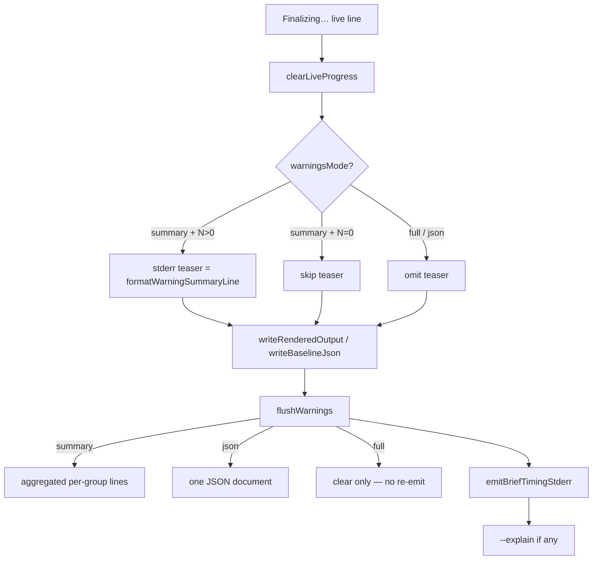

# Milestone 68 — Warnings Presentation DX Design

**Spec**: [`.specs/features/warnings-bookend-dx/spec.md`](./spec.md)  
**Context**: [`.specs/features/warnings-bookend-dx/context.md`](./context.md)  
**Status**: Planned  

---

## Architecture Overview

Extend the M61 deferred-flush lifecycle with a **pre-write teaser** under `--warnings=summary`, without changing pipeline warning collection. Compare human reports drop body-level full warning dumps (K). Docs catch up to the bookend truth.

**Compose:** M59 clear-before-diagnostic; M61 finalize through write; M62 timing/explain after flush.

---

## Code Reuse Analysis

| Component | Location | How to Use |
| --------- | -------- | ---------- |
| `createCliDiagnosticHandlers` | `src/diagnostics/logger.ts` | Add `emitWarningTeaser()` (or return teaser fn) that clears live + writes rollup; keep `flushWarnings` semantics for full/json |
| `formatWarningSummaryLine` | `src/report/summary.ts` | Teaser string SoT — import from diagnostics carefully (prefer thin shared helper or report→diagnostics dependency direction per CONVENTIONS; avoid cycles) |
| `flushWarningSummary` / `flushWarningsJson` | `src/diagnostics/warning-summary.ts` | Unchanged post-write flush for summary/json |
| `writeRenderedOutput` / `executeCompareAndRender` / scan + baseline actions | `bin/scan-actions.ts`, `bin/hotspot-scanner.ts` | Insert teaser call immediately before write; flush after |
| Compare exec summary | `buildCompareExecutiveSummary` | Already has rollup — keep |
| `formatScanWarning` loops | `compare-table.ts`, `compare-markdown.ts` | **Delete** body loops only |

### Integration points

| System | Method |
| ------ | ------ |
| Diagnostics ↔ Bin | Handlers expose teaser + flush; bin owns order |
| Report compare | Pure render change — no bin |
| Docs | `docs/warning-codes.md`, ROADMAP M58, AGENTS, optional README/ARCHITECTURE |

### Fragile areas (CONCERNS)

| Concern | Mitigation |
| ------- | ---------- |
| Diagnostics severity vs exit | Unchanged — successful scan still exit 0 with warnings |
| Double emission under full | Tests assert flush does not re-log when mode is full |
| Import cycles report↔diagnostics | Prefer exporting rollup formatter from a neutral place or duplicate one-liner call path documented in design Execute note — implementer must avoid cycles |

---

## Components

### Warning teaser (diagnostics)

- **Purpose:** Clear live progress and optionally emit short rollup before write
- **Location:** `src/diagnostics/logger.ts` (+ tests); may touch `warning-summary.ts` / exports in `index.ts`
- **Interfaces:**
  - `emitWarningTeaser(): void` on handler return (or `teaseWarnings(): void`) — no-op when mode ≠ `summary` or buffer empty; otherwise clear + write rollup line
  - Existing `flushWarnings(): void` — full mode remains clear-only; summary/json unchanged emission semantics
- **Dependencies:** Buffered warnings; `formatWarningSummaryLine` equivalent
- **Reuses:** M59 `clearLiveProgress`; M58 buffer

### Bin lifecycle wiring

- **Purpose:** Enforce order finalize → teaser → write → flush → timing → explain
- **Location:** `bin/hotspot-scanner.ts` (scan path, baseline save), `bin/scan-actions.ts` (`executeCompareAndRender`)
- **Interfaces:** Call teaser then write then flush at each success path that already flushes today
- **Reuses:** M61 deferred flush call sites; M62 `emitBriefTimingStderr`

### Compare report dedup

- **Purpose:** Remove body warning dumps
- **Location:** `src/report/compare-table.ts`, `src/report/compare-markdown.ts` (+ tests)
- **Interfaces:** No new exports — delete loops and unused `formatScanWarning` imports
- **Reuses:** `buildCompareExecutiveSummary` rollup

### Docs sync

- **Purpose:** A+G+L+E truth
- **Location:** `docs/warning-codes.md`, `.specs/project/ROADMAP.md` (M58 Done prose), `AGENTS.md`, optional README Progress / ARCHITECTURE diagnostics note

---

## Data Models

No schema / type contract changes. `meta.warnings: ScanWarning[]` unchanged. `WarningsMode` already includes `"json"`.

---

## Error Handling Strategy

| Scenario | Handling | User impact |
| -------- | -------- | ----------- |
| Write throws after teaser | Flush may not run (existing failure path) | Teaser may appear without report — acceptable; no new recovery |
| Cancel before write | No teaser/flush | Exit 130/143 |
| Empty buffer summary | Skip teaser | Quiet finalize → write |

---

## Tech Decisions

| Decision | Choice | Rationale |
| -------- | ------ | --------- |
| Teaser string | Reuse `formatWarningSummaryLine` | One rollup vocabulary with exec summary |
| Teaser ownership | Diagnostics handler method | Buffer lives there; bin only orders calls |
| full flush | Clear-only (already true today) | Lock: must not re-emit; harden with tests |
| Compare body | Delete loops | Lock K — stderr owns detail |
| Cycle avoidance | Prefer importing summary formatter into diagnostics **or** move shared one-liner to `src/diagnostics/` / small shared module if needed | Execute picks cheapest non-cycle option |

---

## Test Plan (by layer)

| Layer | Focus |
| ----- | ----- |
| Unit diagnostics | Teaser emits only for summary+N>0; full/json no teaser; flush full no re-emit |
| Unit report | Compare table/md lack warning body lines; rollup present |
| Bin order | Spies: teaser → write → flush → timing → explain on scan + compare; baseline save teaser→write→flush |
| Docs | Manual checklist in docs task Done when |

**Gate:** per-task targeted Vitest; final `pnpm build && pnpm test`.
