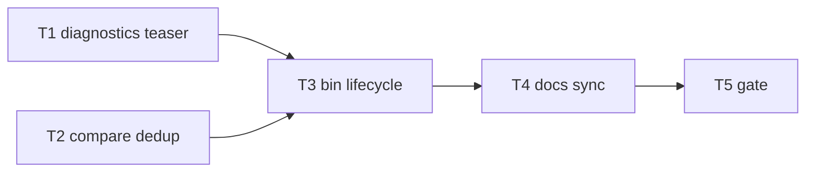

# Milestone 68 — Warnings Presentation DX Tasks

**Design**: [`.specs/features/warnings-bookend-dx/design.md`](./design.md)  
**Spec**: [`.specs/features/warnings-bookend-dx/spec.md`](./spec.md)  
**Context**: [`.specs/features/warnings-bookend-dx/context.md`](./context.md)  
**Status**: Planned  
**Note**: Large feature — diagnostics + bin + report + docs. STOP at Planned; Execute in a separate session via `orchestrator-implementer` after Status promotion. Do **not** implement M69/M70 here.

---

## Execution Plan

### Phase 1: Core code (parallel-safe owners)

```
T1 diagnostics teaser [P] ──┐
                            ├──→ T3 bin lifecycle
T2 compare dedup K [P] ─────┘
```

### Phase 2: Docs

```
T3 → T4 docs A+G+L+E (+ living notes)
```

### Phase 3: Gate

```
T4 → T5 project gate
```



### Diagram-Definition Cross-Check

| Task | Depends on (body) | Diagram shows | Status |
| ---- | ----------------- | ------------- | ------ |
| T1 | None | Root parallel | ✅ Match |
| T2 | None | Root parallel | ✅ Match |
| T3 | T1, T2 | T1→T3, T2→T3 | ✅ Match |
| T4 | T3 | T3→T4 | ✅ Match |
| T5 | T4 | T4→T5 | ✅ Match |

### Path Conflict Check (Check 5)

| Task | Module owner | Paths | Conflict |
| ---- | ------------ | ----- | -------- |
| T1 | diagnostics | `src/diagnostics/logger.ts`, `warning-summary.ts` (if needed), `index.ts` exports, `*.test.ts`; may add thin shared rollup import from `src/report/summary.ts` **or** local helper — avoid cycles | Sole diagnostics owner |
| T2 | report | `src/report/compare-table.ts`, `compare-markdown.ts`, `compare-table.test.ts`, `compare-markdown.test.ts` | Sole report owner; **do not** edit bin/diagnostics |
| T3 | bin | `bin/hotspot-scanner.ts`, `bin/scan-actions.ts`, `bin/hotspot-scanner.test.ts` | After T1; only bin owner for lifecycle |
| T4 | docs | `docs/warning-codes.md`, `AGENTS.md`, `.specs/project/ROADMAP.md` (M58 prose + M68 notes as needed), optional `README.md` / `.specs/codebase/ARCHITECTURE.md` | After T3 |
| T5 | gate | none | After T4 |

T1 `[P]` with T2 — disjoint `src/diagnostics/` vs `src/report/`. No other `[P]`.

### Test Co-location Validation

| Task | Code layer | TESTING.md expectation | Task Tests | Status |
| ---- | ---------- | ---------------------- | ---------- | ------ |
| T1 | `src/diagnostics/` | unit | unit | ✅ OK |
| T2 | `src/report/` | unit | unit | ✅ OK |
| T3 | `bin/` | unit | unit | ✅ OK |
| T4 | docs | none | none | ✅ OK |
| T5 | full project | gate | `pnpm build && pnpm test` | ✅ OK |

### Granularity Check

| Task | Scope | Status |
| ---- | ----- | ------ |
| T1 | Teaser API + mode matrix tests | ✅ Cohesive diagnostics |
| T2 | Remove compare loops + tests | ✅ Granular report |
| T3 | Wire bookend on all flush paths + order tests | ✅ Cohesive bin |
| T4 | Docs A+G+L+E | ✅ Cohesive docs |
| T5 | Project gate | ✅ Granular |

---

## Task Breakdown

### T1: Diagnostics warning teaser API [P]

**What:** Expose a teaser method on `createCliDiagnosticHandlers` that clears the live line and, under `--warnings=summary` with a non-empty buffer, writes one stderr line equal to `formatWarningSummaryLine` of buffered warnings; no-op for `full`/`json` and empty summary buffer. Harden `flushWarnings` under `full` so it clears only and never re-emits streamed lines.  
**Where:** `src/diagnostics/logger.ts`, `src/diagnostics/logger.test.ts`, optionally `warning-summary.ts` / `index.ts`; reuse or safely share `formatWarningSummaryLine` without import cycles  
**Depends on:** None  
**Reuses:** M59 `clearLiveProgress`; M58 buffer + `flushWarningSummary` / `flushWarningsJson`  
**Requirement:** HOTSPOT-1230, HOTSPOT-1232, HOTSPOT-1233, HOTSPOT-1234, HOTSPOT-1235  
**Module owner:** `src/diagnostics/`

**Tools:**

- MCP: NONE
- Skill: `coding-guidelines`, `vitals-pipeline-domain` (diagnostics)

**Done when:**

- [ ] Handler return includes teaser fn (name per design; e.g. `emitWarningTeaser`)
- [ ] summary + N>0 → clear + one rollup line; summary + N=0 → clear only / no rollup line
- [ ] full / json → teaser no-op (json still buffers for flush)
- [ ] flush under full does not re-emit; summary/json flush behavior preserved
- [ ] quiet still buffers/flushes warning+error per M58
- [ ] Unit tests cover mode matrix
- [ ] Gate check passes: `pnpm test -- src/diagnostics/`
- [ ] Test count: no silent deletions

**Tests:** unit  
**Gate:** `pnpm test -- src/diagnostics/`

**Verify:** Run targeted diagnostics tests; assert teaser/flush mode table from context.md.

---

### T2: Compare report warning dedup (K) [P]

**What:** Remove `formatScanWarning` loops over `result.meta.warnings` from compare table and compare markdown; keep executive-summary rollup; update tests.  
**Where:** `src/report/compare-table.ts`, `src/report/compare-markdown.ts`, `src/report/compare-table.test.ts`, `src/report/compare-markdown.test.ts`  
**Depends on:** None  
**Reuses:** `buildCompareExecutiveSummary` / `formatWarningSummaryLine`  
**Requirement:** HOTSPOT-1237, HOTSPOT-1238  
**Module owner:** `src/report/`

**Tools:**

- MCP: NONE
- Skill: `coding-guidelines`

**Done when:**

- [ ] No body loops calling `formatScanWarning` in compare table/markdown
- [ ] Unused imports removed
- [ ] Tests assert rollup line still present and full warning message dumps absent from body
- [ ] Gate check passes: `pnpm test -- src/report/compare-table.test.ts src/report/compare-markdown.test.ts`
- [ ] Test count: no silent deletions

**Tests:** unit  
**Gate:** `pnpm test -- src/report/compare-table.test.ts src/report/compare-markdown.test.ts`

**Verify:** Render fixture compare with warnings → body has `Warnings: N total` only, not per-warning severity lines.

---

### T3: Bin bookend lifecycle (scan / compare / baseline save)

**What:** Call teaser immediately before write and keep `flushWarnings` after write on scan path, `executeCompareAndRender`, and `baseline save`; preserve M62 timing → explain after flush; extend order tests (finalize → teaser → write → flush → timing → explain).  
**Where:** `bin/hotspot-scanner.ts`, `bin/scan-actions.ts`, `bin/hotspot-scanner.test.ts`  
**Depends on:** T1, T2  
**Reuses:** T1 teaser API; existing `writeRenderedOutput` / `writeBaselineJson`; `emitBriefTimingStderr`  
**Requirement:** HOTSPOT-1231, HOTSPOT-1236, HOTSPOT-1244  
**Module owner:** `bin/`

**Tools:**

- MCP: NONE
- Skill: `coding-guidelines`, `vitals-cli-validation`

**Done when:**

- [ ] Scan, compare, and baseline save success paths: teaser → write → flush
- [ ] Timing/explain remain after flush
- [ ] Order tests cover bookend + compose with timing/explain
- [ ] Gate check passes: `pnpm test -- bin/hotspot-scanner.test.ts`
- [ ] Test count: no silent deletions

**Tests:** unit  
**Gate:** `pnpm test -- bin/hotspot-scanner.test.ts`

**Verify:** Spy call order on deferred flush lifecycle describe block includes teaser before write.

**Commit:** `feat(diagnostics): stderr warning bookend before report write`

---

### T4: Docs sync (A + G + L + E)

**What:** Update `docs/warning-codes.md` with real bookend timing and `json` mode; correct ROADMAP M58 “before Hotspots report” prose with M61+M68 pointer; align `AGENTS.md` exit table to `0/1/2/130/143`; touch README/ARCHITECTURE progress/warnings notes if still stale.  
**Where:** `docs/warning-codes.md`, `AGENTS.md`, `.specs/project/ROADMAP.md` (M58 Done section), optional `README.md`, `.specs/codebase/ARCHITECTURE.md`  
**Depends on:** T3  
**Reuses:** Locked mode table from context.md  
**Requirement:** HOTSPOT-1239, HOTSPOT-1240, HOTSPOT-1241, HOTSPOT-1242, HOTSPOT-1243  
**Module owner:** docs

**Tools:**

- MCP: NONE
- Skill: NONE

**Done when:**

- [ ] warning-codes.md no longer claims summary appears before Hotspots report; documents teaser + post-write flush + full/json
- [ ] ROADMAP M58 Done prose corrected / annotated → M61+M68
- [ ] AGENTS.md exit codes match README set
- [ ] Stale living notes updated if found
- [ ] No application code changes in this task

**Tests:** none  
**Gate:** none (docs); verified by T5

**Verify:** Grep for “before the Hotspots report” / “before Hotspots” in docs + ROADMAP — only historical intentional citations remain with M68 pointer.

---

### T5: Project quality gate

**What:** Run full project gate and confirm green.  
**Where:** repo root (no source edits expected)  
**Depends on:** T4  
**Reuses:** N/A  
**Requirement:** Success criteria / all P1–P2  
**Module owner:** gate

**Tools:**

- MCP: NONE
- Skill: NONE (or invoke `verifier-quality-gates` in Execute)

**Done when:**

- [ ] `pnpm build && pnpm test` exits 0
- [ ] No coverage threshold regressions

**Tests:** full suite  
**Gate:** `pnpm build && pnpm test`

**Verify:** Gate output PASS.

**Commit:** `docs(warnings): align bookend timing and exit codes` (if T4 uncommitted) / include with T3 as needed per Execute commit policy

---

## Requirement → Task Mapping

| Requirement ID | Task |
| -------------- | ---- |
| HOTSPOT-1230 | T1 |
| HOTSPOT-1231 | T3 |
| HOTSPOT-1232 | T1 |
| HOTSPOT-1233 | T1 |
| HOTSPOT-1234 | T1 |
| HOTSPOT-1235 | T1 |
| HOTSPOT-1236 | T3 |
| HOTSPOT-1237 | T2 |
| HOTSPOT-1238 | T2 |
| HOTSPOT-1239 | T4 |
| HOTSPOT-1240 | T4 |
| HOTSPOT-1241 | T4 |
| HOTSPOT-1242 | T4 |
| HOTSPOT-1243 | T4 |
| HOTSPOT-1244 | T3 |

---

## Parallel Execution Map

```
Phase 1:
  ├── T1 [P] diagnostics
  └── T2 [P] report compare dedup

Phase 2:
  T1 + T2 complete → T3 bin lifecycle

Phase 3:
  T3 → T4 docs → T5 gate
```
