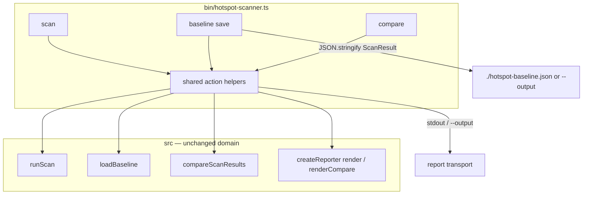

# Milestone 40 — Workflow Subcommands Design

**Spec**: [`.specs/features/workflow-subcommands/spec.md`](./spec.md)  
**Context**: [`.specs/features/workflow-subcommands/context.md`](./context.md)  
**Status**: Planned

---

## Architecture Overview

M40 adds two Commander entry points that wrap the **existing** scan/compare pipeline. No changes to `src/compare/`, scoring, schemas, or `CompareResult`. Bin extracts shared action helpers so `scan --baseline` and `compare` call the same wiring path.



**Baseline:** [scan-compare design](../scan-compare/design.md) (M13).  
**ROADMAP:** M40 Workflow Subcommands.

---

## Code Reuse Analysis

### Existing Components to Leverage

| Component | Location | How to Use |
| --------- | -------- | ---------- |
| `runScan()` | `src/scan.ts` | Current scan for save and compare |
| `loadBaseline` / `compareScanResults` | `src/compare/` | Unchanged compare path |
| `createReporter().render` / `renderCompare` | `src/report/` | Compare output only; save writes ScanResult JSON directly (or via `render(..., { format: "json" })`) |
| `buildCliConfigOverrides`, `buildScanOptions`, `validateOutputPath`, `validateBaselinePath`, `writeReport`, CSV helpers | `bin/hotspot-scanner.ts` | Share across scan / save / compare |
| `mergeScanOptions` / config load | `src/config/` | Same as scan |
| Fixture `tests/fixtures/repos/small-ts/` | tests | Integration round-trip |

### Integration Points

| Consumer | Impact |
| -------- | ------ |
| `bin/hotspot-scanner.ts` | Register `baseline`→`save`, `compare`; refactor shared helpers |
| Optional `bin/scan-actions.ts` | Extracted helpers if `hotspot-scanner.ts` exceeds maintainability — allowed by `tsconfig.bin.json` `include: ["bin/**/*"]` |
| `src/scan.ts`, `src/compare/**`, `src/report/**`, `schemas/` | **None** (reuse only) |
| `src/index.ts` | No new public API required |

---

## Components

### Shared CLI action helpers

- **Purpose**: Single wiring path for “run scan → render or write JSON” and “run scan → compare → render” so `scan --baseline` and `compare` cannot drift.
- **Location**: `bin/hotspot-scanner.ts` and/or `bin/scan-actions.ts`
- **Interfaces** (illustrative — names at implementer discretion):

```typescript
/** Constant — locked default path */
export const DEFAULT_BASELINE_OUTPUT = "./hotspot-baseline.json";

export async function executeScan(options: {
  repoPath: string;
  cliOverrides: HotspotScannerConfig;
  configPath?: string;
}): Promise<ScanResult>;

export async function writeBaselineJson(
  result: ScanResult,
  outputPath: string,
): Promise<void>;

export async function executeCompareAndRender(options: {
  repoPath: string;
  baselinePath: string;
  cliOverrides: HotspotScannerConfig;
  configPath?: string;
  format: OutputFormat;
  top: number;
  outputPath?: string;
}): Promise<void>;
```

- **Dependencies**: `#scan`, `#compare`, `#report`, `#config`, `#diagnostics`
- **Reuses**: Existing validate/write helpers; `JSON.stringify(result, null, 2)` or `reporter.render(result, { format: "json" })` for baseline bytes — both must remain `loadBaseline`-compatible

### Command: `baseline save`

- **Purpose**: Persist ScanResult JSON for later compare.
- **Commander shape**:

```text
hotspot-scanner baseline save <path>
  [--output <path>]          # default ./hotspot-baseline.json
  [--since] [--granularity] [--top] [--min-cochange]
  [--include] [--exclude] [--concurrency] [--config]
```

- **Flow**: parse → merge config → `runScan` → `validateOutputPath` → write UTF-8 JSON → exit 0
- **Does not**: accept `--format` or `--baseline`; does not print the JSON to stdout when writing a file (file is the artifact; stderr diagnostics OK)

### Command: `compare`

- **Purpose**: Explicit compare entry point.
- **Commander shape**:

```text
hotspot-scanner compare <path> --baseline <file>
  [--format] [--output] [--top] + same scan options as scan
```

- **Flow**: identical to current `scan` action when `baselinePath` is set
- **Required**: `--baseline` via `.requiredOption` or explicit `CliUsageError`

### Command: `scan` (refactor only)

- **Purpose**: Keep behavior; call shared helpers for baseline and non-baseline branches.
- **Regression**: HOTSPOT-499

---

## Data / contracts

| Artifact | Schema | Notes |
| -------- | ------ | ----- |
| Baseline file from `baseline save` | `ScanResult` / `schemas/scan-result.json` | Same as `scan --format json --output` |
| Compare output | `CompareResult` / `schemas/compare-result.json` | Unchanged |
| New persistence | None | JSON files only |

No type changes under `src/types/`.

---

## Risks (CONCERNS)

| Risk | Mitigation |
| ---- | ---------- |
| Drift between `compare` and `scan --baseline` | Shared helper; parity test in T4 |
| Baseline JSON not loadable | Prefer reporter JSON or stringify of full `ScanResult`; round-trip test via `loadBaseline` |
| Fragile compare/baseline parsers | Do not edit `src/compare/load-baseline.ts` in M40 |
| Bin file growth / path conflict | One module owner (`bin/`); sequential T1→T3; optional extract file still under `bin/` |

---

## CLI wiring sketch

```typescript
const baseline = program
  .command("baseline")
  .description("Baseline file workflows");

baseline
  .command("save")
  .description("Run a scan and write ScanResult JSON as a baseline")
  .argument("<path>", "Repository path")
  .option("--output <path>", "Baseline file path", DEFAULT_BASELINE_OUTPUT)
  // …scan options mirrored from scan (no --format / --baseline)
  .action(async (repoPath, options) => { /* helpers */ });

program
  .command("compare")
  .description("Compare current scan against a baseline JSON file")
  .argument("<path>", "Repository path")
  .requiredOption("--baseline <path>", "Baseline ScanResult JSON")
  // …same format/output/top/scan options as scan
  .action(async (repoPath, options) => { /* executeCompareAndRender */ });
```

---

## Testing strategy

| Layer | What |
| ----- | ---- |
| Unit (`bin/hotspot-scanner.test.ts`) | Command registration; default output; missing `--baseline`; invalid output; mock `#scan` for save/compare wiring |
| Integration (`bin/hotspot-scanner.integration.test.ts` or existing) | `baseline save` on isolated `small-ts` → `compare --format json` exit 0; `scan --baseline` regression |
| Domain | No new `src/compare` tests required unless helpers incorrectly pull domain into bin |

**Gate:** per-task Vitest paths; final `pnpm build && pnpm test`.

---

## Implementation notes (YAGNI)

- Do not add `src/workflow/` or baseline path config keys.
- Do not emit deprecation warnings on `scan --baseline`.
- Do not change exit codes for delta content.
- Prefer extracting helpers only as needed for DRY between three commands — avoid a large framework.
