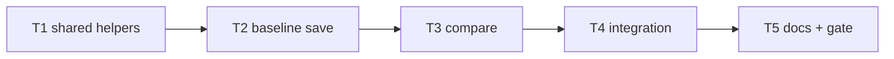

# Milestone 40 — Workflow Subcommands Tasks

**Design**: [`.specs/features/workflow-subcommands/design.md`](./design.md)  
**Spec**: [`.specs/features/workflow-subcommands/spec.md`](./spec.md)  
**Context**: [`.specs/features/workflow-subcommands/context.md`](./context.md)  
**Status**: Planned

---

## Execution Plan

### Phase 1: Shared helpers + scan refactor (Sequential)

```
T1 Extract shared scan/compare action helpers; refactor scan to use them
```

### Phase 2: New commands (Sequential — same bin owner)

```
T1 → T2 baseline save
T2 → T3 compare subcommand
```

### Phase 3: Integration (Sequential)

```
T3 → T4 CLI integration + parity + scan --baseline regression
```

### Phase 4: Docs + full gate (Sequential)

```
T4 → T5 docs sync + pnpm build && pnpm test
```



### Diagram-Definition Cross-Check

| Task | Depends on (declared) | Appears in diagram after deps | Match |
| ---- | --------------------- | ----------------------------- | ----- |
| T1 | None | Root | ✅ |
| T2 | T1 | T1 → T2 | ✅ |
| T3 | T2 | T2 → T3 | ✅ |
| T4 | T3 | T3 → T4 | ✅ |
| T5 | T4 | T4 → T5 | ✅ |

### Test Co-location Validation

| Task | Code layer | TESTING.md expectation | Tests in same task | Match |
| ---- | ---------- | ---------------------- | ------------------ | ----- |
| T1 | `bin/` helpers + scan refactor | CLI unit | Update `bin/hotspot-scanner.test.ts` regression for `scan` / `--baseline` | ✅ |
| T2 | `bin/` `baseline save` | CLI unit | Tests for default path, `--output`, invalid output | ✅ |
| T3 | `bin/` `compare` | CLI unit | Tests for required `--baseline`, format/output wiring | ✅ |
| T4 | `bin/` integration | Integration | Round-trip save→compare; parity with `scan --baseline` | ✅ |
| T5 | Docs only | Gate | Full `pnpm build && pnpm test` | ✅ |

### Path Conflict Check (Check 5)

| Task | Module owner | Paths | Conflict with parallel? |
| ---- | ------------ | ----- | ----------------------- |
| T1–T5 | `bin/` (+ docs in T5) | Primarily `bin/hotspot-scanner.ts` (± `bin/scan-actions.ts`) | No `[P]` — all sequential ✅ |

---

## Task Breakdown

### T1: Shared CLI action helpers + refactor `scan`

**What**: Extract shared helpers for running a scan (config merge + `runScan` + diagnostics) and for the compare-and-render path (`validateBaselinePath` → `loadBaseline` → `compareScanResults` → `renderCompare` → write). Refactor the existing `scan` command action to call these helpers so behavior is unchanged. Export `DEFAULT_BASELINE_OUTPUT = "./hotspot-baseline.json"` for T2. Optional: move helpers to `bin/scan-actions.ts` if the entry file is too large — keep domain imports only as wiring.

**Where**: `bin/hotspot-scanner.ts`, optionally `bin/scan-actions.ts`, `bin/hotspot-scanner.test.ts`

**Depends on**: None

**Reuses**: [design.md](./design.md) § Shared CLI action helpers; existing `buildCliConfigOverrides`, `buildScanOptions`, `validateBaselinePath`, `writeReport`, CSV helpers

**Requirement**: HOTSPOT-499, HOTSPOT-500

**Tools**:

- MCP: NONE
- Skill: `coding-guidelines`, `vitals-cli-validation`

**Done when**:

- [ ] Shared helpers exist and `scan` / `scan --baseline` call them
- [ ] Existing CLI unit tests for `scan` and `--baseline` still pass without intentional assertion weakening
- [ ] No changes under `src/compare/`, `src/scan.ts` domain logic, or `schemas/`
- [ ] Helpers contain wiring/I/O only (no compare classification reimplementation)

**Tests**: `bin/hotspot-scanner.test.ts` — regression coverage for scan and scan `--baseline` paths

**Gate**: `pnpm exec vitest run bin/hotspot-scanner.test.ts`

**Commit**: `refactor(cli): extract shared scan and compare action helpers`

---

### T2: `baseline save` command

**What**: Register nested `baseline` → `save <path>` with `--output` defaulting to `DEFAULT_BASELINE_OUTPUT` (`./hotspot-baseline.json`). Mirror scan options (since, granularity, top, min-cochange, include/exclude, concurrency, config) — do **not** register `--format` or `--baseline`. Action: `runScan` via helpers → `validateOutputPath` → write full `ScanResult` JSON (JSON semantics; `--top` does not truncate). Overwrite existing files without prompt. Document in command help.

**Where**: `bin/hotspot-scanner.ts` (± `bin/scan-actions.ts`), `bin/hotspot-scanner.test.ts`

**Depends on**: T1

**Reuses**: [context.md](./context.md) § baseline save, § default path, § format surface; T1 helpers; `validateOutputPath`

**Requirement**: HOTSPOT-490, HOTSPOT-491, HOTSPOT-492, HOTSPOT-493, HOTSPOT-494, HOTSPOT-495, HOTSPOT-501, HOTSPOT-502

**Tools**:

- MCP: NONE
- Skill: `coding-guidelines`, `vitals-cli-validation`

**Done when**:

- [ ] `createCliProgram()` exposes `baseline` / `save`
- [ ] Default write path is `./hotspot-baseline.json` when `--output` omitted
- [ ] `--output` override works; empty/dir/missing-parent → `CliUsageError` / exit `!= 0`
- [ ] Written file is accepted by `loadBaseline()` (unit or integration assertion)
- [ ] Success exit code `0`
- [ ] Unit tests cover default path, override, and invalid output

**Tests**: `bin/hotspot-scanner.test.ts` — `baseline save` cases (mock `#scan` where appropriate; real temp file for write/load)

**Gate**: `pnpm exec vitest run bin/hotspot-scanner.test.ts`

**Commit**: `feat(cli): add baseline save subcommand`

---

### T3: `compare` subcommand

**What**: Register top-level `compare <path>` with **required** `--baseline <file>` and the same format/output/top/scan/config options as `scan`. Action calls the shared compare-and-render helper (parity with `scan --baseline`). Help documents required `--baseline`. Do not remove or deprecate `scan --baseline`.

**Where**: `bin/hotspot-scanner.ts` (± `bin/scan-actions.ts`), `bin/hotspot-scanner.test.ts`

**Depends on**: T2

**Reuses**: [context.md](./context.md) § compare + keep scan --baseline; T1 `executeCompareAndRender` (or equivalent)

**Requirement**: HOTSPOT-496, HOTSPOT-497, HOTSPOT-498, HOTSPOT-499, HOTSPOT-500, HOTSPOT-501, HOTSPOT-502

**Tools**:

- MCP: NONE
- Skill: `coding-guidelines`, `vitals-cli-validation`

**Done when**:

- [ ] `compare` registered; missing `--baseline` → exit `!= 0`
- [ ] Valid compare path uses `loadBaseline` + `compareScanResults` + `renderCompare`
- [ ] `--format` / `--output` / `--top` / CSV rules match `scan --baseline`
- [ ] `scan --baseline` still present and wired through shared helper
- [ ] Unit tests cover required baseline and successful compare wiring (mocked domain OK)

**Tests**: `bin/hotspot-scanner.test.ts` — `compare` registration, missing baseline, happy-path mock

**Gate**: `pnpm exec vitest run bin/hotspot-scanner.test.ts`

**Commit**: `feat(cli): add compare subcommand wrapping scan --baseline`

---

### T4: Integration — save → compare round-trip + parity

**What**: Add/extend integration tests: on an isolated `small-ts` (or equivalent) fixture copy, run `baseline save` to a temp file, then `compare --baseline` with `--format json` and assert exit `0` + parseable CompareResult. Assert behavioral parity: `compare … --baseline X --format json` vs `scan … --baseline X --format json` for the same inputs (stable fields / structure). Keep `scan --baseline` regression green.

**Where**: `bin/hotspot-scanner.integration.test.ts` and/or `bin/hotspot-scanner.test.ts`

**Depends on**: T3

**Reuses**: Existing integration patterns; `tests/fixtures/repos/small-ts/`; [vitals-cli-validation](../../../.cursor/skills/vitals-cli-validation/SKILL.md)

**Requirement**: HOTSPOT-497, HOTSPOT-499, HOTSPOT-502, HOTSPOT-503

**Tools**:

- MCP: NONE
- Skill: `vitals-cli-validation`

**Done when**:

- [ ] Round-trip save → compare exits `0` with valid compare JSON
- [ ] Parity assertion between `compare` and `scan --baseline` documented in test
- [ ] Pre-M40 `scan --baseline` integration behavior still passes
- [ ] `bin/**` coverage thresholds still met for changed files

**Tests**: integration cases above

**Gate**: `pnpm exec vitest run bin/hotspot-scanner.test.ts bin/hotspot-scanner.integration.test.ts`

**Commit**: `test(cli): cover baseline save and compare workflow`

---

### T5: Documentation sync + full project gate

**What**: Update ARCHITECTURE (CLI flow: `baseline save`, `compare`, retain `scan --baseline`), STRUCTURE / module map for any new `bin/` file, README CLI/workflow section for save→compare, and ROADMAP M40 checkbox/status on Execute Done. Run full quality gate. No schema or domain doc rewrites beyond CLI surface.

**Where**: `.specs/codebase/ARCHITECTURE.md`, `.specs/codebase/STRUCTURE.md`, `README.md`, `.specs/project/ROADMAP.md`, `.specs/project/STATE.md` (if decisions emerge)

**Depends on**: T4

**Reuses**: [spec.md](./spec.md) HOTSPOT-504; living-docs convention

**Requirement**: HOTSPOT-504

**Tools**:

- MCP: NONE
- Skill: NONE

**Done when**:

- [ ] Docs mention `baseline save` (default `./hotspot-baseline.json`) and `compare --baseline`
- [ ] Docs still document `scan --baseline`
- [ ] ROADMAP M40 ready to mark Done when Execute finishes (planner leaves Specs: Planned until then)
- [ ] `pnpm build && pnpm test` passes

**Tests**: none (docs); gate is the verification

**Gate**: `pnpm build && pnpm test`

**Commit**: `docs: document baseline save and compare subcommands`

---

## Parallel Execution Map

```
Phase 1: T1
Phase 2: T2 → T3        (no [P] — shared bin/hotspot-scanner.ts)
Phase 3: T4
Phase 4: T5             (full gate)
```

**Note:** Do not mark T2/T3 `[P]` — both own the same CLI entry module.

---

## Requirement → Task Mapping

| Requirement ID | Task(s) |
| -------------- | ------- |
| HOTSPOT-490 | T2 |
| HOTSPOT-491 | T2 |
| HOTSPOT-492 | T2 |
| HOTSPOT-493 | T2 |
| HOTSPOT-494 | T2 |
| HOTSPOT-495 | T2 |
| HOTSPOT-496 | T3 |
| HOTSPOT-497 | T3, T4 |
| HOTSPOT-498 | T3 |
| HOTSPOT-499 | T1, T3, T4 |
| HOTSPOT-500 | T1, T2, T3 |
| HOTSPOT-501 | T2, T3 |
| HOTSPOT-502 | T2, T3, T4 |
| HOTSPOT-503 | T4 |
| HOTSPOT-504 | T5 |
| HOTSPOT-505–509 | Reserved unused |

**Coverage:** 15/15 P1 mapped, 0 unmapped

---

## Handoff

Status is **Planned**. Promote to `Approved` / `Ready for Execute` in a **new** development session, then invoke `orchestrator-implementer`.

Suggested commit messages are per-task proposals only — commit when the user asks.
