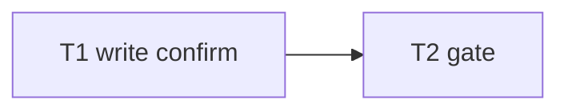

# Milestone 69 — Write Confirmation UX Tasks

**Spec**: [`.specs/features/write-confirm-ux/spec.md`](./spec.md)  
**Status**: Planned  
**Note**: Medium feature — bin write path only. STOP at Planned; Execute in a separate session via `orchestrator-implementer` after Status promotion. Prefer Execute after M68 (bookend compose). Do **not** implement M68/M70 here.

---

## Execution Plan

### Phase 1: Implementation

```
T1 write confirm + tests
```

### Phase 2: Gate

```
T1 → T2 project gate
```



### Diagram-Definition Cross-Check

| Task | Depends on (body) | Diagram shows | Status |
| ---- | ----------------- | ------------- | ------ |
| T1 | None | Root | ✅ Match |
| T2 | T1 | T1→T2 | ✅ Match |

### Path Conflict Check (Check 5)

| Task | Module owner | Paths | Conflict |
| ---- | ------------ | ----- | -------- |
| T1 | bin | `bin/scan-actions.ts`, `bin/hotspot-scanner.test.ts` (confirm cases); touch `bin/hotspot-scanner.ts` only if wiring needed (prefer keep logic in `writeRenderedOutput`) | Sole bin write-confirm owner |
| T2 | gate | none | After T1 |

No `[P]` — single sequential owner.

### Test Co-location Validation

| Task | Code layer | TESTING.md expectation | Task Tests | Status |
| ---- | ---------- | ---------------------- | ---------- | ------ |
| T1 | `bin/` | unit | unit | ✅ OK |
| T2 | full project | gate | `pnpm build && pnpm test` | ✅ OK |

### Granularity Check

| Task | Scope | Status |
| ---- | ----- | ------ |
| T1 | Confirm emissions + quiet/stdout/bundle cases + tests | ✅ Cohesive bin |
| T2 | Project gate | ✅ Granular |

---

## Task Breakdown

### T1: Stderr write confirmation for `--output` and `--csv-single-file`

**What:** After successful single-file writes in `writeRenderedOutput` (table/md/json `--output`, and `--csv-single-file`), emit `Wrote <path>\n` on stderr unless `quiet`; leave CSV bundle confirm unchanged; no confirm for stdout-only.  
**Where:** `bin/scan-actions.ts`, `bin/hotspot-scanner.test.ts`  
**Depends on:** None  
**Reuses:** M62 `writeCsvBundle` quiet/confirm pattern; existing `writeRenderedOutput` options  
**Requirement:** HOTSPOT-1260, HOTSPOT-1261, HOTSPOT-1262, HOTSPOT-1263, HOTSPOT-1264  
**Module owner:** `bin/`

**Tools:**

- MCP: NONE
- Skill: `coding-guidelines`, `vitals-cli-validation`

**Done when:**

- [ ] `--output` table/md/json → stderr confirm with path
- [ ] `--csv-single-file` → stderr confirm with path
- [ ] `--quiet` suppresses single-file and (existing) bundle confirms
- [ ] stdout-only → no confirm
- [ ] CSV bundle multi-line confirm still present when not quiet
- [ ] Unit tests cover the matrix
- [ ] Gate check passes: `pnpm test -- bin/hotspot-scanner.test.ts`
- [ ] Test count: no silent deletions

**Tests:** unit  
**Gate:** `pnpm test -- bin/hotspot-scanner.test.ts`

**Verify:** Temp-dir CLI runs: json `-o`, markdown `-o`, csv `--csv-single-file -o`, csv bundle `-o`, quiet variants.

**Commit:** `feat(cli): confirm successful --output and csv-single-file writes`

---

### T2: Project quality gate

**What:** Run full project gate.  
**Where:** repo root  
**Depends on:** T1  
**Reuses:** N/A  
**Requirement:** Success criteria  
**Module owner:** gate

**Done when:**

- [ ] `pnpm build && pnpm test` exits 0

**Tests:** full suite  
**Gate:** `pnpm build && pnpm test`

---

## Requirement → Task Mapping

| Requirement ID | Task |
| -------------- | ---- |
| HOTSPOT-1260 | T1 |
| HOTSPOT-1261 | T1 |
| HOTSPOT-1262 | T1 |
| HOTSPOT-1263 | T1 |
| HOTSPOT-1264 | T1 |
