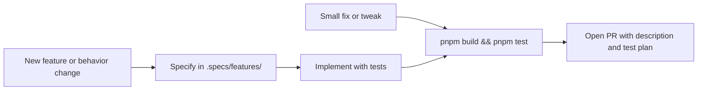

# Contributing to @vitals/hotspot-scanner

Thank you for your interest in contributing. This guide covers local setup, the quality gate, and how to open a pull request.

**Audience:** human contributors. For AI agent policies, skills, and exit-code detail, see [AGENTS.md](AGENTS.md). Do not mirror STRUCTURE, TESTING, INTEGRATIONS, CONCERNS, or the AGENTS exit-code table here — link those SoTs instead.

**@vitals/hotspot-scanner** is a local CLI that ranks TypeScript/JavaScript maintenance hotspots from NCLOC and Git churn (file-level). Design source of truth: [.specs/codebase/ARCHITECTURE.md](.specs/codebase/ARCHITECTURE.md).

## Prerequisites

| Requirement | Version                       |
| ----------- | ----------------------------- |
| Node.js     | 22+                           |
| pnpm        | latest stable                 |
| git         | required at runtime for scans |

## Local setup

```bash
git clone https://github.com/taranti/hotspot-scanner.git
cd hotspot-scanner
pnpm install
pnpm build
pnpm test
```

`pnpm build && pnpm test` is the project quality gate (see below). `pnpm test` runs Vitest with mandatory per-file coverage; thresholds and include/exclude rules live in [.specs/codebase/TESTING.md](.specs/codebase/TESTING.md).

## Quality gate

Before opening a pull request, re-run:

```bash
pnpm build && pnpm test
```

This is the required acceptance bar for all contributions. There is no CI pipeline in v1 — local verification is what reviewers expect.

### Recommended local checks (optional)

These scripts help catch issues earlier; they are **not** part of the required Done gate in AGENTS.md:

```bash
pnpm typecheck    # TypeScript for src/ and bin/ without emit
pnpm lint         # ESLint (flat config at eslint.config.mjs)
pnpm format:check # Prettier verification (use pnpm format to fix)
```

Do not lower coverage thresholds, skip tests, or weaken assertions to pass the gate. A falling test count is a potential regression — investigate before merging. Coverage SoT: [.specs/codebase/TESTING.md](.specs/codebase/TESTING.md).

## Manual CLI validation

When you change CLI flags, `bin/`, or pipeline wiring, validate against a fixture repo:

```bash
pnpm exec hotspot-scanner scan tests/fixtures/repos/small-ts
pnpm exec hotspot-scanner scan tests/fixtures/repos/small-ts --since "12 months ago" --format json
```

Exit codes: see [AGENTS.md](AGENTS.md) § Validation (CLI).

## How to contribute



Work on a focused branch (fork or branch off the default branch), then open a PR with what changed, why, and a test plan.

### Small changes

For bug fixes, typos, or narrow refactors:

1. Read the relevant module and [.specs/codebase/CONVENTIONS.md](.specs/codebase/CONVENTIONS.md)
2. Co-locate `*.test.ts` with the module under test
3. Run the quality gate

### Medium and large features

For new CLI flags, scanner modules, or scoring changes:

1. Follow **Specify → Design → Tasks → Execute** (see [.cursor/skills/vitals-spec-driven/](.cursor/skills/vitals-spec-driven/))
2. Create or extend `.specs/features/<slug>/` with:
   - `spec.md` — requirements with traceable `HOTSPOT-*` IDs
   - `design.md` — optional, for architectural decisions
   - `tasks.md` — optional, for multi-step breakdown
3. Check [.specs/project/ROADMAP.md](.specs/project/ROADMAP.md) for planned milestones
4. Update living docs in `.specs/codebase/` when adding modules, types, or integrations

**YAGNI:** implement only what the spec or task requires. Do not add extra flags, abstractions, or features beyond the current requirement.

## Code conventions

Summary of [.specs/codebase/CONVENTIONS.md](.specs/codebase/CONVENTIONS.md). Directory layout: [.specs/codebase/STRUCTURE.md](.specs/codebase/STRUCTURE.md).

- **ESM only** — import internal modules with `.js` extension in TypeScript source
- **Domain logic in `src/`** — `bin/` is CLI wiring (commander flags and command actions); keep domain logic out of `bin/`
- **Co-locate tests** — `*.test.ts` next to the module; fixtures live in `tests/fixtures/`
- **Separate build** — `src/**` via root `tsc`; `bin/` via `tsconfig.bin.json`

## Boundaries and risks

External adapters and spawn/deps ownership: [.specs/codebase/INTEGRATIONS.md](.specs/codebase/INTEGRATIONS.md). Mock at adapter boundaries — not in scorers, reporter, or `scan.ts`. New runtime dependencies need design justification and an entry in `INTEGRATIONS.md`.

Fragile modules (git mining, NCLOC, scoring) need extra care and targeted fixtures: [.specs/codebase/CONCERNS.md](.specs/codebase/CONCERNS.md).

## Commits and pull requests

- Use **Conventional Commits** (e.g. `feat:`, `fix:`, `test:`, `docs:`)
- PR description should include: what changed, why, and a test plan (commands you ran)
- Bug reports and feature requests: [GitHub Issues](https://github.com/taranti/hotspot-scanner/issues)
- Security vulnerabilities: follow [SECURITY.md](SECURITY.md) — do not open a public issue

## Documentation map

| Topic                 | Document                                                           |
| --------------------- | ------------------------------------------------------------------ |
| Module layout         | [.specs/codebase/STRUCTURE.md](.specs/codebase/STRUCTURE.md)       |
| Pipeline / data flow  | [.specs/codebase/ARCHITECTURE.md](.specs/codebase/ARCHITECTURE.md) |
| Testing & coverage    | [.specs/codebase/TESTING.md](.specs/codebase/TESTING.md)           |
| External dependencies | [.specs/codebase/INTEGRATIONS.md](.specs/codebase/INTEGRATIONS.md) |
| Fragile areas         | [.specs/codebase/CONCERNS.md](.specs/codebase/CONCERNS.md)         |
| Conventions           | [.specs/codebase/CONVENTIONS.md](.specs/codebase/CONVENTIONS.md)   |
| Decisions             | [.specs/project/STATE.md](.specs/project/STATE.md)                 |
| Roadmap               | [.specs/project/ROADMAP.md](.specs/project/ROADMAP.md)             |
| AI/agent workflow     | [AGENTS.md](AGENTS.md)                                             |
