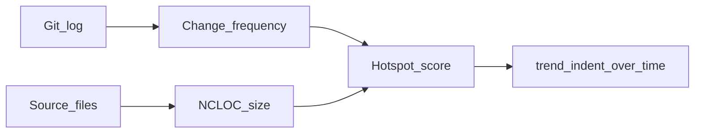

# Methodology — why NCLOC and indentation?

hotspot-scanner ranks **maintenance hotspots**: places where structural weight meets frequent change. The metrics are **deliberate proxies** for prioritization — not a claim that NCLOC or indentation *are* cognitive or cyclomatic complexity.

This page is the longer “why.” For CLI recipes and growth-pattern labels, see [recipes.md](recipes.md). Product limitations: [README → Limitations](../README.md#limitations).

## Hotspot = complexity × change frequency

Complexity alone is a weak guide. A large, nested module that nobody touches is **low-interest** technical debt. The same structure in a file that changes every sprint is **high-interest** debt: people pay the cost repeatedly.

In practice, change activity in a codebase follows a **power-law-like** shape: most commits concentrate in a small slice of files. Hotspot analysis aims that slice — where accidental complexity is expensive — rather than asking you to “fix all debt.”

Framing inspired by Adam Tornhill’s behavioral code analysis (*Your Code as a Crime Scene*): combine a **complexity dimension** with an **effort / change-frequency** dimension, then act on the intersection.

## Change frequency (Git churn)

`scan` mines Git history (`git log --numstat`) and treats **raw commit count per file** in the `--since` window as churn. That is the behavioral axis: where the organization actually spends change effort.

This is the same *idea* as Tornhill’s “revisions” analyses (e.g. Code Maat-style change frequencies). hotspot-scanner is its own pipeline and scoring model — not a Code Maat port.

## Size proxy: NCLOC

For **ranking** (`scan`), the complexity/size axis is **NCLOC** — non-commented lines of code in the working tree:

- Blank and comment-only lines are excluded (closer to `cloc` “code” than raw LOC).
- No AST, McCabe, or language-specific parser for the score.

**Why a simple size proxy?**

- Elaborate static metrics often fail to clearly outperform LOC when predicting maintenance difficulty or cognitive load; a simple, explainable measure is a reasonable first cut.
- NCLOC is **intuitive** for stakeholders (“~2,500 lines of real code”) — natural units for humans, while the scorer still uses **normalized** values internally.
- It is cheap, language-neutral in spirit, and stable enough for **relative** ranking inside one scan.

The hotspot score is a **harmonic mean** of normalized NCLOC and normalized churn: files that are both large *and* active rise; a huge dormant file does not dominate merely by size.

## Indentation proxy (`trend` / `assess` only)

Indentation metrics are **not** part of the `scan` hotspot score. They appear when you drill into history:

- **Whitespace / “negative space”** — nesting depth as a language-agnostic shadow of control structure (conditional slopes), in the tradition of indentation-as-complexity proxies (see references below).
- Per revision: `indentMean`, `indentSd`, `indentMax`, `indentTotal`, plus NCLOC — so you can tell growth from **adding size** vs growth from **deeper nesting**.
- Always-on **growth patterns** (`deteriorating` / `refactored` / `stable` / `inconclusive`) — see [Tornhill growth curves](recipes.md#tornhill-growth-curves-trend-pattern).

Prefer **trends over absolute indent numbers**. A high max indent is a hint; a rising `indentMean` while NCLOC stays flat is a stronger warning signal.

## How this maps to commands

| Command | Role | Proxies |
| ------- | ---- | ------- |
| `scan` | Rank files *now* | NCLOC + Git churn |
| `trend` | One file over sampled revisions | Indentation + NCLOC history |
| `assess` | Scan, then sequential trends on top hotspots | Same proxies as `trend` per candidate |

## What this is not / caveats

- **Not** McCabe, Halstead, Cognitive Complexity, or AST-based truth.
- **Formatter cliffs** — a mass Prettier / re-indent commit can spike indent metrics and false-label growth patterns; treat Pattern as indicative. Details: [recipes → Tornhill growth curves](recipes.md#tornhill-growth-curves-trend-pattern).
- **Flat-but-complex** code (dense one-liners, some comprehensions) can understate nesting via whitespace.
- **Scores are scan-relative** — not comparable across repos or windows without your own process.
- **TypeScript/JavaScript eligible extensions only** — see [README Limitations](../README.md#limitations).

Use the tool to **prioritize investigation and refactoring**, not as a CI gate on absolute complexity.

## References

- [Tornhill, Adam. *Your Code as a Crime Scene*, 2nd ed](https://pragprog.com/titles/atcrime2/your-code-as-a-crime-scene-second-edition/)
- [Hindle, Godfrey, Holt. *Reading Beside the Lines: Indentation as a Proxy for Complexity Metric*](https://ieeexplore.ieee.org/document/4556125)
- [Peitek et al. *Program Comprehension and Code Complexity Metrics: An fMRI Study*](https://ieeexplore.ieee.org/document/9402005)
- [Lehman, M. M. *On understanding laws, evolution, and conservation in the large-program life cycle*](https://www.sciencedirect.com/science/article/abs/pii/0164121279900220)
