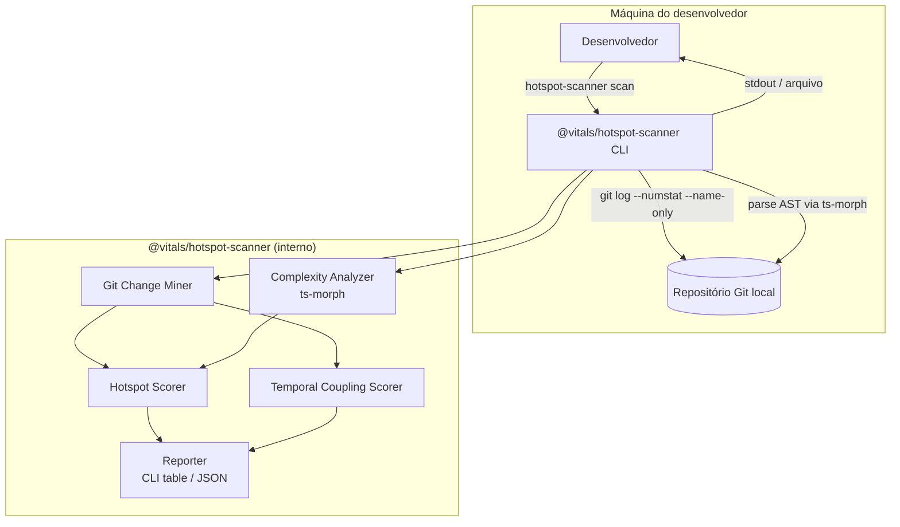
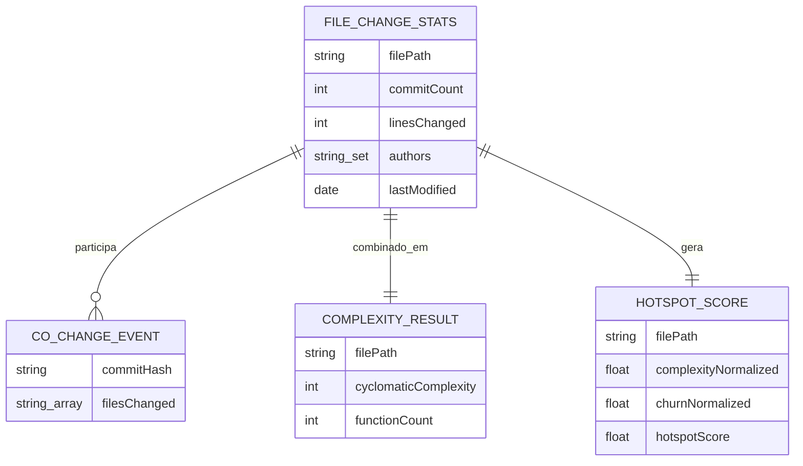
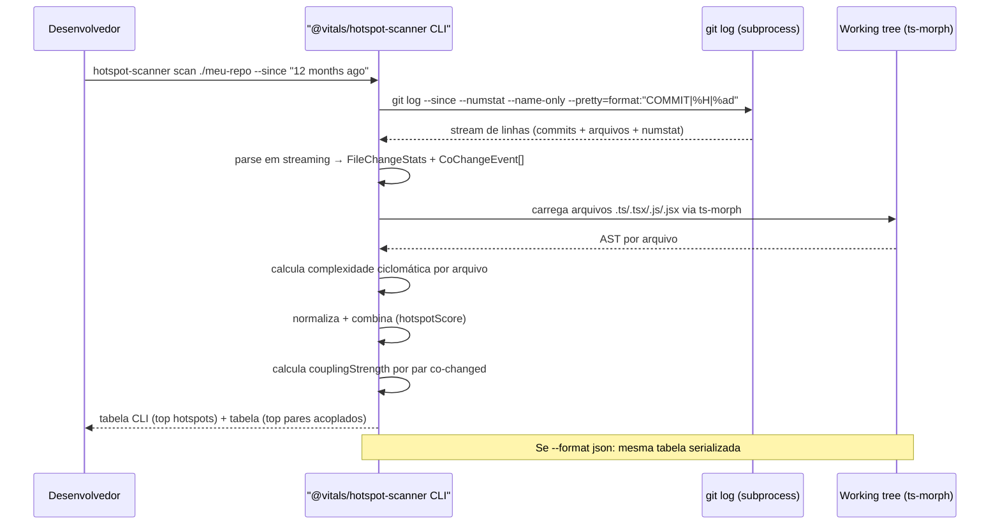

# Implementation Spec: @vitals/hotspot-scanner

| Campo | Valor |
|---|---|
| **ID** | IMPL-2026-003 |
| **Versão** | 0.1 (Draft) |
| **Data** | 2026-07-21 |
| **Autores** | Alan (Tech Lead) |
| **Revisores** | [CLARIFICAR: quem revisa tecnicamente antes de aprovar] |
| **Status** | Draft |
| **PRD vinculado** | N/A — ferramenta interna de engenharia, sem PRD upstream |
| **ADRs vinculados** | ADR-2026-018, ADR-2026-019, ADR-2026-020, ADR-2026-021 |
| **Repositório** | [CLARIFICAR: URL do repo — pacote npm `@vitals/hotspot-scanner`] |
| **Spec OpenAPI/Smithy** | N/A — CLI, sem API HTTP |

---

## 1. TL;DR

CLI standalone que identifica hotspots de manutenção em repositórios TypeScript/JavaScript, cruzando complexidade ciclomática por arquivo (via AST, com implementação própria do algoritmo de McCabe sobre `ts-morph`) com frequência de mudança extraída do histórico Git, e somando um terceiro sinal de acoplamento temporal (arquivos que mudam juntos com frequência, mesmo sem dependência estática declarada). Roda 100% local, sem gate de CI/CD nesta fase. Dois trade-offs centrais: (1) escopo TS/JS-only, trocando abrangência de linguagem por precisão real de complexidade em vez de LOC como proxy; (2) implementação própria do cálculo de complexidade sobre `ts-morph`, em vez de depender de pacotes dedicados de complexidade — todas as opções avaliadas (`ts-complex`, `escomplex`, `typhonjs-escomplex`) estão abandonadas há 7-10 anos, e a alternativa mantida (ESLint core + wrapper de terceiros `eslintcc`) foi descartada por preferência de manter a lógica de cálculo sob controle direto do projeto.

---

## 2. Contexto e escopo

### 2.1. Background

Ferramentas comerciais como CodeScene calculam hotspots cruzando LOC (proxy de complexidade) com frequência de commit (proxy de esforço), priorizando a sobreposição das duas métricas. O livro *Your Code as a Crime Scene* (Tornhill) propõe um terceiro eixo — acoplamento temporal entre arquivos — como sinal de dependências ocultas que análise estática não captura.

Este projeto busca reproduzir essa lógica localmente: cruzar complexidade real por arquivo com frequência de mudança extraída do Git, e somar acoplamento temporal como terceiro sinal — dois arquivos sem nenhuma dependência declarada entre si podem estar fortemente acoplados na prática (ex: um DTO e seu schema de validação que sempre mudam juntos).

### 2.2. Escopo deste spec

Este documento cobre a primeira versão do `@vitals/hotspot-scanner`: um CLI local, sem integração com CI/CD, sem dashboard, sem persistência entre execuções. Não há spec irmã de frontend ou infra nesta fase — é um artefato standalone que aceita um path de repositório e produz um relatório.

---

## 3. Goals e Non-goals técnicos

### 3.1. Goals técnicos

- Extrair estatísticas de mudança por arquivo (contagem de commits, linhas alteradas, autores) a partir do histórico Git em uma única passada de `git log`
- Calcular complexidade ciclomática real por arquivo TypeScript/JavaScript via parse de AST (`ts-morph`), não LOC como proxy
- Detectar acoplamento temporal entre pares de arquivos (co-changes no mesmo commit) na mesma execução, sem re-parsear o log
- Combinar os três sinais (complexidade, churn, acoplamento) em um score de hotspot e um ranking de pares acoplados
- Escalar de repositórios pequenos (~500 arquivos, ~5k commits) a grandes (milhares de arquivos, dezenas de milhares de commits) sem degradar para tempo de execução impraticável em uma máquina de desenvolvedor
- Rodar 100% localmente, sem dependência de rede ou serviço externo

### 3.2. Non-goals técnicos

- Não inclui gate de CI/CD nesta fase — fica para uma iteração futura, após o padrão de threshold e uso ser validado localmente pelo time
- Não inclui suporte a linguagens além de TypeScript/JavaScript nesta versão
- Não inclui dashboard visual ou UI interativa — output é CLI table + JSON
- Não inclui persistência histórica entre execuções (comparar hotspots ao longo do tempo fica para versão futura)
- Não integra com nenhuma ferramenta externa de análise arquitetural nesta fase — mantém-se standalone e autocontido
- Não calcula relative code churn (ponderação por tamanho de arquivo) — decisão fechada para esta versão, não apenas adiada; churn é medido por contagem bruta de commits (`commitCount`, §5.1). Ver §14.5 para a análise de trade-off que fundamentou essa decisão.

---

## 4. Arquitetura proposta

### 4.1. Visão geral (C4 Container)

### 4.2. Decisões arquiteturais

| Decisão | Justificativa resumida | ADR |
|---|---|---|
| CLI standalone e autocontido | Mantém o projeto simples e sem dependências de ciclo de vida de outras ferramentas internas | ADR-2026-018 |
| `ts-morph` + implementação própria de McCabe | Precisão real de complexidade (vs LOC como proxy); evita dependência de pacotes de complexidade nichados e sem manutenção; controle total sobre a definição da métrica | ADR-2026-019 |
| Um único `git log --numstat --name-only` alimentando os três sinais | Evita rodar `git log` múltiplas vezes sobre o mesmo histórico; custo de parsing amortizado em uma passada | ADR-2026-020 |
| Binário CLI publicado sem o escopo do pacote (`hotspot-scanner`, não `@vitals/hotspot-scanner`) | Padrão usual para pacotes npm com escopo que expõem CLI; evita que o usuário precise digitar o escopo no terminal a cada comando | ADR-2026-021 |

### 4.3. Detalhamento de componentes

**Git Change Miner**: invoca `git log` uma vez, parseia o output em streaming (não carrega tudo em memória de uma vez para repos grandes), produzindo dois artefatos concorrentes: `FileChangeStats` (agregado por arquivo) e `CoChangeEvent[]` (lista de eventos por commit, usada pelo Coupling Scorer).

**Complexity Analyzer**: usa `ts-morph` para carregar cada arquivo `.ts`/`.tsx`/`.js`/`.jsx` do estado atual do working tree (não do histórico) e obter a AST tipada. A partir da AST, percorre os nós de decisão (`if`/`else if`, `for`, `while`, `do-while`, `case` de `switch`, `catch`, operadores lógicos `&&`/`||`/`??` em condições, expressões ternárias) e calcula complexidade ciclomática por função/arquivo com implementação própria da fórmula de McCabe (nós de decisão + 1). Por ser lógica própria (não delegada a um pacote de terceiros), a definição exata de "nó de decisão" é decisão do projeto — deve ser documentada e coberta por testes (ver §9), já que ferramentas diferentes divergem nesse detalhe (ex: se `switch` conta pontos por `case` individual ou como bloco único).

**Hotspot Scorer**: normaliza complexidade e churn (min-max ou log-scale, a decidir na implementação) e calcula `hotspotScore = normalize(complexity) * normalize(churn)`.

**Temporal Coupling Scorer**: para cada par de arquivos que aparece junto em pelo menos N commits (configurável via flag `--min-cochange`, §6.1), calcula `couplingStrength = coChangeCount / min(commitsA, commitsB)`.

**Reporter**: produz uma tabela CLI ordenada por hotspot score (top N) e uma tabela separada de pares acoplados (top N), mais opção de exportar ambas como JSON.

---

## 5. Modelo de dados

> Modelo conceitual — não há persistência, então não há schema de banco. As estruturas abaixo são in-memory/JSON de output.

### 5.1. Estruturas principais

### 5.2. Decisões de modelagem

- `FileChangeStats` e `CoChangeEvent` são derivados da mesma leitura de `git log` — parseados em uma única função para evitar I/O duplicado
- O campo `authors` em `FileChangeStats` é coletado por já vir "de graça" na mesma leitura de `git log --pretty=%an` que popula os demais campos, mas **não alimenta nenhum score nesta versão** e não é exposto no schema JSON de output (§6.2). É reservado para uso futuro (ex: sinal de bus factor — quantos autores distintos concentram o conhecimento de um hotspot), registrado aqui para não parecer campo morto sem propósito. Ver nota de privacidade em §8.1 sobre esse campo.
- Renomeações de arquivo (`git log --follow`) precisam ser tratadas explicitamente, ou um arquivo renomeado 3 vezes perde histórico e aparenta ser "novo" — comportamento a validar nos testes (ver §9)
- Não há período de retenção ou LGPD aplicável — a ferramenta processa apenas metadados de código-fonte e histórico de commit, sem dados pessoais de participantes/usuários finais do sistema previdenciário

---

## 6. Contratos de API e integrações

> Não há API HTTP. A "interface" é a CLI.

### 6.1. Interface de linha de comando

> Pacote publicado como `@vitals/hotspot-scanner`; binário exposto sem o escopo (`hotspot-scanner`) — ver decisão formalizada em ADR-2026-021.

| Comando | Propósito |
|---|---|
| `hotspot-scanner scan <path>` | Executa análise completa (hotspot + coupling) no path informado |
| `hotspot-scanner scan <path> --since <período>` | Limita a janela de histórico do Git (ex: `--since "12 months ago"`). Default: janela curta (proposto 12 meses, ver nota) — sem `--since`, o comando não roda sobre o histórico completo do repositório |
| `hotspot-scanner scan <path> --format json` | Exporta resultado como JSON em vez de tabela CLI |
| `hotspot-scanner scan <path> --top <N>` | Limita quantidade de itens no ranking (default: [CLARIFICAR]) |
| `hotspot-scanner scan <path> --min-cochange <N>` | Threshold mínimo de co-changes para considerar um par acoplado (default: [CLARIFICAR]) |

### 6.2. Convenções

- Default de `--since`: janela curta (proposto 12 meses, a confirmar — ver §16), não histórico completo. Justificativa: alinhado ao cenário de repos grandes (RT-001, §8.3) e favorece precisão caso Relative Code Churn seja adotado futuramente (janela mais curta reduz distorção do denominador — ver §14.5). Trade-off aceito: usuário pode não perceber que está vendo só uma fração do histórico; mitigado por mensagem informativa no output indicando a janela usada em cada execução.
- Exit code `0` sempre nesta fase (sem gate/threshold de falha — non-goal §3.2)
- Output JSON segue um schema versionado simples (`{"version": "1.0", "hotspots": [...], "coupling": [...]}`). Política de versionamento: nenhum consumidor externo está confirmado nesta fase (§3.2 exclui integração com outras ferramentas), então a política é mínima — o campo `version` é incrementado (major) apenas se um campo existente for removido ou seu tipo/significado mudar; adicionar novo campo não incrementa a versão. Revisitar com política formal se/quando um consumidor real for identificado.

### 6.3. Integrações externas

Nenhuma. A única "integração" é com o binário `git` local (via `child_process` ou lib como `simple-git`) e com o sistema de arquivos do repositório analisado. Não há chamada de rede.

---

## 7. Fluxos de dados críticos

### 7.1. Execução completa de scan

### 7.2. Tratamento de repositório grande (escala)

Para repos com dezenas de milhares de commits, o parsing do `git log` deve ser feito em streaming linha a linha (não `execSync` carregando output inteiro em memória), e o parse de AST via `ts-morph` deve processar arquivos em batches para não estourar heap em repos com milhares de arquivos. [CLARIFICAR: qual o limite de memória/tempo aceitável antes de considerar paralelização com worker threads?]

---

## 8. Considerações transversais

### 8.1. Segurança

#### Authentication & Authorization
Não aplicável — ferramenta CLI local, sem superfície de rede, sem múltiplos usuários. A única autorização relevante é a que o usuário já tem no filesystem/repositório local.

#### Threat model (STRIDE resumido)
Superfície de ataque é mínima dado o escopo local-only, mas vale registrar:

| Ameaça | Mitigação |
|---|---|
| **T**ampering | N/A — não há dado em trânsito nem persistência para adulterar |
| **I**nformation disclosure | Output pode conter nomes de autores de commit — revisar antes de compartilhar relatório externamente (ex: com fornecedor) |
| Demais categorias STRIDE | Não aplicáveis a uma ferramenta CLI local sem rede, sem auth, sem estado persistido |

#### Dados sensíveis
Nomes de autores de commit (extraídos de `git log --pretty=%an`) podem ser considerados dado pessoal em alguns contextos. Como a ferramenta roda local e o output fica com o desenvolvedor, não há tratamento adicional necessário nesta fase — mas isso deve ser revisitado se o output for algum dia centralizado ou compartilhado (ex: dashboard corporativo).

### 8.2. Privacidade (LGPD)

Não aplicável como DPIA formal — a ferramenta não processa dados de titulares (participantes do sistema previdenciário), apenas metadados de repositório de código-fonte interno. Nomes de autores de commit são dados de colaboradores internos, não de titulares externos; tratamento segue a política interna já existente de dados de RH/colaboradores, fora do escopo deste spec.

### 8.3. Performance

| Métrica | Alvo | Condição |
|---|---|---|
| Tempo de execução — repo pequeno | ≤ 30s | ~500 arquivos, ~5k commits |
| Tempo de execução — repo grande | [CLARIFICAR: alvo aceitável] | Milhares de arquivos, dezenas de milhares de commits |
| Uso de memória | Não estourar heap padrão do Node (~1.5-4GB) | Repo grande, sem flag `--max-old-space-size` customizada |

#### Capacity planning
Escopo definido como "variado" (§ decisões da conversa) — a ferramenta precisa degradar graciosamente em repos grandes, não apenas funcionar em repos pequenos. Isso é o principal risco técnico do projeto (ver RT-001 em §13) e justifica o design de streaming no Git Miner desde a v1, em vez de otimizar depois.

### 8.4. Confiabilidade

#### Failure modes

| Falha | Impacto | Detecção | Resposta |
|---|---|---|---|
| Repositório Git corrompido ou inválido | Scan não pode iniciar | `git log` retorna erro | Mensagem clara de erro, exit code != 0 |
| Arquivo TS/JS com sintaxe inválida (não compila) | `ts-morph` falha ao parsear aquele arquivo | Exception no parse | Log de warning, arquivo excluído do cálculo de complexidade (não derruba o scan inteiro) |
| Repo sem histórico suficiente (`--since` maior que a idade do repo) | Poucos ou nenhum dado de churn | Contagem de commits = 0 | Warning informativo, prossegue com o que houver |
| Arquivo renomeado múltiplas vezes ao longo do histórico | Contagem de churn distorcida ou histórico perdido (arquivo aparenta ser "novo") | Comparação de path atual vs eventos de rename no `git log --numstat` | Tratamento explícito via `--follow` (ver RT-003, §5.2, §9); se não totalmente resolvido, warning informando que o arquivo teve renomeações detectadas |
| Timeout/lentidão em repo muito grande | Scan não termina em tempo prático | [CLARIFICAR: timeout configurável?] | [CLARIFICAR: comportamento — abortar, ou permitir rodar indefinidamente?] |

#### Idempotência
Não aplicável no sentido tradicional (não há efeito colateral persistido) — rodar o mesmo scan duas vezes no mesmo estado de repo produz o mesmo resultado, por definição, já que é uma leitura pura sem escrita.

### 8.5. Observabilidade

Dado o escopo local-only sem CI/CD nesta fase, observabilidade formal (métricas RED, traces, alertas) não se aplica. O que faz sentido:

- **Log de progresso no CLI**: para repos grandes, mostrar progresso (ex: "processando commit 5.000/40.000") para o desenvolvedor não achar que travou
- **Log de warnings**: arquivos que falharam no parse de AST, arquivos renomeados detectados, etc. — para o desenvolvedor entender limitações do resultado

### 8.6. Acessibilidade
Não aplicável — ferramenta CLI, sem frontend.

---

## 9. Plano de testes

| Camada | Cobertura alvo | Ferramentas |
|---|---|---|
| Unit | ≥ 80% nos módulos de scoring e parsing | Jest |
| Unit — Git Miner | Parsing correto de `git log --numstat` incluindo casos de rename, merge commits, arquivos deletados | Jest com fixtures de log real |
| Unit — Complexity Analyzer | Complexidade ciclomática calculada corretamente para casos conhecidos (if/else, switch, loops aninhados, try/catch) | Jest + arquivos TS de fixture com complexidade esperada manualmente calculada |
| Unit — CLI/parsing de argumentos | Defaults aplicados corretamente quando flag omitida (`--since`, `--top`, `--min-cochange`); erro claro para valores inválidos (ex: `--since` com formato de data não reconhecido pelo Git) | Jest + biblioteca de parsing de CLI escolhida na implementação |
| Integração | Scan completo em repositório de teste real (fixture ou repo público pequeno) produz output esperado | Jest + repositório Git de fixture versionado no próprio projeto |
| Performance | Validar tempo de execução em repo grande sintético (gerado ou clonado) | Script de benchmark manual, não necessariamente no CI |

Caso de teste específico a não esquecer: arquivo renomeado múltiplas vezes ao longo do histórico — validar se `--follow` (ou lógica equivalente) preserva a contagem de churn corretamente, já que isso foi identificado como ponto de atenção na fase de design.

---

## 10. Plano de deploy e rollout

Não aplicável no sentido de produção/CI-CD — é um CLI local. "Deploy" aqui significa: publicação do pacote (npm local/interno) para instalação pelos desenvolvedores.

| Fase | Mecanismo |
|---|---|
| Uso interno pelo autor | `npm link` local durante desenvolvimento |
| Disponibilização para o time | Publicação em registry interno (npm privado) ou instalação via Git |

[CLARIFICAR: mecanismo de distribuição preferido — npm privado interno ou instalação direta via Git?]

---

## 11. Plano de migração

Não aplicável — projeto novo, sem sistema legado a substituir ou dados a migrar.

---

## 12. Plano de rollback

Não aplicável no sentido tradicional — como não há deploy em produção nem estado persistido, "rollback" se resume a: desinstalar/não usar a versão da ferramenta que apresentar problema, e voltar à versão anterior do pacote se publicado com versionamento semântico.

---

## 13. Riscos técnicos

| ID | Risco | Prob | Impacto | Mitigação |
|---|---|---|---|---|
| RT-001 | Degradação de performance em repositórios grandes (dezenas de milhares de commits) | Média | Alto | Streaming no Git Miner desde a v1; processamento em batch no Complexity Analyzer; benchmark antes de considerar a v1 "pronta" |
| RT-002 | `ts-morph` falhar ou ter comportamento inesperado em sintaxe TS mais recente/exótica | Baixa | Médio | Fallback: logar warning e excluir arquivo do cálculo, não derrubar o scan inteiro |
| RT-003 | Renomeações de arquivo distorcendo contagem de churn | Média | Médio | Tratamento explícito de `--follow` e teste dedicado (§9) |
| RT-004 | Contagem bruta de commits favorece arquivos pequenos-e-voláteis sobre arquivos grandes-e-genuinamente-instáveis no ranking de hotspot | Média | Baixo | Risco aceito para esta versão (decisão fechada, §14.5) — não há mitigação implementada; revisitar apenas se o viés se mostrar problema prático relevante em uso real |
| RT-005 | Implementação própria do algoritmo de McCabe conter bugs ou divergir de definições padrão de mercado (ex: tratamento de `switch`, operadores de coalescência nula) | Média | Médio | Suite de testes dedicada com casos conhecidos e valores esperados calculados manualmente (§9); documentar explicitamente a definição de "nó de decisão" adotada |

---

## 14. Alternativas consideradas

### 14.1. Fonte de complexidade: `ts-morph` + implementação própria vs pacotes dedicados de complexidade vs ESLint core + `eslintcc` vs LOC como proxy

Este ponto mereceu investigação própria porque a primeira formulação do spec tratou `ts-morph` como se fosse uma "ferramenta de complexidade" — o que é impreciso. `ts-morph` é uma biblioteca de manipulação de AST/compiler API do TypeScript, de propósito geral; ela não calcula complexidade ciclomática nativamente. As alternativas reais avaliadas foram:

- **Pacotes dedicados de complexidade para TS (`ts-complex`, `escomplex`, `typhonjs-escomplex`) — rejeitados**: todos estão sem manutenção ativa há 7-10 anos (`ts-complex` travado em v1.0.0 há 7 anos com 1 único dependente no registro; `escomplex`/`typhonjs-escomplex` em alpha há 10 anos). Não atendem ao critério de "bem mantido".
- **ESLint core (regra `complexity`) + `eslintcc` como wrapper de relatório — avaliado e rejeitado por preferência**: a regra `complexity` é nativa do ESLint (mantido pela OpenJS Foundation, risco de abandono baixíssimo) e já lida com sintaxe moderna (operadores de atribuição lógica, inicializadores de campo de classe). `eslintcc` é um wrapper fino de terceiros que roda o ESLint programaticamente e extrai o relatório em JSON — risco de manutenção baixo e de fácil substituição caso abandonado, já que não carrega a lógica de cálculo em si. Tecnicamente essa era a opção de menor esforço de implementação com melhor perfil de manutenção; foi descartada por preferência do projeto em manter a lógica de complexidade sob implementação e controle diretos, em vez de depender de configuração de regra de terceiros.
- **`ts-morph` + implementação própria do algoritmo de McCabe (escolhido)**: usa `ts-morph` apenas como biblioteca de acesso à AST tipada; a lógica de contagem de nós de decisão e cálculo de complexidade é escrita e mantida pelo projeto. Elimina a dependência de pacotes de complexidade nichados e abandonados, e evita divergência de configuração de uma regra de lint de terceiros — ao custo de o projeto assumir a responsabilidade de implementar e testar corretamente a fórmula de McCabe (ver nota em §4.3 sobre a necessidade de documentar e testar a definição exata de "nó de decisão").
- **LOC como proxy (rejeitado)**: é o que o CodeScene usa por padrão, mas é uma aproximação — decidiu-se que, tendo escopo limitado a uma linguagem, vale o esforço de complexidade real
- **Ferramenta externa via CLI de outro ecossistema, ex: `lizard` (rejeitado)**: adicionaria dependência de toolchain Python a um projeto Node/TS

Trade-off aceito: mais superfície de código próprio para manter e testar (a lógica de McCabe), em troca de zero dependência de pacotes de terceiros nichados/abandonados para o cálculo central da ferramenta, e controle total sobre a definição exata da métrica.

Formalizado em **ADR-2026-019** (revisado).

### 14.2. Escopo: CLI standalone vs módulo integrado a outra ferramenta interna

- **CLI standalone (escolhido)**: mantém o projeto simples, com escopo e ciclo de release próprios, sem dependência de roadmap de outra ferramenta
- **Módulo integrado a uma ferramenta de análise arquitetural existente (rejeitado nesta fase)**: reaproveitaria lógica de complexidade já existente em outro lugar, evitando duplicação conceitual — mas acoplaria o roadmap deste projeto ao de outra ferramenta ainda em evolução
- Trade-off: aceita-se duplicar conceitualmente a ideia de "sinal de complexidade" caso ela já exista em outro projeto interno, em troca de desacoplamento de ciclo de vida
- Formalizado em **ADR-2026-018**

### 14.3. Escopo de linguagem: TS/JS-only vs linguagem-agnóstico

- **TS/JS-only (escolhido)**: permite complexidade ciclomática real via AST tipado, que é o objetivo central da v1
- **Linguagem-agnóstico, usando só LOC via Git (rejeitado)**: seria mais abrangente (funcionaria em qualquer repo), mas voltaria a usar LOC como proxy — o mesmo trade-off que o CodeScene aceita e que aqui se decidiu evitar
- Trade-off: ferramenta não serve para repositórios Python/Java do stack, mas atende o objetivo de precisão que motivou o projeto
- Formalizado em **ADR-2026-019** (mesma decisão, faces diferentes do mesmo trade-off)

### 14.4. Um único `git log` vs consultas separadas por sinal

- **Uma única leitura de `git log --numstat --name-only` (escolhido)**: alimenta change frequency e co-change detection na mesma passada
- **Duas consultas separadas — uma para churn, outra para coupling (rejeitado)**: mais simples de implementar isoladamente, mas dobra o custo de I/O em repos grandes, exatamente o cenário que preocupa mais (RT-001)
- Trade-off: parser um pouco mais complexo (precisa produzir duas estruturas de saída de uma vez), mas metade do custo de I/O
- Formalizado em **ADR-2026-020**

### 14.5. Métrica de churn: contagem bruta de commits vs Relative Code Churn

- **Contagem bruta de commits (`commitCount`) — escolhido**: simples de calcular e de explicar; não depende do tamanho atual do arquivo, então não sofre do problema de denominador móvel (ver abaixo); é a mesma métrica que o CodeScene usa como default
- **Relative Code Churn (`linesChanged / currentFileLineCount`) — avaliado e rejeitado para esta versão**: corrigiria o viés de arquivos grandes-e-genuinamente-instáveis perderem para arquivos pequenos-e-voláteis no ranking, mas introduz um viés simétrico na direção oposta (favorece arquivos pequenos que mudaram recentemente) e depende de `currentFileLineCount` como instantâneo do tamanho atual, enquanto `linesChanged` é acumulado ao longo de toda a janela de `--since` — se o arquivo mudou de tamanho de forma relevante dentro da janela, a proporção calculada fica menos fiel quanto mais o arquivo cresceu ou encolheu. Some-se a isso a agravante do RT-003 (renomeações), que fica mais delicada sob essa métrica: um arquivo splitado ou com trechos movidos pode ter denominador dissociado do histórico que gerou o numerador.
- Trade-off aceito: o hotspot score fica sujeito ao viés de contagem bruta (arquivo pequeno-e-volátil pode superestimar risco de manutenção) em troca de uma métrica mais simples, sem o problema de denominador móvel e sem agravar RT-003
- Não fica marcado como questão em aberto para versão futura — é uma decisão fechada para o escopo atual do projeto, revisitável apenas se o viés de contagem bruta se mostrar um problema prático relevante em uso real
- Nota de coerência: caso essa decisão seja revisitada no futuro, o `Temporal Coupling Scorer` (§4.3) usa `min(commitsA, commitsB)` — contagem bruta — como denominador; se o hotspot score adotar churn relativo, os dois sinais do relatório passariam a usar bases de normalização diferentes (um relativo ao tamanho do arquivo, outro em contagem absoluta de commits), o que exigiria uma nota explícita no output para não confundir a leitura combinada dos dois rankings

---

## 15. ADRs vinculados

| ID | Título | Status |
|---|---|---|
| ADR-2026-018 | CLI standalone e autocontido | Proposto |
| ADR-2026-019 | `ts-morph` + implementação própria de McCabe para complexidade ciclomática, escopo TS/JS-only | Proposto |
| ADR-2026-020 | Uma única leitura de `git log` alimentando churn e coupling | Proposto |
| ADR-2026-021 | Binário CLI publicado sem escopo do pacote npm | Proposto |

---

## 16. Questões em aberto

- [ ] `[CLARIFICAR: quem revisa tecnicamente este spec antes de aprovar]`
- [ ] `[CLARIFICAR: nome definitivo do repositório/pacote]`
- [ ] `[CLARIFICAR: valor exato do default de --since — proposto 12 meses, a confirmar]`
- [ ] `[CLARIFICAR: valores default de --top e --min-cochange]`
- [ ] `[CLARIFICAR: limite de memória/tempo aceitável em repo grande antes de considerar paralelização com worker threads]`
- [ ] `[CLARIFICAR: timeout configurável para scans muito longos — abortar ou permitir rodar indefinidamente?]`
- [ ] `[CLARIFICAR: mecanismo de distribuição do pacote — npm privado interno ou instalação via Git?]`

---

## 17. Histórico de mudanças

| Versão | Data | Autor | Mudanças |
|---|---|---|---|
| 0.1 | 2026-07-21 | Alan | Versão inicial |
| 0.2 | 2026-07-21 | Alan | Auditoria de consistência: fecha decisão sobre Relative Code Churn (não implementado nesta versão, §14.5), define default de `--since`, corrige mitigação de RT-004, formaliza ADR-2026-021 (nomenclatura do binário), adiciona failure mode de renomeação, política mínima de versionamento do schema JSON, documenta propósito do campo `authors`, adiciona teste de parsing de CLI |
